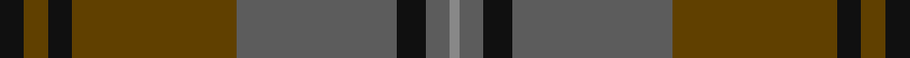

This page is one **sett** — a single exact thread-count. It belongs to the [tartan](/tartans/k5t5k5t34n33k6n5na2/)
(the same proportion at any scale), whose colour order is pattern [KGKGBKBR](/stripes/kgkgbkbr/).

Sourced from tartans-authority.  It is a [8 stripe tartan](/stripes/stripes8/).

Original link http://www.tartansauthority.com/tartan-ferret/display/10667/

## Thread count
K/5 T5 K5 T34 N33 K6 N5 Na/2

## Palette
Each colour and the base-6 reference it is a variant of.

| Colour | Shade | Base |
|---|---|---|
| K | <code style="background-color:#101010;">#101010</code> `oklch(17.3% 0.000 89.9)` <small>#101010</small> | K <code style="background-color:#000000;">#000000</code> |
| N | <code style="background-color:#5C5C5C;">#5C5C5C</code> `oklch(47.5% 0.000 89.9)` <small>#5C5C5C</small> | B <code style="background-color:#2A418A;">#2A418A</code> |
| Na | <code style="background-color:#888888;">#888888</code> `oklch(62.7% 0.000 89.9)` <small>#888888</small> | R <code style="background-color:#CC0000;">#CC0000</code> |
| T | <code style="background-color:#604000;">#604000</code> `oklch(39.8% 0.083 76.8)` <small>#604000</small> | G <code style="background-color:#006100;">#006100</code> |

# Sample pattern

## Nearest tartans

The nearest existing variants by ΔTartan distance, with this tartan at the top so the swatches line up against it.

ΔTartan

Tartan

Sett

—

<a href="/ttd/edit/#slug=k5dy5k5dy34n33k6n5o2">Brave for Men (Fashion)</a> <a class="nn-out" href="/setts/s8/k5dy5k5dy34n33k6n5o2/" title="open its dictionary page">↗</a>

1.18

<a href="/ttd/edit/#slug=k3y3k3y21dy21k3y1~x2">Granite City (Silver Granite) Fashion Tartan Tartan Number: 7459. Earliest known date: pre 2007 Produced for Mike King of Philip King Tailoring Ltd, Aberdeen. Previously recorded by the STA as 'Granite City'. Thought to have been produced for Mike King of Aberdeen. . It is believed that Lochcarron of Scotland have now (Jan 2008) trademarked the word ‘Granite’ when used in connection with tartans. See products available Copyright © Blair Urquhart, Comrie, 2015</a> <a class="nn-out" href="/setts/s7/k3y3k3y21dy21k3y1~x2/" title="open its dictionary page">↗</a>

1.28

<a href="/ttd/edit/#slug=dy35dg19r3g8r3dg8r3db3~x2">John Muir Way</a> <a class="nn-out" href="/setts/s8/dy35dg19r3g8r3dg8r3db3~x2/" title="open its dictionary page">↗</a>

1.29

<a href="/ttd/edit/#slug=do6lg3do18dy2do2dy10y28r2y4~x2">Scottish Crofting Foundation</a> <a class="nn-out" href="/setts/s9/do6lg3do18dy2do2dy10y28r2y4~x2/" title="open its dictionary page">↗</a>

1.33

<a href="/ttd/edit/#slug=dt4dg2dr16dr10dg10dt32n3~x2">Dempster Family Tartan Tartan Number: 2219. Earliest known date: 2001 Designed by Claire Donaldson of the House of Edgar. See products available Copyright © Blair Urquhart, Comrie, 2015</a> <a class="nn-out" href="/setts/s7/dt4dg2dr16dr10dg10dt32n3~x2/" title="open its dictionary page">↗</a>

1.34

<a href="/ttd/edit/#slug=do8y2do27k10n4k2n3k2n16do2~x2">Highland Granite</a> <a class="nn-out" href="/setts/s10/do8y2do27k10n4k2n3k2n16do2~x2/" title="open its dictionary page">↗</a>

1.34

<a href="/ttd/edit/#slug=dy28g2dy4db18g23db2g3lo4~x2">Eastern Western Motor Group, Dalbraith</a> <a class="nn-out" href="/setts/s8/dy28g2dy4db18g23db2g3lo4~x2/" title="open its dictionary page">↗</a>

1.35

<a href="/ttd/edit/#slug=dy35dg19r3y8r3dg8r3t3~x2">John Muir Way</a> <a class="nn-out" href="/setts/s8/dy35dg19r3y8r3dg8r3t3~x2/" title="open its dictionary page">↗</a>

1.37

<a href="/ttd/edit/#slug=dg27r2dg3r3n3lo2n14r2n3lo3n3r2n14~x2">Crowne Plaza (Corporate)</a> <a class="nn-out" href="/setts/s13/dg27r2dg3r3n3lo2n14r2n3lo3n3r2n14~x2/" title="open its dictionary page">↗</a>

1.41

<a href="/ttd/edit/#slug=r4g46r10db10dy33db5dy4lo3~x2">State Seal of Minnesota (Fashion)</a> <a class="nn-out" href="/setts/s8/r4g46r10db10dy33db5dy4lo3~x2/" title="open its dictionary page">↗</a>

1.44

<a href="/ttd/edit/#slug=dy9n4dy2n4dy2n30dy9n4t14lo2~x2">Hanna of Leith (yellow line)</a> <a class="nn-out" href="/setts/s10/dy9n4dy2n4dy2n30dy9n4t14lo2~x2/" title="open its dictionary page">↗</a>

## Neighbour map

Every grey dot is one of 14299 variants placed by the first two principal components of the ΔTartan feature space (44% of its variance). Red is this tartan; blue dots are its nearest — click one to open its page.

<svg viewBox="0 0 640 380" role="img" style="max-width:100%;height:auto;border:1px solid #e0e0e0;border-radius:4px;display:block" xmlns="http://www.w3.org/2000/svg"><image href="/nn/cloud.v1.png" width="640" height="380"/><a href="/setts/s7/k3y3k3y21dy21k3y1~x2/"><circle cx="396.2" cy="224.2" r="4" fill="#3465a4"><title>Granite City (Silver Granite) Fashion Tartan Tartan Number: 7459. Earliest known date: pre 2007 Produced for Mike King of Philip King Tailoring Ltd, Aberdeen. Previously recorded by the STA as 'Granite City'. Thought to have been produced for Mike King of Aberdeen. . It is believed that Lochcarron of Scotland have now (Jan 2008) trademarked the word ‘Granite’ when used in connection with tartans. See products available Copyright © Blair Urquhart, Comrie, 2015</title></circle></a><a href="/setts/s8/dy35dg19r3g8r3dg8r3db3~x2/"><circle cx="300.4" cy="205.5" r="4" fill="#3465a4"><title>John Muir Way</title></circle></a><a href="/setts/s9/do6lg3do18dy2do2dy10y28r2y4~x2/"><circle cx="309.8" cy="194.3" r="4" fill="#3465a4"><title>Scottish Crofting Foundation</title></circle></a><a href="/setts/s7/dt4dg2dr16dr10dg10dt32n3~x2/"><circle cx="383.9" cy="251.1" r="4" fill="#3465a4"><title>Dempster Family Tartan Tartan Number: 2219. Earliest known date: 2001 Designed by Claire Donaldson of the House of Edgar. See products available Copyright © Blair Urquhart, Comrie, 2015</title></circle></a><a href="/setts/s10/do8y2do27k10n4k2n3k2n16do2~x2/"><circle cx="386.0" cy="231.4" r="4" fill="#3465a4"><title>Highland Granite</title></circle></a><a href="/setts/s8/dy28g2dy4db18g23db2g3lo4~x2/"><circle cx="289.4" cy="218.9" r="4" fill="#3465a4"><title>Eastern Western Motor Group, Dalbraith</title></circle></a><a href="/setts/s8/dy35dg19r3y8r3dg8r3t3~x2/"><circle cx="302.0" cy="206.0" r="4" fill="#3465a4"><title>John Muir Way</title></circle></a><a href="/setts/s13/dg27r2dg3r3n3lo2n14r2n3lo3n3r2n14~x2/"><circle cx="358.4" cy="197.5" r="4" fill="#3465a4"><title>Crowne Plaza (Corporate)</title></circle></a><a href="/setts/s8/r4g46r10db10dy33db5dy4lo3~x2/"><circle cx="289.3" cy="195.0" r="4" fill="#3465a4"><title>State Seal of Minnesota (Fashion)</title></circle></a><a href="/setts/s10/dy9n4dy2n4dy2n30dy9n4t14lo2~x2/"><circle cx="396.8" cy="215.8" r="4" fill="#3465a4"><title>Hanna of Leith (yellow line)</title></circle></a><circle cx="356.4" cy="215.8" r="5" fill="#c00000"/></svg>

ID: /setts/s8/k5dy5k5dy34n33k6n5o2/
