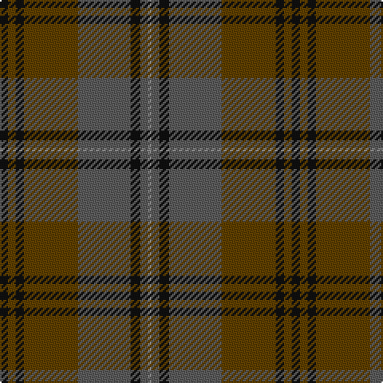

In pattern [KGKGBKBR](/patterns/kgkgbkbr/).

This was sourced from tartans-authority.  It is a [8 stripes tartan](/stripes/stripes8/).

Original link http://www.tartansauthority.com/tartan-ferret/display/10667/

## Thread count
K/5 T5 K5 T34 N33 K6 N5 Na/2

## Palette
Each colour and its ΔE from the base-6 reference it is a variant of.

| Colour | Shade | Base | ΔE (OKLab) |
|---|---|---|---|
| K | <code style="background-color:#101010;">#101010</code> `#101010` | K <code style="background-color:#000000;">#000000</code> | 0.17 |
| N | <code style="background-color:#5C5C5C;">#5C5C5C</code> `#5C5C5C` | B <code style="background-color:#2C4084;">#2C4084</code> | 0.14 |
| Na | <code style="background-color:#888888;">#888888</code> `#888888` | R <code style="background-color:#C80000;">#C80000</code> | 0.24 |
| T | <code style="background-color:#604000;">#604000</code> `#604000` | G <code style="background-color:#006400;">#006400</code> | 0.14 |

# Sample pattern

## Nearest tartans

The nearest existing variants by ΔTartan distance.

1. [Granite City (Silver Granite) Fashion Tartan Tartan Number: 7459. Earliest known date: pre 2007 Produced for Mike King of Philip King Tailoring Ltd, Aberdeen. Previously recorded by the STA as 'Granite City'. Thought to have been produced for Mike King of Aberdeen. . It is believed that Lochcarron of Scotland have now (Jan 2008) trademarked the word ‘Granite’ when used in connection with tartans. See products available Copyright © Blair Urquhart, Comrie, 2015](/setts/s7/k6g6k6g42b42k6g2-b413c2e-g716d61-k1e1a10/) — ΔT 1.17
1. [John Muir Way](/setts/s8/g70ga38r6gb16r6ga16r6b6-b2c2c80-g603800-ga003820-gb408060-rc80000/) — ΔT 1.27
1. [Scottish Crofting Foundation](/setts/s9/b12y6b36g4b4g20ga56r4ga8-b441800-g604000-ga5c6428-r880000-ya0b8a4/) — ΔT 1.29
1. [Eastern Western Motor Group, Dalbraith](/setts/s8/g56ga4g8b36ga46b4ga6y8-b202060-g604000-ga006818-ya08858/) — ΔT 1.31
1. [Dempster Family Tartan Tartan Number: 2219. Earliest known date: 2001 Designed by Claire Donaldson of the House of Edgar. See products available Copyright © Blair Urquhart, Comrie, 2015](/setts/s7/b8g4ba32ba20g20b64bb6-b14283c-ba4c0000-bb5c5c5c-g285800/) — ΔT 1.33
1. [Highland Granite](/setts/s10/b16g4b54k20ba8k4ba6k4ba32b4-b343434-ba585858-g7c7c7c-k101010/) — ΔT 1.33
1. [John Muir Way](/setts/s8/g70ga38r6gb16r6ga16r6b6-b5f749c-g604000-ga003c14-gb767e52-rc80000/) — ΔT 1.35
1. [Crowne Plaza (Corporate)](/setts/s13/g54r4g6r6b6y4b28r4b6y6b6r4b28-b405468-g285c30-rc80000-ybc8c00/) — ΔT 1.36
1. [State Seal of Minnesota (Fashion)](/setts/s8/r8g92r20b20ga66b10ga8y6-b2c2c80-g006818-ga604000-r880000-ybc8c00/) — ΔT 1.40
1. [Hanna of Leith (yellow line)](/setts/s10/g18b8g4b8g4b60g18b8ba28y4-b5c5c5c-ba2888c4-g603800-yd09800/) — ΔT 1.44

## Neighbour map

Every grey dot is one of 15726 variants placed by the first two principal components of the ΔTartan feature space (44% of its variance). Red is this tartan; blue dots are its nearest — click one to open its page.

<svg viewBox="0 0 640 380" role="img" style="max-width:100%;height:auto;border:1px solid #e0e0e0;border-radius:4px;display:block" xmlns="http://www.w3.org/2000/svg"><image href="/nn/cloud.v1.png" width="640" height="380"/><a href="/setts/s7/k6g6k6g42b42k6g2-b413c2e-g716d61-k1e1a10/"><circle cx="393.1" cy="215.7" r="4" fill="#3465a4"><title>Granite City (Silver Granite) Fashion Tartan Tartan Number: 7459. Earliest known date: pre 2007 Produced for Mike King of Philip King Tailoring Ltd, Aberdeen. Previously recorded by the STA as 'Granite City'. Thought to have been produced for Mike King of Aberdeen. . It is believed that Lochcarron of Scotland have now (Jan 2008) trademarked the word ‘Granite’ when used in connection with tartans. See products available Copyright © Blair Urquhart, Comrie, 2015</title></circle></a><a href="/setts/s8/g70ga38r6gb16r6ga16r6b6-b2c2c80-g603800-ga003820-gb408060-rc80000/"><circle cx="296.6" cy="197.1" r="4" fill="#3465a4"><title>John Muir Way</title></circle></a><a href="/setts/s9/b12y6b36g4b4g20ga56r4ga8-b441800-g604000-ga5c6428-r880000-ya0b8a4/"><circle cx="306.2" cy="186.1" r="4" fill="#3465a4"><title>Scottish Crofting Foundation</title></circle></a><a href="/setts/s8/g56ga4g8b36ga46b4ga6y8-b202060-g604000-ga006818-ya08858/"><circle cx="285.3" cy="210.8" r="4" fill="#3465a4"><title>Eastern Western Motor Group, Dalbraith</title></circle></a><a href="/setts/s7/b8g4ba32ba20g20b64bb6-b14283c-ba4c0000-bb5c5c5c-g285800/"><circle cx="380.4" cy="239.7" r="4" fill="#3465a4"><title>Dempster Family Tartan Tartan Number: 2219. Earliest known date: 2001 Designed by Claire Donaldson of the House of Edgar. See products available Copyright © Blair Urquhart, Comrie, 2015</title></circle></a><a href="/setts/s10/b16g4b54k20ba8k4ba6k4ba32b4-b343434-ba585858-g7c7c7c-k101010/"><circle cx="381.8" cy="219.7" r="4" fill="#3465a4"><title>Highland Granite</title></circle></a><a href="/setts/s8/g70ga38r6gb16r6ga16r6b6-b5f749c-g604000-ga003c14-gb767e52-rc80000/"><circle cx="298.3" cy="197.6" r="4" fill="#3465a4"><title>John Muir Way</title></circle></a><a href="/setts/s13/g54r4g6r6b6y4b28r4b6y6b6r4b28-b405468-g285c30-rc80000-ybc8c00/"><circle cx="354.1" cy="187.4" r="4" fill="#3465a4"><title>Crowne Plaza (Corporate)</title></circle></a><a href="/setts/s8/r8g92r20b20ga66b10ga8y6-b2c2c80-g006818-ga604000-r880000-ybc8c00/"><circle cx="284.9" cy="186.4" r="4" fill="#3465a4"><title>State Seal of Minnesota (Fashion)</title></circle></a><a href="/setts/s10/g18b8g4b8g4b60g18b8ba28y4-b5c5c5c-ba2888c4-g603800-yd09800/"><circle cx="393.4" cy="205.6" r="4" fill="#3465a4"><title>Hanna of Leith (yellow line)</title></circle></a><circle cx="352.7" cy="206.2" r="5" fill="#c00000"/></svg>

ID: /setts/s8/k5g5k5g34b33k6b5r2-b5c5c5c-g604000-k101010-r888888/
