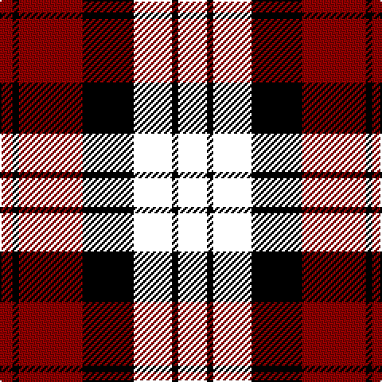

In pattern [KKKKKRKR](/patterns/kkkkkrkr/).

This was sourced from tartans-authority.  It is a [8 stripes tartan](/stripes/stripes8/).

Original link http://www.tartansauthority.com/tartan-ferret/display/3029/

## Thread count
DR/8 K4 DR40 K32 B24 K4 B4 Y/10

## Palette
Each colour and its ΔE from the base-6 reference it is a variant of.

| Colour | Shade | Base | ΔE (OKLab) |
|---|---|---|---|
| DR | <code style="background-color:#8C0000;">#8C0000</code> `#8C0000` | R <code style="background-color:#CC0000;">#CC0000</code> | 0.14 |
| K | <code style="background-color:#000000;">#000000</code> `#000000` | K <code style="background-color:#000000;">#000000</code> | 0.00 |

# Sample pattern

## Nearest tartans

The nearest existing variants by ΔTartan distance.

1. [Henry, W. A. (Commemorative)](/setts/s9/k16r16k3k16r2r1r2k6r2~k000000-r9c0030~x4/) — ΔT 1.26
1. [Impulse (Fashion)](/setts/s11/r2k10r9k13r7k3r2k3r2k3r2~k000000-r880000~x2/) — ΔT 1.45
1. [Unidentified #58](/setts/s9/r4k12w1g6r3k1r3w1r3~g004c00-k000000-r8c0000-wc8c8c8~x4/) — ΔT 1.52
1. [Aitken](/setts/s8/y5b2k2b12k16r20k2r4~b00008c-k000000-r8c0000-yc88c00~x2/) — ΔT 1.54
1. [Lunar](/setts/s11/k10r1k3b7ba1b1ba1b1ba1b1ba7~b3c2010-ba646464-k000000-r8c0000~x4/) — ΔT 1.55
1. [Lunar (Fashion)](/setts/s11/k10k1k3k7b1k1b1k1b1k1b7~b646464-k000000~x4/) — ΔT 1.61
1. [Red, White, Blue Watch (Dance)](/setts/s13/r12k2r2k2r2k10k12k3k12k10r12k2r2~k000000-r8c0000~x2/) — ΔT 1.62
1. [MacLachlan](/setts/s13/r16k2r2k2r2k16b16g3b16k16r16k2r2~b000052-g11450d-k000000-raa0000~x2/) — ΔT 1.65
1. [MacLachlan](/setts/s13/r16k2r2k2r2k16b16g3b16k16r16k2r2~b000052-g11450d-k000000-raa0000/) — ΔT 1.65
1. [Gipsy](/setts/s9/k2r2b8r2w1r2k8r2k2~b000048-k000000-rc80000-wfcfcfc~x2/) — ΔT 1.68

## Neighbour map

Every grey dot is one of 15726 variants placed by the first two principal components of the ΔTartan feature space (44% of its variance). Red is this tartan; blue dots are its nearest — click one to open its page.

<svg viewBox="0 0 640 380" role="img" style="max-width:100%;height:auto;border:1px solid #e0e0e0;border-radius:4px;display:block" xmlns="http://www.w3.org/2000/svg"><image href="/nn/cloud.v1.png" width="640" height="380"/><a href="/setts/s9/k16r16k3k16r2r1r2k6r2~k000000-r9c0030~x4/"><circle cx="188.6" cy="160.6" r="4" fill="#3465a4"><title>Henry, W. A. (Commemorative)</title></circle></a><a href="/setts/s11/r2k10r9k13r7k3r2k3r2k3r2~k000000-r880000~x2/"><circle cx="140.8" cy="199.1" r="4" fill="#3465a4"><title>Impulse (Fashion)</title></circle></a><a href="/setts/s9/r4k12w1g6r3k1r3w1r3~g004c00-k000000-r8c0000-wc8c8c8~x4/"><circle cx="200.0" cy="178.5" r="4" fill="#3465a4"><title>Unidentified #58</title></circle></a><a href="/setts/s8/y5b2k2b12k16r20k2r4~b00008c-k000000-r8c0000-yc88c00~x2/"><circle cx="185.7" cy="190.6" r="4" fill="#3465a4"><title>Aitken</title></circle></a><a href="/setts/s11/k10r1k3b7ba1b1ba1b1ba1b1ba7~b3c2010-ba646464-k000000-r8c0000~x4/"><circle cx="212.0" cy="177.0" r="4" fill="#3465a4"><title>Lunar</title></circle></a><a href="/setts/s11/k10k1k3k7b1k1b1k1b1k1b7~b646464-k000000~x4/"><circle cx="211.0" cy="184.6" r="4" fill="#3465a4"><title>Lunar (Fashion)</title></circle></a><a href="/setts/s13/r12k2r2k2r2k10k12k3k12k10r12k2r2~k000000-r8c0000~x2/"><circle cx="199.4" cy="232.6" r="4" fill="#3465a4"><title>Red, White, Blue Watch (Dance)</title></circle></a><a href="/setts/s13/r16k2r2k2r2k16b16g3b16k16r16k2r2~b000052-g11450d-k000000-raa0000~x2/"><circle cx="167.1" cy="187.3" r="4" fill="#3465a4"><title>MacLachlan</title></circle></a><a href="/setts/s13/r16k2r2k2r2k16b16g3b16k16r16k2r2~b000052-g11450d-k000000-raa0000/"><circle cx="167.1" cy="187.3" r="4" fill="#3465a4"><title>MacLachlan</title></circle></a><a href="/setts/s9/k2r2b8r2w1r2k8r2k2~b000048-k000000-rc80000-wfcfcfc~x2/"><circle cx="181.3" cy="198.3" r="4" fill="#3465a4"><title>Gipsy</title></circle></a><circle cx="215.2" cy="206.9" r="5" fill="#c00000"/></svg>

ID: /setts/s8/k5k2k2k12k16r20k2r4~k000000-r8c0000~x2/
