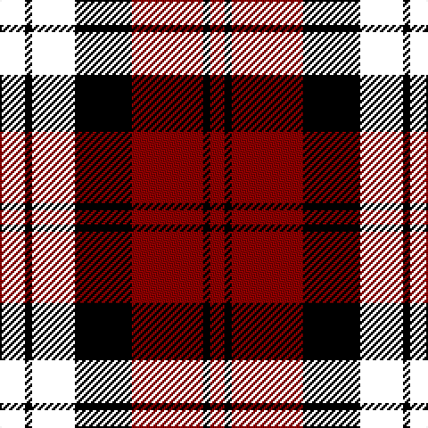

In pattern [KKKKKRKR](/stripes/kkkkkrkr/).

This was sourced from tartans-authority.  It is a [8 stripe tartan](/stripes/stripes8/).

Original link http://www.tartansauthority.com/tartan-ferret/display/3029/

## Thread count
Y/10 B4 K4 B24 K32 DR40 K4 DR/8

## Palette
Each colour and its ΔE from the base-6 reference it is a variant of.

| Colour | Shade | Base | ΔE (OKLab) |
|---|---|---|---|
| DR | <code style="background-color:#8C0000;">#8C0000</code> `#8C0000` | R <code style="background-color:#CC0000;">#CC0000</code> | 0.14 |
| K | <code style="background-color:#000000;">#000000</code> `#000000` | K <code style="background-color:#000000;">#000000</code> | 0.00 |

# Sample pattern

## Nearest tartans

The nearest existing variants by ΔTartan distance.

1. [Henry, W. A. (Commemorative)](/setts/s9/k16r16k3k16r2r1r2k6r2~x4/) — ΔT 1.26
1. [Impulse (Fashion)](/setts/s11/r2k10r9k13r7k3r2k3r2k3r2~x2/) — ΔT 1.45
1. [Unidentified #58](/setts/s9/r4k12lb1dg6r3k1r3lb1r3~x4/) — ΔT 1.52
1. [Aitken](/setts/s8/lo5db2k2db12k16r20k2r4~x2/) — ΔT 1.54
1. [Lunar](/setts/s11/k10r1k3do7n1do1n1do1n1do1n7~x4/) — ΔT 1.55
1. [Red, White, Blue Watch (Dance)](/setts/s13/r12k2r2k2r2k10k12k3k12k10r12k2r2~x2/) — ΔT 1.62
1. [Lunar (Fashion)](/setts/s11/k10k1k3k7n1k1n1k1n1k1n7~x4/) — ΔT 1.62
1. [Gipsy](/setts/s9/k2r2k8r2w1r2db8r2k2~x2/) — ΔT 1.68
1. [Cumming (d)](/setts/s13/k1db1r1k8r1dg6r6db1k6r1dg8r1k1~x2/) — ΔT 1.70
1. [Cumming](/setts/s13/k1db1r1k8r1dg6r6db1k6r1dg8r1k1/) — ΔT 1.70

## Neighbour map

Every grey dot is one of 14299 variants placed by the first two principal components of the ΔTartan feature space (44% of its variance). Red is this tartan; blue dots are its nearest — click one to open its page.

<svg viewBox="0 0 640 380" role="img" style="max-width:100%;height:auto;border:1px solid #e0e0e0;border-radius:4px;display:block" xmlns="http://www.w3.org/2000/svg"><image href="/nn/cloud.v1.png" width="640" height="380"/><a href="/setts/s9/k16r16k3k16r2r1r2k6r2~x4/"><circle cx="191.1" cy="163.1" r="4" fill="#3465a4"><title>Henry, W. A. (Commemorative)</title></circle></a><a href="/setts/s11/r2k10r9k13r7k3r2k3r2k3r2~x2/"><circle cx="143.1" cy="203.1" r="4" fill="#3465a4"><title>Impulse (Fashion)</title></circle></a><a href="/setts/s9/r4k12lb1dg6r3k1r3lb1r3~x4/"><circle cx="202.4" cy="176.8" r="4" fill="#3465a4"><title>Unidentified #58</title></circle></a><a href="/setts/s8/lo5db2k2db12k16r20k2r4~x2/"><circle cx="188.4" cy="189.3" r="4" fill="#3465a4"><title>Aitken</title></circle></a><a href="/setts/s11/k10r1k3do7n1do1n1do1n1do1n7~x4/"><circle cx="215.0" cy="178.7" r="4" fill="#3465a4"><title>Lunar</title></circle></a><a href="/setts/s13/r12k2r2k2r2k10k12k3k12k10r12k2r2~x2/"><circle cx="201.9" cy="234.3" r="4" fill="#3465a4"><title>Red, White, Blue Watch (Dance)</title></circle></a><a href="/setts/s11/k10k1k3k7n1k1n1k1n1k1n7~x4/"><circle cx="214.7" cy="187.5" r="4" fill="#3465a4"><title>Lunar (Fashion)</title></circle></a><a href="/setts/s9/k2r2k8r2w1r2db8r2k2~x2/"><circle cx="184.2" cy="196.0" r="4" fill="#3465a4"><title>Gipsy</title></circle></a><a href="/setts/s13/k1db1r1k8r1dg6r6db1k6r1dg8r1k1~x2/"><circle cx="187.2" cy="185.2" r="4" fill="#3465a4"><title>Cumming (d)</title></circle></a><a href="/setts/s13/k1db1r1k8r1dg6r6db1k6r1dg8r1k1/"><circle cx="187.2" cy="185.2" r="4" fill="#3465a4"><title>Cumming</title></circle></a><circle cx="217.6" cy="208.9" r="5" fill="#c00000"/></svg>

ID: /setts/s8/k5k2k2k12k16r20k2r4~x2/
