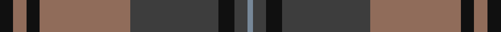

**Bands:** [KRKRBKBB](/stripes/krkrbkbb/) · **Stripes:** [K O K O DO K DO T](/stripes/stripes8/) K O K O DO K DO T

This was sourced from register-of-tartans.  It is a [8 band tartan](/bands/bands8/).

Original link https://www.tartanregister.gov.uk/tartanDetails.aspx?ref=10666

## Attestations

This cloth appears in 2 source records; the oldest owns this page.

- 28/06/2012 — Brave for Men (register-of-tartans, [record](https://www.tartanregister.gov.uk/tartanDetails.aspx?ref=10666))
- undated — Brave for Men Fashion Tartan Tartan Number: 10666. Earliest known date: 28/06/2012 A woven sample of this tartan has been received by the Scottish Register of Tartans for permanent preservation in the National Records of Scotland. See products available Copyright © Blair Urquhart, Comrie, 2015 (house-of-tartan, [record](http://www.house-of-tartan.scotland.net/house/TartanViewjs.asp?colr=Def&tnam=10666))

## Register references

External register numbers recorded for this tartan.

- Scottish Register of Tartans: [10666](https://www.tartanregister.gov.uk/tartanDetails.aspx?ref=10666)

## Thread count
K/5 LT5 K5 LT34 Na33 K6 Na5 N/2

## Palette
Each colour and its ΔE from the base-6 reference it is a variant of.

| Colour | Shade | Base | ΔE (OKLab) |
|---|---|---|---|
| K | <code style="background-color:#101010;">#101010</code> `#101010` | K <code style="background-color:#000000;">#000000</code> | 0.17 |
| LT | <code style="background-color:#906C5A;">#906C5A</code> `#906C5A` | R <code style="background-color:#CC0000;">#CC0000</code> | 0.17 |
| N | <code style="background-color:#778899;">#778899</code> `#778899` | B <code style="background-color:#2A418A;">#2A418A</code> | 0.24 |
| Na | <code style="background-color:#3D3D3D;">#3D3D3D</code> `#3D3D3D` | B <code style="background-color:#2A418A;">#2A418A</code> | 0.13 |

# Sample pattern

## Nearest tartans

The nearest existing variants by ΔTartan distance.

1. [Markson (Personal)](/setts/s11/r16dg1g2dg1r4dg5t1dg5g14dg1t2~x2/) — ΔT 0.86
1. [Brown of the Southeast (Personal)](/setts/s8/n12dg2n4dg2n4k33dg13r4~x2/) — ΔT 0.93
1. [Rannoch Moor (Fashion)](/setts/s8/r3dg12r12r5dg2db30r2dg2~x2/) — ΔT 1.00
1. [Cork Irish County Tartan Tartan Number: 2253. Earliest known date: 1996 One of a series of Irish District tartans designed by Polly Wittering of the House of Edgar, with colours reminiscent of the Country with soft warm colours dominating. See products available Copyright © Blair Urquhart, Comrie, 2015](/setts/s9/g28r12g4db20lo2db3lo2db3g7~x2/) — ΔT 1.01
1. [Speyside Grey (Fashion)](/setts/s8/n32k3n3k3o5k8o21k4~x2/) — ΔT 1.03
1. [Queen of Scots (Commemorative))](/setts/s9/g22k3g1k3g2dp8r1dp8r16~x2/) — ΔT 1.07
1. [Ormiston (Personal)](/setts/s9/dg26db3r3db20r3db3r30lb3k2~x2/) — ΔT 1.13
1. [Speyside Blue (Fashion)](/setts/s8/n32k3n3k3b5k8o21k4~x2/) — ΔT 1.20
1. [Cape Breton University Chemistry Society](/setts/s10/db4o17db4y4db2y4db4y27db4ly4~x2/) — ΔT 1.24
1. [Scotland 2000 (Commemorative)](/setts/s8/lb4dt38g6dr2g6dr36lo2dr3~x2/) — ΔT 1.26

## Neighbour map

Every grey dot is one of 14299 variants placed by the first two principal components of the ΔTartan feature space (44% of its variance). Red is this tartan; blue dots are its nearest — click one to open its page.

<svg viewBox="0 0 640 380" role="img" style="max-width:100%;height:auto;border:1px solid #e0e0e0;border-radius:4px;display:block" xmlns="http://www.w3.org/2000/svg"><image href="/nn/cloud.v1.png" width="640" height="380"/><a href="/setts/s11/r16dg1g2dg1r4dg5t1dg5g14dg1t2~x2/"><circle cx="277.3" cy="176.4" r="4" fill="#3465a4"><title>Markson (Personal)</title></circle></a><a href="/setts/s8/n12dg2n4dg2n4k33dg13r4~x2/"><circle cx="304.0" cy="191.0" r="4" fill="#3465a4"><title>Brown of the Southeast (Personal)</title></circle></a><a href="/setts/s8/r3dg12r12r5dg2db30r2dg2~x2/"><circle cx="289.3" cy="185.6" r="4" fill="#3465a4"><title>Rannoch Moor (Fashion)</title></circle></a><a href="/setts/s9/g28r12g4db20lo2db3lo2db3g7~x2/"><circle cx="303.8" cy="192.7" r="4" fill="#3465a4"><title>Cork Irish County Tartan Tartan Number: 2253. Earliest known date: 1996 One of a series of Irish District tartans designed by Polly Wittering of the House of Edgar, with colours reminiscent of the Country with soft warm colours dominating. See products available Copyright © Blair Urquhart, Comrie, 2015</title></circle></a><a href="/setts/s8/n32k3n3k3o5k8o21k4~x2/"><circle cx="270.3" cy="197.1" r="4" fill="#3465a4"><title>Speyside Grey (Fashion)</title></circle></a><a href="/setts/s9/g22k3g1k3g2dp8r1dp8r16~x2/"><circle cx="267.7" cy="166.1" r="4" fill="#3465a4"><title>Queen of Scots (Commemorative))</title></circle></a><a href="/setts/s9/dg26db3r3db20r3db3r30lb3k2~x2/"><circle cx="254.3" cy="164.6" r="4" fill="#3465a4"><title>Ormiston (Personal)</title></circle></a><a href="/setts/s8/n32k3n3k3b5k8o21k4~x2/"><circle cx="267.1" cy="197.7" r="4" fill="#3465a4"><title>Speyside Blue (Fashion)</title></circle></a><a href="/setts/s10/db4o17db4y4db2y4db4y27db4ly4~x2/"><circle cx="280.9" cy="175.4" r="4" fill="#3465a4"><title>Cape Breton University Chemistry Society</title></circle></a><a href="/setts/s8/lb4dt38g6dr2g6dr36lo2dr3~x2/"><circle cx="293.0" cy="157.0" r="4" fill="#3465a4"><title>Scotland 2000 (Commemorative)</title></circle></a><circle cx="310.2" cy="188.0" r="5" fill="#c00000"/></svg>

ID: /setts/s8/k5o5k5o34do33k6do5t2/
