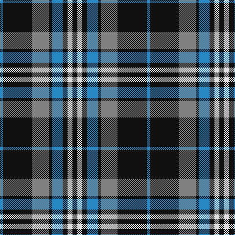

**Bands:** [KWKBKGKB](/stripes/kwkbkgkb/) · **Stripes:** [K W K T K Y K T](/stripes/stripes8/) K W K T K Y K T

This was sourced from register-of-tartans.  It is a [8 band tartan](/bands/bands8/).

Original link https://www.tartanregister.gov.uk/tartanDetails.aspx?ref=5876

## Register references

External register numbers recorded for this tartan.

- Scottish Register of Tartans: [5876](https://www.tartanregister.gov.uk/tartanDetails.aspx?ref=5876)
- Scottish Tartans Authority (ITI): 7415
- Scottish Tartans World Register: 3182

## Thread count
K/10 LN10 K10 B22 K6 N34 K60 B/6

## Palette
Each colour and its ΔE from the base-6 reference it is a variant of.

| Colour | Shade | Base | ΔE (OKLab) |
|---|---|---|---|
| B | <code style="background-color:#2888C4;">#2888C4</code> `#2888C4` | B <code style="background-color:#2A418A;">#2A418A</code> | 0.21 |
| K | <code style="background-color:#101010;">#101010</code> `#101010` | K <code style="background-color:#000000;">#000000</code> | 0.17 |
| LN | <code style="background-color:#E0E0E0;">#E0E0E0</code> `#E0E0E0` | W <code style="background-color:#F7F7F7;">#F7F7F7</code> | 0.07 |
| N | <code style="background-color:#808080;">#808080</code> `#808080` | G <code style="background-color:#006100;">#006100</code> | 0.23 |

# Sample pattern

## Nearest tartans

The nearest existing variants by ΔTartan distance.

1. [St Andrews University Corporate Tartan Tartan Number: 2398. Earliest known date: pre 1998 Originally named St. Andrews International. Apparently a Gordon Paton MD, bought the company from North East Fife Enterprise Trust in 1997, the aim being to brand quality Scottish products for export worldwide. The company intended to set up a membership scheme but the company went into liquidation. The intended venue belonged to St Andrews University and it appears that the ownership of the tartan has fallen to the University and its name has been changed from 'International' to 'University' (Deirdre Kinloch Anderson, Aug 2004).No thread count given so this entry is based on an estimate from a small computer graphic. Has since been corrected to conform to the SRT (Scottish Register of Tartans) See products available Copyright © Blair Urquhart, Comrie, 2015](/setts/s10/k3db2ly3k2ly5db18g3k3g2db3~x2/) — ΔT 0.74
1. [Dunbog Primary School](/setts/s10/r12db3g5db16ly2g2~x2/) — ΔT 0.95
1. [Guthrie (Name)](/setts/s9/k1g12k12r1k1r1k12b12r1~x4/) — ΔT 1.00
1. [Aquascutum (Kinloch Anderson)](/setts/s9/dy7k7dy4k26w12k3w14m2k6/) — ΔT 1.04
1. [Dunfermline Athletic (2008) (Corp)](/setts/s7/k11w1k1w1k4o8r1~x8/) — ΔT 1.06
1. [Thayer USA](/setts/s6/r5db25w5db3dg25db3~x2/) — ΔT 1.08
1. [MacKean (Personal)](/setts/s7/r8k18r6k18b27k2w3~x2/) — ΔT 1.14
1. [Scotsburn Croft](/setts/s9/lg16k3lg16k26dp4k26o20k3o8/) — ΔT 1.14
1. [Ardmore (Fashion)](/setts/s8/k21o2k8w2o16n6k2n8~x2/) — ΔT 1.19
1. [Kells Irish Pubs](/setts/s12/k17lr2k3g2k3g2k24b8g4b4g3b8~x2/) — ΔT 1.19

## Neighbour map

Every grey dot is one of 14299 variants placed by the first two principal components of the ΔTartan feature space (44% of its variance). Red is this tartan; blue dots are its nearest — click one to open its page.

<svg viewBox="0 0 640 380" role="img" style="max-width:100%;height:auto;border:1px solid #e0e0e0;border-radius:4px;display:block" xmlns="http://www.w3.org/2000/svg"><image href="/nn/cloud.v1.png" width="640" height="380"/><a href="/setts/s10/k3db2ly3k2ly5db18g3k3g2db3~x2/"><circle cx="246.7" cy="172.6" r="4" fill="#3465a4"><title>St Andrews University Corporate Tartan Tartan Number: 2398. Earliest known date: pre 1998 Originally named St. Andrews International. Apparently a Gordon Paton MD, bought the company from North East Fife Enterprise Trust in 1997, the aim being to brand quality Scottish products for export worldwide. The company intended to set up a membership scheme but the company went into liquidation. The intended venue belonged to St Andrews University and it appears that the ownership of the tartan has fallen to the University and its name has been changed from 'International' to 'University' (Deirdre Kinloch Anderson, Aug 2004).No thread count given so this entry is based on an estimate from a small computer graphic. Has since been corrected to conform to the SRT (Scottish Register of Tartans) See products available Copyright © Blair Urquhart, Comrie, 2015</title></circle></a><a href="/setts/s10/r12db3g5db16ly2g2~x2/"><circle cx="264.6" cy="194.2" r="4" fill="#3465a4"><title>Dunbog Primary School</title></circle></a><a href="/setts/s9/k1g12k12r1k1r1k12b12r1~x4/"><circle cx="256.3" cy="186.7" r="4" fill="#3465a4"><title>Guthrie (Name)</title></circle></a><a href="/setts/s9/dy7k7dy4k26w12k3w14m2k6/"><circle cx="232.9" cy="170.8" r="4" fill="#3465a4"><title>Aquascutum (Kinloch Anderson)</title></circle></a><a href="/setts/s7/k11w1k1w1k4o8r1~x8/"><circle cx="311.8" cy="182.6" r="4" fill="#3465a4"><title>Dunfermline Athletic (2008) (Corp)</title></circle></a><a href="/setts/s6/r5db25w5db3dg25db3~x2/"><circle cx="250.4" cy="215.6" r="4" fill="#3465a4"><title>Thayer USA</title></circle></a><a href="/setts/s7/r8k18r6k18b27k2w3~x2/"><circle cx="230.3" cy="194.5" r="4" fill="#3465a4"><title>MacKean (Personal)</title></circle></a><a href="/setts/s9/lg16k3lg16k26dp4k26o20k3o8/"><circle cx="197.6" cy="209.6" r="4" fill="#3465a4"><title>Scotsburn Croft</title></circle></a><a href="/setts/s8/k21o2k8w2o16n6k2n8~x2/"><circle cx="239.6" cy="197.5" r="4" fill="#3465a4"><title>Ardmore (Fashion)</title></circle></a><a href="/setts/s12/k17lr2k3g2k3g2k24b8g4b4g3b8~x2/"><circle cx="305.6" cy="167.4" r="4" fill="#3465a4"><title>Kells Irish Pubs</title></circle></a><circle cx="258.0" cy="188.9" r="5" fill="#c00000"/></svg>

ID: /setts/s8/k5w5k5t11k3y17k30t3~x2/
