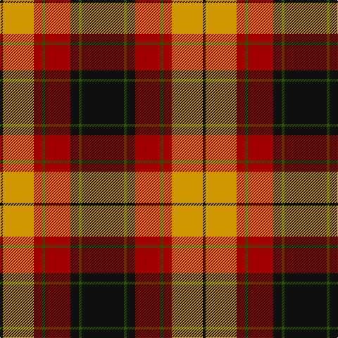

In pattern [KGKRGRYK](/patterns/kgkrgryk/).

This was sourced from register-of-tartans.  It is a [8 stripes tartan](/stripes/stripes8/).

Original link https://www.tartanregister.gov.uk/tartanDetails.aspx?ref=1863

## Attestations

This cloth appears in 2 source records; the oldest owns this page.

- 01/01/1972 — Island of Innis, The (register-of-tartans, [record](https://www.tartanregister.gov.uk/tartanDetails.aspx?ref=1863))
- pre 1972 — Island of Innis, The (Fashion) (tartans-authority, [record](http://www.tartansauthority.com/tartan-ferret/display/5279/))

## Thread count
K/4 DY44 DR12 G4 DR36 K12 G4 K/60

## Palette
Each colour and its ΔE from the base-6 reference it is a variant of.

| Colour | Shade | Base | ΔE (OKLab) |
|---|---|---|---|
| DR | <code style="background-color:#A00000;">#A00000</code> `#A00000` | R <code style="background-color:#C80000;">#C80000</code> | 0.09 |
| DY | <code style="background-color:#D09800;">#D09800</code> `#D09800` | Y <code style="background-color:#E8C000;">#E8C000</code> | 0.11 |
| G | <code style="background-color:#285800;">#285800</code> `#285800` | G <code style="background-color:#006400;">#006400</code> | 0.04 |
| K | <code style="background-color:#101010;">#101010</code> `#101010` | K <code style="background-color:#000000;">#000000</code> | 0.17 |

# Sample pattern

ID: /setts/s8/k60g4k12r36g4r12y44k4-g285800-k101010-ra00000-yd09800/
