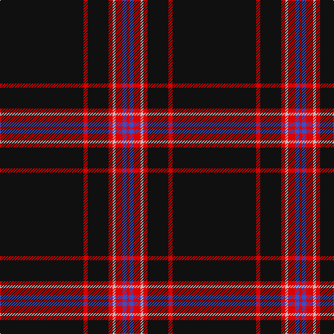

This page is one **sett** — a single exact thread-count. It belongs to the [tartan](/tartans/k60r3k15r3n2r5b3r2/)
(the same proportion at any scale), whose colour order is pattern [KRKRWRBR](/stripes/krkrwrbr/).

Sourced from register-of-tartans.  It is a [8 stripe tartan](/stripes/stripes8/).

Original link https://www.tartanregister.gov.uk/tartanDetails.aspx?ref=11073

## Register references

External register numbers recorded for this tartan.

- Scottish Register of Tartans: [11073](https://www.tartanregister.gov.uk/tartanDetails.aspx?ref=11073)

## Thread count
K/120 R6 K30 R6 N4 R10 B6 R/4

## Palette
Each colour and the base-6 reference it is a variant of.

| Colour | Shade | Base |
|---|---|---|
| B | <code style="background-color:#3850C8;">#3850C8</code> `oklch(48.8% 0.188 269.4)` <small>#3850C8</small> | B <code style="background-color:#2A418A;">#2A418A</code> |
| K | <code style="background-color:#101010;">#101010</code> `oklch(17.3% 0.000 89.9)` <small>#101010</small> | K <code style="background-color:#000000;">#000000</code> |
| N | <code style="background-color:#C0C0C0;">#C0C0C0</code> `oklch(80.8% 0.000 89.9)` <small>#C0C0C0</small> | W <code style="background-color:#F7F7F7;">#F7F7F7</code> |
| R | <code style="background-color:#DC0000;">#DC0000</code> `oklch(56.2% 0.230 29.2)` <small>#DC0000</small> | R <code style="background-color:#CC0000;">#CC0000</code> |

# Sample pattern

## Nearest tartans

The nearest existing variants by ΔTartan distance, with this tartan at the top so the swatches line up against it.

ΔTartan

Tartan

Sett

—

<a href="/ttd/edit/#slug=k60r3k15r3lb2r5b3r2~x2">Whitaker (2014)</a> <a class="nn-out" href="/setts/s8/k60r3k15r3lb2r5b3r2~x2/" title="open its dictionary page">↗</a>

0.41

<a href="/ttd/edit/#slug=k60r3k15r3lb2r5db3r2~x2">Whitaker (2014)</a> <a class="nn-out" href="/setts/s8/k60r3k15r3lb2r5db3r2~x2/" title="open its dictionary page">↗</a>

0.86

<a href="/ttd/edit/#slug=k80r6g3r12k2w2~x2">Dellen</a> <a class="nn-out" href="/setts/s6/k80r6g3r12k2w2~x2/" title="open its dictionary page">↗</a>

0.93

<a href="/ttd/edit/#slug=k62r3k3lo3k3r3k9lr5~x2">Auld Bernensis</a> <a class="nn-out" href="/setts/s8/k62r3k3lo3k3r3k9lr5~x2/" title="open its dictionary page">↗</a>

0.95

<a href="/ttd/edit/#slug=k64r1k4r1k6r7w2r7k6t2~x2">Noordermeer (Personal)</a> <a class="nn-out" href="/setts/s10/k64r1k4r1k6r7w2r7k6t2~x2/" title="open its dictionary page">↗</a>

0.97

<a href="/ttd/edit/#slug=k62r3k3lo3k3r3k9o5~x2">Auld Bernensis</a> <a class="nn-out" href="/setts/s8/k62r3k3lo3k3r3k9o5~x2/" title="open its dictionary page">↗</a>

1.03

<a href="/ttd/edit/#slug=w2k2dp8k10dp8k64w2k8ly1k1~x2">Payne of Wallins Creek (Personal)</a> <a class="nn-out" href="/setts/s10/w2k2dp8k10dp8k64w2k8ly1k1~x2/" title="open its dictionary page">↗</a>

1.09

<a href="/ttd/edit/#slug=k80r6dg3r12k2w2~x2">Dellen</a> <a class="nn-out" href="/setts/s6/k80r6dg3r12k2w2~x2/" title="open its dictionary page">↗</a>

1.16

<a href="/ttd/edit/#slug=k21r1k1ly1k1r1k3w3~x6">Black Country (District)</a> <a class="nn-out" href="/setts/s8/k21r1k1ly1k1r1k3w3~x6/" title="open its dictionary page">↗</a>

1.18

<a href="/ttd/edit/#slug=k59r3k6r3k8r15k2ly3~x2">Royal Army PTC Assoc. (Military)</a> <a class="nn-out" href="/setts/s8/k59r3k6r3k8r15k2ly3~x2/" title="open its dictionary page">↗</a>

1.24

<a href="/ttd/edit/#slug=k40dp2k6b2k2b2k10dp4w2dp5~x2">Ironside (Personal)</a> <a class="nn-out" href="/setts/s10/k40dp2k6b2k2b2k10dp4w2dp5~x2/" title="open its dictionary page">↗</a>

## Neighbour map

Every grey dot is one of 14299 variants placed by the first two principal components of the ΔTartan feature space (44% of its variance). Red is this tartan; blue dots are its nearest — click one to open its page.

<svg viewBox="0 0 640 380" role="img" style="max-width:100%;height:auto;border:1px solid #e0e0e0;border-radius:4px;display:block" xmlns="http://www.w3.org/2000/svg"><image href="/nn/cloud.v1.png" width="640" height="380"/><a href="/setts/s8/k60r3k15r3lb2r5db3r2~x2/"><circle cx="580.0" cy="140.0" r="4" fill="#3465a4"><title>Whitaker (2014)</title></circle></a><a href="/setts/s6/k80r6g3r12k2w2~x2/"><circle cx="557.6" cy="131.3" r="4" fill="#3465a4"><title>Dellen</title></circle></a><a href="/setts/s8/k62r3k3lo3k3r3k9lr5~x2/"><circle cx="578.8" cy="141.7" r="4" fill="#3465a4"><title>Auld Bernensis</title></circle></a><a href="/setts/s10/k64r1k4r1k6r7w2r7k6t2~x2/"><circle cx="586.8" cy="98.4" r="4" fill="#3465a4"><title>Noordermeer (Personal)</title></circle></a><a href="/setts/s8/k62r3k3lo3k3r3k9o5~x2/"><circle cx="599.2" cy="152.4" r="4" fill="#3465a4"><title>Auld Bernensis</title></circle></a><a href="/setts/s10/w2k2dp8k10dp8k64w2k8ly1k1~x2/"><circle cx="581.8" cy="104.6" r="4" fill="#3465a4"><title>Payne of Wallins Creek (Personal)</title></circle></a><a href="/setts/s6/k80r6dg3r12k2w2~x2/"><circle cx="582.9" cy="141.6" r="4" fill="#3465a4"><title>Dellen</title></circle></a><a href="/setts/s8/k21r1k1ly1k1r1k3w3~x6/"><circle cx="528.7" cy="133.7" r="4" fill="#3465a4"><title>Black Country (District)</title></circle></a><a href="/setts/s8/k59r3k6r3k8r15k2ly3~x2/"><circle cx="539.9" cy="149.2" r="4" fill="#3465a4"><title>Royal Army PTC Assoc. (Military)</title></circle></a><a href="/setts/s10/k40dp2k6b2k2b2k10dp4w2dp5~x2/"><circle cx="525.3" cy="151.4" r="4" fill="#3465a4"><title>Ironside (Personal)</title></circle></a><circle cx="568.1" cy="133.5" r="5" fill="#c00000"/></svg>

ID: /setts/s8/k60r3k15r3lb2r5b3r2~x2/
