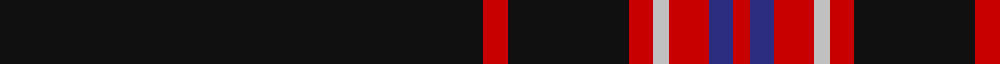

In pattern [KRKRWRBR](/stripes/krkrwrbr/).

This was sourced from tartans-authority.  It is a [8 stripe tartan](/stripes/stripes8/).

Original link http://www.tartansauthority.com/tartan-ferret/display/11073/

## Thread count
K/120 R6 K30 R6 N4 R10 DB6 R/4

## Palette
Each colour and its ΔE from the base-6 reference it is a variant of.

| Colour | Shade | Base | ΔE (OKLab) |
|---|---|---|---|
| DB | <code style="background-color:#2C2C80;">#2C2C80</code> `#2C2C80` | B <code style="background-color:#2A418A;">#2A418A</code> | 0.06 |
| K | <code style="background-color:#101010;">#101010</code> `#101010` | K <code style="background-color:#000000;">#000000</code> | 0.17 |
| N | <code style="background-color:#C0C0C0;">#C0C0C0</code> `#C0C0C0` | W <code style="background-color:#F7F7F7;">#F7F7F7</code> | 0.17 |
| R | <code style="background-color:#C80000;">#C80000</code> `#C80000` | R <code style="background-color:#CC0000;">#CC0000</code> | 0.01 |

# Sample pattern

## Nearest tartans

The nearest existing variants by ΔTartan distance.

1. [Whitaker (2014)](/setts/s8/k60r3k15r3lb2r5b3r2~x2/) — ΔT 0.41
1. [Auld Bernensis](/setts/s8/k62r3k3lo3k3r3k9o5~x2/) — ΔT 0.88
1. [Dellen](/setts/s6/k80r6dg3r12k2w2~x2/) — ΔT 0.93
1. [Noordermeer (Personal)](/setts/s10/k64r1k4r1k6r7w2r7k6t2~x2/) — ΔT 1.03
1. [Dellen](/setts/s6/k80r6g3r12k2w2~x2/) — ΔT 1.04
1. [Laird Abdullah (Personal)](/setts/s8/k10n2k2n8k40r4k5r2~x2/) — ΔT 1.06
1. [Payne of Wallins Creek (Personal)](/setts/s10/w2k2dp8k10dp8k64w2k8ly1k1~x2/) — ΔT 1.12
1. [Auld Bernensis](/setts/s8/k62r3k3lo3k3r3k9lr5~x2/) — ΔT 1.14
1. [Ironside (Personal)](/setts/s10/k40dp2k6b2k2b2k10dp4w2dp5~x2/) — ΔT 1.16
1. [Harley Davidson](/setts/s10/k49o8k4n6o4n6k4o8k49o2/) — ΔT 1.26

## Neighbour map

Every grey dot is one of 14299 variants placed by the first two principal components of the ΔTartan feature space (44% of its variance). Red is this tartan; blue dots are its nearest — click one to open its page.

<svg viewBox="0 0 640 380" role="img" style="max-width:100%;height:auto;border:1px solid #e0e0e0;border-radius:4px;display:block" xmlns="http://www.w3.org/2000/svg"><image href="/nn/cloud.v1.png" width="640" height="380"/><a href="/setts/s8/k60r3k15r3lb2r5b3r2~x2/"><circle cx="568.1" cy="133.5" r="4" fill="#3465a4"><title>Whitaker (2014)</title></circle></a><a href="/setts/s8/k62r3k3lo3k3r3k9o5~x2/"><circle cx="599.2" cy="152.4" r="4" fill="#3465a4"><title>Auld Bernensis</title></circle></a><a href="/setts/s6/k80r6dg3r12k2w2~x2/"><circle cx="582.9" cy="141.6" r="4" fill="#3465a4"><title>Dellen</title></circle></a><a href="/setts/s10/k64r1k4r1k6r7w2r7k6t2~x2/"><circle cx="586.8" cy="98.4" r="4" fill="#3465a4"><title>Noordermeer (Personal)</title></circle></a><a href="/setts/s6/k80r6g3r12k2w2~x2/"><circle cx="557.6" cy="131.3" r="4" fill="#3465a4"><title>Dellen</title></circle></a><a href="/setts/s8/k10n2k2n8k40r4k5r2~x2/"><circle cx="538.5" cy="174.0" r="4" fill="#3465a4"><title>Laird Abdullah (Personal)</title></circle></a><a href="/setts/s10/w2k2dp8k10dp8k64w2k8ly1k1~x2/"><circle cx="581.8" cy="104.6" r="4" fill="#3465a4"><title>Payne of Wallins Creek (Personal)</title></circle></a><a href="/setts/s8/k62r3k3lo3k3r3k9lr5~x2/"><circle cx="578.8" cy="141.7" r="4" fill="#3465a4"><title>Auld Bernensis</title></circle></a><a href="/setts/s10/k40dp2k6b2k2b2k10dp4w2dp5~x2/"><circle cx="525.3" cy="151.4" r="4" fill="#3465a4"><title>Ironside (Personal)</title></circle></a><a href="/setts/s10/k49o8k4n6o4n6k4o8k49o2/"><circle cx="508.2" cy="154.7" r="4" fill="#3465a4"><title>Harley Davidson</title></circle></a><circle cx="580.0" cy="140.0" r="5" fill="#c00000"/></svg>

ID: /setts/s8/k60r3k15r3lb2r5db3r2~x2/
