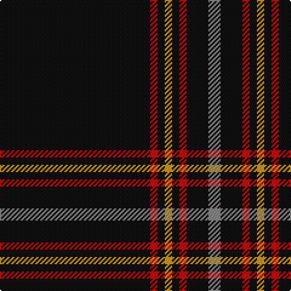

This page is one **sett** — a single exact thread-count. It belongs to the [tartan](/tartans/k62r3k3lo3k3r3k9o5/)
(the same proportion at any scale), whose colour order is pattern [KRKYKRKR](/stripes/krkykrkr/).

Sourced from tartans-authority.  It is a [8 stripe tartan](/stripes/stripes8/).

Original link http://www.tartansauthority.com/tartan-ferret/display/10964/

## Thread count
K/124 R6 K6 DY6 K6 R6 K18 N/10

## Palette

Palette: <strong>Tartan Register</strong> <small style="color:#888">(3 of 4 colours)</small>
<table><thead><tr><th>Colour</th><th>Threads</th><th>Shade</th><th>Base</th><th>OKLCh</th></tr></thead><tbody><tr><td>K/</td><td style="text-align:right;font-variant-numeric:tabular-nums">124</td><td><code style="background-color:#101010;">#101010</code> <small style="color:#888">#101010</small></td><td>K <code style="background-color:#000000;">#000000</code></td><td><small style="color:#888">oklch(17.3% 0.000 89.9)</small></td></tr><tr><td>R</td><td style="text-align:right;font-variant-numeric:tabular-nums">6</td><td><code style="background-color:#C80000;">#C80000</code> <small style="color:#888">#C80000</small></td><td>R <code style="background-color:#CC0000;">#CC0000</code></td><td><small style="color:#888">oklch(52.3% 0.215 29.2)</small></td></tr><tr><td>K</td><td style="text-align:right;font-variant-numeric:tabular-nums">6</td><td><code style="background-color:#101010;">#101010</code> <small style="color:#888">#101010</small></td><td>K <code style="background-color:#000000;">#000000</code></td><td><small style="color:#888">oklch(17.3% 0.000 89.9)</small></td></tr><tr><td>DY</td><td style="text-align:right;font-variant-numeric:tabular-nums">6</td><td><code style="background-color:#D09800;">#D09800</code> <small style="color:#888">#D09800</small></td><td>Y <code style="background-color:#F2BF00;">#F2BF00</code></td><td><small style="color:#888">oklch(71.4% 0.147 82.1)</small></td></tr><tr><td>K</td><td style="text-align:right;font-variant-numeric:tabular-nums">6</td><td><code style="background-color:#101010;">#101010</code> <small style="color:#888">#101010</small></td><td>K <code style="background-color:#000000;">#000000</code></td><td><small style="color:#888">oklch(17.3% 0.000 89.9)</small></td></tr><tr><td>R</td><td style="text-align:right;font-variant-numeric:tabular-nums">6</td><td><code style="background-color:#C80000;">#C80000</code> <small style="color:#888">#C80000</small></td><td>R <code style="background-color:#CC0000;">#CC0000</code></td><td><small style="color:#888">oklch(52.3% 0.215 29.2)</small></td></tr><tr><td>K</td><td style="text-align:right;font-variant-numeric:tabular-nums">18</td><td><code style="background-color:#101010;">#101010</code> <small style="color:#888">#101010</small></td><td>K <code style="background-color:#000000;">#000000</code></td><td><small style="color:#888">oklch(17.3% 0.000 89.9)</small></td></tr><tr><td>N/</td><td style="text-align:right;font-variant-numeric:tabular-nums">10</td><td><code style="background-color:#888888;">#888888</code> <small style="color:#888">#888888</small></td><td>R <code style="background-color:#CC0000;">#CC0000</code></td><td><small style="color:#888">oklch(62.7% 0.000 89.9)</small></td></tr></tbody></table>

# Sample pattern

## Nearest tartans

The nearest existing variants by ΔTartan distance, with this tartan at the top so the swatches line up against it.

ΔTartan

Tartan

Sett

—

<a href="/ttd/edit/#slug=k62r3k3lo3k3r3k9o5~x2">Auld Bernensis</a> <a class="nn-out" href="/setts/s8/k62r3k3lo3k3r3k9o5~x2/" title="open its dictionary page">↗</a>

0.73

<a href="/ttd/edit/#slug=k62r3k3lo3k3r3k9lr5~x2">Auld Bernensis</a> <a class="nn-out" href="/setts/s8/k62r3k3lo3k3r3k9lr5~x2/" title="open its dictionary page">↗</a>

0.88

<a href="/ttd/edit/#slug=k60r3k15r3lb2r5db3r2~x2">Whitaker (2014)</a> <a class="nn-out" href="/setts/s8/k60r3k15r3lb2r5db3r2~x2/" title="open its dictionary page">↗</a>

0.97

<a href="/ttd/edit/#slug=k60r3k15r3lb2r5b3r2~x2">Whitaker (2014)</a> <a class="nn-out" href="/setts/s8/k60r3k15r3lb2r5b3r2~x2/" title="open its dictionary page">↗</a>

1.33

<a href="/ttd/edit/#slug=k10n2k2n8k40r4k5r2~x2">Laird Abdullah (Personal)</a> <a class="nn-out" href="/setts/s8/k10n2k2n8k40r4k5r2~x2/" title="open its dictionary page">↗</a>

1.38

<a href="/ttd/edit/#slug=k40n3k5n2k2n2k2n6k4w2k4~x2">Stewart Mourning (Clan)</a> <a class="nn-out" href="/setts/s11/k40n3k5n2k2n2k2n6k4w2k4~x2/" title="open its dictionary page">↗</a>

1.42

<a href="/ttd/edit/#slug=ly2k4ly1k4r5k50y1k2r1~x2">Magdalene</a> <a class="nn-out" href="/setts/s9/ly2k4ly1k4r5k50y1k2r1~x2/" title="open its dictionary page">↗</a>

1.43

<a href="/ttd/edit/#slug=ly2k4ly1k4r5k50o1k2r1~x2">Magdalene (Commemorative)</a> <a class="nn-out" href="/setts/s9/ly2k4ly1k4r5k50o1k2r1~x2/" title="open its dictionary page">↗</a>

1.46

<a href="/ttd/edit/#slug=k40dp2k6b2k2b2k10dp4w2dp5~x2">Ironside (Personal)</a> <a class="nn-out" href="/setts/s10/k40dp2k6b2k2b2k10dp4w2dp5~x2/" title="open its dictionary page">↗</a>

1.46

<a href="/ttd/edit/#slug=k21r1k1ly1k1r1k3w3~x6">Black Country (District)</a> <a class="nn-out" href="/setts/s8/k21r1k1ly1k1r1k3w3~x6/" title="open its dictionary page">↗</a>

1.57

<a href="/ttd/edit/#slug=r7k3r3k22r3k3r3k37ly2k4~x2">Maier (Personal)</a> <a class="nn-out" href="/setts/s10/r7k3r3k22r3k3r3k37ly2k4~x2/" title="open its dictionary page">↗</a>

## Neighbour map

Every grey dot is one of 14299 variants placed by the first two principal components of the ΔTartan feature space (44% of its variance). Red is this tartan; blue dots are its nearest — click one to open its page.

<svg viewBox="0 0 640 380" role="img" style="max-width:100%;height:auto;border:1px solid #e0e0e0;border-radius:4px;display:block" xmlns="http://www.w3.org/2000/svg"><image href="/nn/cloud.v1.png" width="640" height="380"/><a href="/setts/s8/k62r3k3lo3k3r3k9lr5~x2/"><circle cx="578.8" cy="141.7" r="4" fill="#3465a4"><title>Auld Bernensis</title></circle></a><a href="/setts/s8/k60r3k15r3lb2r5db3r2~x2/"><circle cx="580.0" cy="140.0" r="4" fill="#3465a4"><title>Whitaker (2014)</title></circle></a><a href="/setts/s8/k60r3k15r3lb2r5b3r2~x2/"><circle cx="568.1" cy="133.5" r="4" fill="#3465a4"><title>Whitaker (2014)</title></circle></a><a href="/setts/s8/k10n2k2n8k40r4k5r2~x2/"><circle cx="538.5" cy="174.0" r="4" fill="#3465a4"><title>Laird Abdullah (Personal)</title></circle></a><a href="/setts/s11/k40n3k5n2k2n2k2n6k4w2k4~x2/"><circle cx="563.4" cy="158.7" r="4" fill="#3465a4"><title>Stewart Mourning (Clan)</title></circle></a><a href="/setts/s9/ly2k4ly1k4r5k50y1k2r1~x2/"><circle cx="626.0" cy="106.6" r="4" fill="#3465a4"><title>Magdalene</title></circle></a><a href="/setts/s9/ly2k4ly1k4r5k50o1k2r1~x2/"><circle cx="626.0" cy="105.3" r="4" fill="#3465a4"><title>Magdalene (Commemorative)</title></circle></a><a href="/setts/s10/k40dp2k6b2k2b2k10dp4w2dp5~x2/"><circle cx="525.3" cy="151.4" r="4" fill="#3465a4"><title>Ironside (Personal)</title></circle></a><a href="/setts/s8/k21r1k1ly1k1r1k3w3~x6/"><circle cx="528.7" cy="133.7" r="4" fill="#3465a4"><title>Black Country (District)</title></circle></a><a href="/setts/s10/r7k3r3k22r3k3r3k37ly2k4~x2/"><circle cx="542.7" cy="172.3" r="4" fill="#3465a4"><title>Maier (Personal)</title></circle></a><circle cx="599.2" cy="152.4" r="5" fill="#c00000"/></svg>

ID: /setts/s8/k62r3k3lo3k3r3k9o5~x2/
