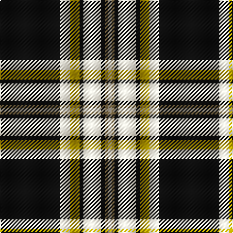

In pattern [KWYKWKYW](/patterns/kwykwkyw/).

This was sourced from tartans-authority.  It is a [8 stripes tartan](/stripes/stripes8/).

Original link http://www.tartansauthority.com/tartan-ferret/display/8136/

## Thread count
K/62 W10 Y10 K4 W18 K4 LT3 W/4

## Palette
Each colour and its ΔE from the base-6 reference it is a variant of.

| Colour | Shade | Base | ΔE (OKLab) |
|---|---|---|---|
| K | <code style="background-color:#101010;">#101010</code> `#101010` | K <code style="background-color:#000000;">#000000</code> | 0.17 |
| LT | <code style="background-color:#A08858;">#A08858</code> `#A08858` | Y <code style="background-color:#E8C000;">#E8C000</code> | 0.21 |
| W | <code style="background-color:#F0E4CC;">#F0E4CC</code> `#F0E4CC` | W <code style="background-color:#F4F4F0;">#F4F4F0</code> | 0.05 |
| Y | <code style="background-color:#E8C000;">#E8C000</code> `#E8C000` | Y <code style="background-color:#E8C000;">#E8C000</code> | 0.00 |

# Sample pattern

ID: /setts/s8/k62w10y10k4w18k4ya3w4-k101010-wf0e4cc-ye8c000-yaa08858/
