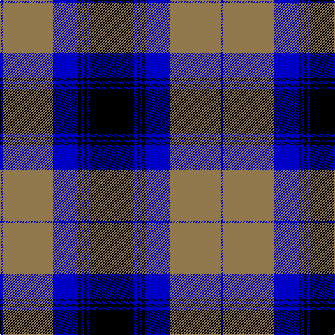

In pattern [BRBKBKBK](/patterns/brbkbkbk/).

This was sourced from tartans-authority.  It is a [8 stripes tartan](/stripes/stripes8/).

Original link http://www.tartansauthority.com/tartan-ferret/display/5326/

## Thread count
B/4 LT72 B36 K4 B4 K4 B4 K/64

## Palette
Each colour and its ΔE from the base-6 reference it is a variant of.

| Colour | Shade | Base | ΔE (OKLab) |
|---|---|---|---|
| B | <code style="background-color:#0000C4;">#0000C4</code> `#0000C4` | B <code style="background-color:#2C4084;">#2C4084</code> | 0.14 |
| K | <code style="background-color:#000000;">#000000</code> `#000000` | K <code style="background-color:#000000;">#000000</code> | 0.00 |
| LT | <code style="background-color:#90784C;">#90784C</code> `#90784C` | R <code style="background-color:#C80000;">#C80000</code> | 0.19 |

# Sample pattern

## Nearest tartans

The nearest existing variants by ΔTartan distance.

1. [Hakkarain (Personal)](/setts/s6/k74w36ka74r4ka4r4-k000040-ka101010-rc80000-we0e0e0/) — ΔT 1.18
1. [Napier](/setts/s11/k8y4k4y4k4y8k4y4k8b24y2-b000052-k000000-yaaaaaa/) — ΔT 1.24
1. [Napier](/setts/s11/k4w4k4w4k4w8k4w4k8b24w2-b000064-k000000-wd0d0d0/) — ΔT 1.27
1. [Meoni (Personal)](/setts/s7/b2g2b36g24k36r2k2-b2c2c80-g006818-k000000-rc80000/) — ΔT 1.36
1. [Hebridean Old](/setts/s9/b4k4b36ba2k26ba2g32b6k4-b304080-ba8080d0-g008000-k000000/) — ΔT 1.37
1. [Rangers F.C.](/setts/s11/r6g28k24b80k24g4k4g4k4g14r6-b304080-g30a010-k000000-rc00020/) — ΔT 1.45
1. [Scottish Knights Templar, of M.T.S. International](/setts/s9/r6b40k12w10k8w6k4r2b4-b304080-k000000-rc00000-we0e0e0/) — ΔT 1.45
1. [Napier](/setts/s11/k8w4k4w4k4w8k4w4k8b24w2-b304080-k000000-we0e0e0/) — ΔT 1.46
1. [Hebridean Old](/setts/s8/b4k4b36k26b2g32b2k4-b5480b0-g008000-k000000/) — ΔT 1.50
1. [Kerr, hunting](/setts/s10/g28k4g4k4g6k20b32k2b4k4-b304080-g008000-k000000/) — ΔT 1.50

## Neighbour map

Every grey dot is one of 15726 variants placed by the first two principal components of the ΔTartan feature space (44% of its variance). Red is this tartan; blue dots are its nearest — click one to open its page.

<svg viewBox="0 0 640 380" role="img" style="max-width:100%;height:auto;border:1px solid #e0e0e0;border-radius:4px;display:block" xmlns="http://www.w3.org/2000/svg"><image href="/nn/cloud.v1.png" width="640" height="380"/><a href="/setts/s6/k74w36ka74r4ka4r4-k000040-ka101010-rc80000-we0e0e0/"><circle cx="219.3" cy="171.5" r="4" fill="#3465a4"><title>Hakkarain (Personal)</title></circle></a><a href="/setts/s11/k8y4k4y4k4y8k4y4k8b24y2-b000052-k000000-yaaaaaa/"><circle cx="189.8" cy="184.6" r="4" fill="#3465a4"><title>Napier</title></circle></a><a href="/setts/s11/k4w4k4w4k4w8k4w4k8b24w2-b000064-k000000-wd0d0d0/"><circle cx="171.6" cy="174.1" r="4" fill="#3465a4"><title>Napier</title></circle></a><a href="/setts/s7/b2g2b36g24k36r2k2-b2c2c80-g006818-k000000-rc80000/"><circle cx="227.0" cy="174.9" r="4" fill="#3465a4"><title>Meoni (Personal)</title></circle></a><a href="/setts/s9/b4k4b36ba2k26ba2g32b6k4-b304080-ba8080d0-g008000-k000000/"><circle cx="215.3" cy="158.1" r="4" fill="#3465a4"><title>Hebridean Old</title></circle></a><a href="/setts/s11/r6g28k24b80k24g4k4g4k4g14r6-b304080-g30a010-k000000-rc00020/"><circle cx="216.4" cy="128.7" r="4" fill="#3465a4"><title>Rangers F.C.</title></circle></a><a href="/setts/s9/r6b40k12w10k8w6k4r2b4-b304080-k000000-rc00000-we0e0e0/"><circle cx="240.5" cy="136.2" r="4" fill="#3465a4"><title>Scottish Knights Templar, of M.T.S. International</title></circle></a><a href="/setts/s11/k8w4k4w4k4w8k4w4k8b24w2-b304080-k000000-we0e0e0/"><circle cx="178.8" cy="174.2" r="4" fill="#3465a4"><title>Napier</title></circle></a><a href="/setts/s8/b4k4b36k26b2g32b2k4-b5480b0-g008000-k000000/"><circle cx="227.5" cy="173.6" r="4" fill="#3465a4"><title>Hebridean Old</title></circle></a><a href="/setts/s10/g28k4g4k4g6k20b32k2b4k4-b304080-g008000-k000000/"><circle cx="212.4" cy="176.4" r="4" fill="#3465a4"><title>Kerr, hunting</title></circle></a><circle cx="235.8" cy="163.7" r="5" fill="#c00000"/></svg>

ID: /setts/s8/k64b4k4b4k4b36r72b4-b0000c4-k000000-r90784c/
