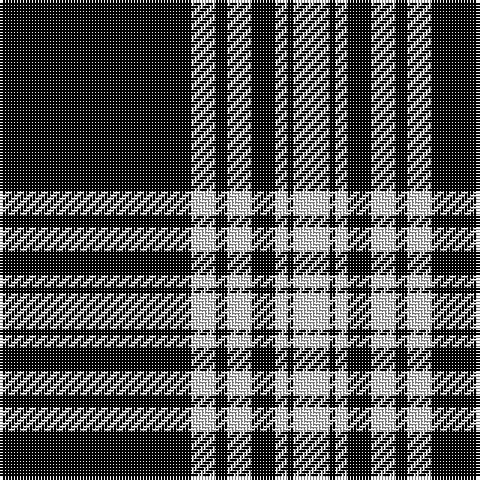

In pattern [KWKWKWKW](/patterns/kwkwkwkw/).

This was sourced from weddslist.  It is a [8 stripes tartan](/stripes/stripes8/).

Original link http://www.weddslist.com/cgi-bin/tartans/pg.pl?source=sts

## Thread count
K/64 LN8 K4 LN8 K8 LN4 K2 LN/12

## Palette
Each colour and its ΔE from the base-6 reference it is a variant of.

| Colour | Shade | Base | ΔE (OKLab) |
|---|---|---|---|
| K | <code style="background-color:#000000;">#000000</code> `#000000` | K <code style="background-color:#000000;">#000000</code> | 0.00 |
| LN | <code style="background-color:#E0E0E0;">#E0E0E0</code> `#E0E0E0` | W <code style="background-color:#F7F7F7;">#F7F7F7</code> | 0.07 |

# Sample pattern

## Nearest tartans

The nearest existing variants by ΔTartan distance.

1. [Menzies B/W Clan Tartan Tartan Number: 1244. Earliest known date: 1934 Not the tartan in Wilsons pattern books See products available Copyright © Blair Urquhart, Comrie, 2015](/setts/s8/k64w8k4w8k8w4k2w12-k101010-we0e0e0/) — ΔT 1.06
1. [Stewart Mourning](/setts/s12/k86w8k12w4k6w4k6w18k10w6k6w6-k000000-we0e0e0/) — ΔT 1.10
1. [Bargain Booze](/setts/s7/k150w12k10w36k4w4k6-k101010-wc0c0c0/) — ΔT 1.14
1. [Royal Stuart / Stewart](/setts/s11/k72w8k12w2k2w2k2w16k8w2k12-k000000-we0e0e0/) — ΔT 1.28
1. [Royal Stewart B & W (Universal?)](/setts/s11/k72w8k12w2k2w2k2w16k8w2k12-k101010-wfcfcfc/) — ΔT 1.38
1. [Stuart/Stewart Mourning](/setts/s12/k86w8k12w4k6w4k6w18k10w6k6w6-k101010-we0e0e0/) — ΔT 1.42
1. [Mull Rugby Club](/setts/s8/k88r4w20r6k12r2w4k36-k101010-rdc0000-wffffff/) — ΔT 1.49
1. [Menzies (1938)](/setts/s8/k144w16k12w16k24w8k4w48-k101010-wfcfcfc/) — ΔT 1.53
1. [Black Isle Corporate Tartan Tartan Number: 6183. Earliest known date: 15/07/2003 Designed for Black Isle Pewter Limited by Robert Howarth Guibal of Black Isle Pewter. Threadcount taken from a Marton Mills swatch book. See products available Copyright © Blair Urquhart, Comrie, 2015](/setts/s6/k96r44k20r20k4r8-k000000-r8e8e8e/) — ΔT 1.55
1. [Erck, Georges van (Personal),](/setts/s8/k76y2w14y2k8y4k6y4-k1c1714-we5e0d2-ye0a126/) — ΔT 1.60

## Neighbour map

Every grey dot is one of 15726 variants placed by the first two principal components of the ΔTartan feature space (44% of its variance). Red is this tartan; blue dots are its nearest — click one to open its page.

<svg viewBox="0 0 640 380" role="img" style="max-width:100%;height:auto;border:1px solid #e0e0e0;border-radius:4px;display:block" xmlns="http://www.w3.org/2000/svg"><image href="/nn/cloud.v1.png" width="640" height="380"/><a href="/setts/s8/k64w8k4w8k8w4k2w12-k101010-we0e0e0/"><circle cx="479.2" cy="146.0" r="4" fill="#3465a4"><title>Menzies B/W Clan Tartan Tartan Number: 1244. Earliest known date: 1934 Not the tartan in Wilsons pattern books See products available Copyright © Blair Urquhart, Comrie, 2015</title></circle></a><a href="/setts/s12/k86w8k12w4k6w4k6w18k10w6k6w6-k000000-we0e0e0/"><circle cx="477.5" cy="143.8" r="4" fill="#3465a4"><title>Stewart Mourning</title></circle></a><a href="/setts/s7/k150w12k10w36k4w4k6-k101010-wc0c0c0/"><circle cx="547.0" cy="148.7" r="4" fill="#3465a4"><title>Bargain Booze</title></circle></a><a href="/setts/s11/k72w8k12w2k2w2k2w16k8w2k12-k000000-we0e0e0/"><circle cx="538.4" cy="134.2" r="4" fill="#3465a4"><title>Royal Stuart / Stewart</title></circle></a><a href="/setts/s11/k72w8k12w2k2w2k2w16k8w2k12-k101010-wfcfcfc/"><circle cx="535.7" cy="126.5" r="4" fill="#3465a4"><title>Royal Stewart B &amp; W (Universal?)</title></circle></a><a href="/setts/s12/k86w8k12w4k6w4k6w18k10w6k6w6-k101010-we0e0e0/"><circle cx="479.3" cy="139.0" r="4" fill="#3465a4"><title>Stuart/Stewart Mourning</title></circle></a><a href="/setts/s8/k88r4w20r6k12r2w4k36-k101010-rdc0000-wffffff/"><circle cx="527.5" cy="133.1" r="4" fill="#3465a4"><title>Mull Rugby Club</title></circle></a><a href="/setts/s8/k144w16k12w16k24w8k4w48-k101010-wfcfcfc/"><circle cx="450.7" cy="142.3" r="4" fill="#3465a4"><title>Menzies (1938)</title></circle></a><a href="/setts/s6/k96r44k20r20k4r8-k000000-r8e8e8e/"><circle cx="411.0" cy="200.3" r="4" fill="#3465a4"><title>Black Isle Corporate Tartan Tartan Number: 6183. Earliest known date: 15/07/2003 Designed for Black Isle Pewter Limited by Robert Howarth Guibal of Black Isle Pewter. Threadcount taken from a Marton Mills swatch book. See products available Copyright © Blair Urquhart, Comrie, 2015</title></circle></a><a href="/setts/s8/k76y2w14y2k8y4k6y4-k1c1714-we5e0d2-ye0a126/"><circle cx="529.4" cy="121.1" r="4" fill="#3465a4"><title>Erck, Georges van (Personal),</title></circle></a><circle cx="477.7" cy="150.8" r="5" fill="#c00000"/></svg>

ID: /setts/s8/k64w8k4w8k8w4k2w12-k000000-we0e0e0/
