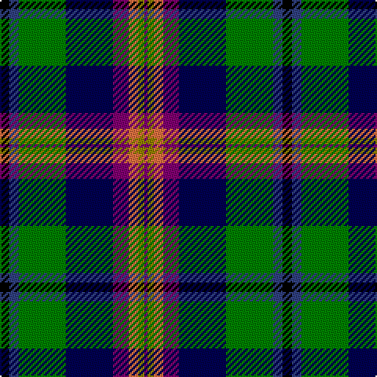

In pattern [BGRBBGBK](/patterns/bgrbbgbk/).

This was sourced from weddslist.  It is a [8 stripes tartan](/stripes/stripes8/).

Original link http://www.weddslist.com/cgi-bin/tartans/pg.pl?source=sts

## Thread count
K/6 B6 G30 DB30 P10 O6 LG4 P/2

## Palette
Each colour and its ΔE from the base-6 reference it is a variant of.

| Colour | Shade | Base | ΔE (OKLab) |
|---|---|---|---|
| B | <code style="background-color:#304080;">#304080</code> `#304080` | B <code style="background-color:#2C4084;">#2C4084</code> | 0.01 |
| DB | <code style="background-color:#000050;">#000050</code> `#000050` | B <code style="background-color:#2C4084;">#2C4084</code> | 0.20 |
| G | <code style="background-color:#008000;">#008000</code> `#008000` | G <code style="background-color:#006400;">#006400</code> | 0.09 |
| K | <code style="background-color:#000000;">#000000</code> `#000000` | K <code style="background-color:#000000;">#000000</code> | 0.00 |
| LG | <code style="background-color:#908000;">#908000</code> `#908000` | G <code style="background-color:#006400;">#006400</code> | 0.19 |
| O | <code style="background-color:#F07040;">#F07040</code> `#F07040` | R <code style="background-color:#C80000;">#C80000</code> | 0.18 |
| P | <code style="background-color:#800070;">#800070</code> `#800070` | B <code style="background-color:#2C4084;">#2C4084</code> | 0.17 |

# Sample pattern

## Nearest tartans

The nearest existing variants by ΔTartan distance.

1. [Young Family Tartan Tartan Number: 2048. Earliest known date: 1991 Based on the Christina Young blanket dating from 1726 and preserved at the Scottish Tartans Society museum in Keith, Banffshire. The design retains the unusual purple - yellow - orange box check of the original blanket and changes only the ground colour to the greens and blues of the Douglas tartan. There are 7 colours. Black is normally replaced by dark blue in commercial weaving. See products available Copyright © Blair Urquhart, Comrie, 2015](/setts/s8/k6b6g30ba30r10y6ya4r2-b2c2c80-ba202060-g006818-k101010-rb468ac-yd87c00-yae8c000/) — ΔT 0.76
1. [Julien Pigeut Tartan Tartan Number: 6574. Earliest known date: 2004 For the wedding of Julien and Sylvia Piguet. Also worn by Roland Mathez best man of Julien. See products available Copyright © Blair Urquhart, Comrie, 2015](/setts/s8/k40b15r10y3ba5w5bb10ba20-b5c5c5c-ba2888c4-bb2c2c80-k101010-r888888-we0e0e0-ye8c000/) — ΔT 0.81
1. [Colorado (District)](/setts/s9/g64w6b6w6g4k40ba34r6y8-b9c58bc-ba38409c-g004828-k000000-rd40000-wc8c8c8-ye8c000/) — ΔT 0.83
1. [Iowa (District)](/setts/s8/r8y6g24k32ga10b40k8w4-b2c2c80-g006818-ga604000-k101010-rc80000-wf8f8f8-ye8c000/) — ΔT 0.95
1. [Scotland's International - Home (Fas](/setts/s10/b48k48ka4w12ka4y4ka32wa10r12w4-b344454-k00002c-ka101010-rc80000-we0e0e0-wa98c8e8-ye8c000/) — ΔT 1.00
1. [Whitson Family Tartan Tartan Number: 1422. Earliest known date: 1984 UK Design No 514358 See products available Copyright © Blair Urquhart, Comrie, 2015](/setts/s9/w8k2g38y2k38b26r4b8r4-b2c2c80-g006818-k101010-rc80000-we0e0e0-ye8c000/) — ΔT 1.05
1. [Bullman (Name)](/setts/s10/g4y2g26ga4g2k24b20r2b2w4-b202060-g006818-ga789484-k101010-rc80000-we0e0e0-yd8b000/) — ΔT 1.06
1. [Carnegie of Skibo Corporate Tartan Tartan Number: 8314. Earliest known date: December 2001 Only available from Robert Mathieson, The Kilt Centre, 1 Campbell Lane, Hamilton. ML3 6DB. Scotland. Tel: +44 (0)1698 200 234. e-mail: kiltcentre@btconnect.com Lochcarron swatch. A corporate tartan for use in kilt hire. The name was chosen to imbue the tartan with some relevant provenance - Andrew Carnegie's retirement residence. See products available Copyright © Blair Urquhart, Comrie, 2015](/setts/s11/w6b10wa4b18ba20k4ba10k10g18ga62w4-b2c2c80-ba750c69-g0a3321-ga006818-k080808-we0e0e0-wa0ce1d7/) — ΔT 1.12
1. [Loch Awe](/setts/s9/b6k4r6g40k48ba40r6k4y6-b778899-ba0000cd-g008b00-k101010-rff0000-yffe600/) — ΔT 1.13
1. [Harvey of Cornwall (Personal)](/setts/s7/w10k52b52g24y10g5r5-b2c4084-g003c14-k101010-rdc0000-we0e0e0-ye8c000/) — ΔT 1.13

## Neighbour map

Every grey dot is one of 15726 variants placed by the first two principal components of the ΔTartan feature space (44% of its variance). Red is this tartan; blue dots are its nearest — click one to open its page.

<svg viewBox="0 0 640 380" role="img" style="max-width:100%;height:auto;border:1px solid #e0e0e0;border-radius:4px;display:block" xmlns="http://www.w3.org/2000/svg"><image href="/nn/cloud.v1.png" width="640" height="380"/><a href="/setts/s8/k6b6g30ba30r10y6ya4r2-b2c2c80-ba202060-g006818-k101010-rb468ac-yd87c00-yae8c000/"><circle cx="112.6" cy="128.8" r="4" fill="#3465a4"><title>Young Family Tartan Tartan Number: 2048. Earliest known date: 1991 Based on the Christina Young blanket dating from 1726 and preserved at the Scottish Tartans Society museum in Keith, Banffshire. The design retains the unusual purple - yellow - orange box check of the original blanket and changes only the ground colour to the greens and blues of the Douglas tartan. There are 7 colours. Black is normally replaced by dark blue in commercial weaving. See products available Copyright © Blair Urquhart, Comrie, 2015</title></circle></a><a href="/setts/s8/k40b15r10y3ba5w5bb10ba20-b5c5c5c-ba2888c4-bb2c2c80-k101010-r888888-we0e0e0-ye8c000/"><circle cx="102.7" cy="133.4" r="4" fill="#3465a4"><title>Julien Pigeut Tartan Tartan Number: 6574. Earliest known date: 2004 For the wedding of Julien and Sylvia Piguet. Also worn by Roland Mathez best man of Julien. See products available Copyright © Blair Urquhart, Comrie, 2015</title></circle></a><a href="/setts/s9/g64w6b6w6g4k40ba34r6y8-b9c58bc-ba38409c-g004828-k000000-rd40000-wc8c8c8-ye8c000/"><circle cx="129.0" cy="106.0" r="4" fill="#3465a4"><title>Colorado (District)</title></circle></a><a href="/setts/s8/r8y6g24k32ga10b40k8w4-b2c2c80-g006818-ga604000-k101010-rc80000-wf8f8f8-ye8c000/"><circle cx="76.4" cy="154.0" r="4" fill="#3465a4"><title>Iowa (District)</title></circle></a><a href="/setts/s10/b48k48ka4w12ka4y4ka32wa10r12w4-b344454-k00002c-ka101010-rc80000-we0e0e0-wa98c8e8-ye8c000/"><circle cx="58.7" cy="115.0" r="4" fill="#3465a4"><title>Scotland's International - Home (Fas</title></circle></a><a href="/setts/s9/w8k2g38y2k38b26r4b8r4-b2c2c80-g006818-k101010-rc80000-we0e0e0-ye8c000/"><circle cx="138.3" cy="124.8" r="4" fill="#3465a4"><title>Whitson Family Tartan Tartan Number: 1422. Earliest known date: 1984 UK Design No 514358 See products available Copyright © Blair Urquhart, Comrie, 2015</title></circle></a><a href="/setts/s10/g4y2g26ga4g2k24b20r2b2w4-b202060-g006818-ga789484-k101010-rc80000-we0e0e0-yd8b000/"><circle cx="131.1" cy="118.8" r="4" fill="#3465a4"><title>Bullman (Name)</title></circle></a><a href="/setts/s11/w6b10wa4b18ba20k4ba10k10g18ga62w4-b2c2c80-ba750c69-g0a3321-ga006818-k080808-we0e0e0-wa0ce1d7/"><circle cx="127.6" cy="105.0" r="4" fill="#3465a4"><title>Carnegie of Skibo Corporate Tartan Tartan Number: 8314. Earliest known date: December 2001 Only available from Robert Mathieson, The Kilt Centre, 1 Campbell Lane, Hamilton. ML3 6DB. Scotland. Tel: +44 (0)1698 200 234. e-mail: kiltcentre@btconnect.com Lochcarron swatch. A corporate tartan for use in kilt hire. The name was chosen to imbue the tartan with some relevant provenance - Andrew Carnegie's retirement residence. See products available Copyright © Blair Urquhart, Comrie, 2015</title></circle></a><a href="/setts/s9/b6k4r6g40k48ba40r6k4y6-b778899-ba0000cd-g008b00-k101010-rff0000-yffe600/"><circle cx="114.5" cy="133.0" r="4" fill="#3465a4"><title>Loch Awe</title></circle></a><a href="/setts/s7/w10k52b52g24y10g5r5-b2c4084-g003c14-k101010-rdc0000-we0e0e0-ye8c000/"><circle cx="118.4" cy="165.2" r="4" fill="#3465a4"><title>Harvey of Cornwall (Personal)</title></circle></a><circle cx="96.2" cy="124.9" r="5" fill="#c00000"/></svg>

ID: /setts/s8/k6b6g30ba30bb10r6ga4bb2-b304080-ba000050-bb800070-g008000-ga908000-k000000-rf07040/
