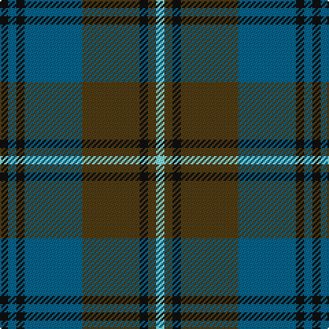

In pattern [KBKBGKGW](/patterns/kbkbgkgw/).

This was sourced from register-of-tartans.  It is a [8 stripes tartan](/stripes/stripes8/).

Original link https://www.tartanregister.gov.uk/tartanDetails.aspx?ref=131

## Thread count
K/6 B6 K6 B42 T42 K6 T6 LB/6

## Palette
Each colour and its ΔE from the base-6 reference it is a variant of.

| Colour | Shade | Base | ΔE (OKLab) |
|---|---|---|---|
| B | <code style="background-color:#07648C;">#07648C</code> `#07648C` | B <code style="background-color:#2C4084;">#2C4084</code> | 0.10 |
| Ba | <code style="background-color:#3C82AF;">#3C82AF</code> `#3C82AF` | B <code style="background-color:#2C4084;">#2C4084</code> | 0.20 |
| K | <code style="background-color:#101010;">#101010</code> `#101010` | K <code style="background-color:#000000;">#000000</code> | 0.17 |
| LB | <code style="background-color:#82F5FA;">#82F5FA</code> `#82F5FA` | W <code style="background-color:#F4F4F0;">#F4F4F0</code> | 0.12 |
| T | <code style="background-color:#503C14;">#503C14</code> `#503C14` | G <code style="background-color:#006400;">#006400</code> | 0.15 |

# Sample pattern

## Nearest tartans

The nearest existing variants by ΔTartan distance.

1. [Auld Lang Syne Burns Commemorative Tartan Tartan Number: 2400. Earliest known date: 01/01/2002 Launched on the 25th January at a the Beach Ballroom Aberdeen, to celebrate the birth of Robert Burns 2002./Threadcount and colours aren't 100% original. Generated manually./ See products available Copyright © Blair Urquhart, Comrie, 2015](/setts/s8/k6b6k6b48ba48k6ba6w6-b205d7a-ba351d00-k090700-wa7eae1/) — ΔT 0.72
1. [Hebridean 1](/setts/s9/b4r6g22r6b4ba4b22r4g4-b304080-ba5480b0-g008000-r900030/) — ΔT 0.87
1. [Stewart of Appin Htg (error)](/setts/s10/g16r6g6r10g52b14ba6b56r6b12-b2c2c80-ba5c8ca8-g006818-rc80000/) — ΔT 0.89
1. [Beck-McSorley](/setts/s8/r6g6r6g42ra42r6ra6rb6-g003820-r9c68a4-ra888888-rbe87878/) — ΔT 0.91
1. [Antrim, County](/setts/s10/g10b4g36y4b10y4r10b34g4y8-b14283c-g406054-rc04c08-ybc8c00/) — ΔT 0.92
1. [Speyside Blue (Fashion)](/setts/s8/b64k6b6k6ba10k16r42k8-b5c5c5c-ba1474b4-k101010-r888888/) — ΔT 0.94
1. [Cahonas Scotland](/setts/s9/b10w6b46k50b8ba46k6ba6k10-b646464-ba1870a4-k101010-wc8c8c8/) — ΔT 0.96
1. [Lamont](/setts/s8/b40k4b4k4b8k32g40w4-b2c4084-g005020-k101010-we0e0e0/) — ΔT 1.01
1. [Graden (Personal)](/setts/s9/b44g8k8g28w6g8w6g8k6-b203078-g006818-k101010-wc0c0c0/) — ΔT 1.02
1. [Durie (Clan)](/setts/s9/b48r4b4r4b4r16g48y4g8-b202060-g006818-r880000-ye8c000/) — ΔT 1.03

## Neighbour map

Every grey dot is one of 15726 variants placed by the first two principal components of the ΔTartan feature space (44% of its variance). Red is this tartan; blue dots are its nearest — click one to open its page.

<svg viewBox="0 0 640 380" role="img" style="max-width:100%;height:auto;border:1px solid #e0e0e0;border-radius:4px;display:block" xmlns="http://www.w3.org/2000/svg"><image href="/nn/cloud.v1.png" width="640" height="380"/><a href="/setts/s8/k6b6k6b48ba48k6ba6w6-b205d7a-ba351d00-k090700-wa7eae1/"><circle cx="251.4" cy="201.2" r="4" fill="#3465a4"><title>Auld Lang Syne Burns Commemorative Tartan Tartan Number: 2400. Earliest known date: 01/01/2002 Launched on the 25th January at a the Beach Ballroom Aberdeen, to celebrate the birth of Robert Burns 2002./Threadcount and colours aren't 100% original. Generated manually./ See products available Copyright © Blair Urquhart, Comrie, 2015</title></circle></a><a href="/setts/s9/b4r6g22r6b4ba4b22r4g4-b304080-ba5480b0-g008000-r900030/"><circle cx="209.1" cy="224.6" r="4" fill="#3465a4"><title>Hebridean 1</title></circle></a><a href="/setts/s10/g16r6g6r10g52b14ba6b56r6b12-b2c2c80-ba5c8ca8-g006818-rc80000/"><circle cx="267.7" cy="194.1" r="4" fill="#3465a4"><title>Stewart of Appin Htg (error)</title></circle></a><a href="/setts/s8/r6g6r6g42ra42r6ra6rb6-g003820-r9c68a4-ra888888-rbe87878/"><circle cx="232.6" cy="200.5" r="4" fill="#3465a4"><title>Beck-McSorley</title></circle></a><a href="/setts/s10/g10b4g36y4b10y4r10b34g4y8-b14283c-g406054-rc04c08-ybc8c00/"><circle cx="245.7" cy="201.3" r="4" fill="#3465a4"><title>Antrim, County</title></circle></a><a href="/setts/s8/b64k6b6k6ba10k16r42k8-b5c5c5c-ba1474b4-k101010-r888888/"><circle cx="263.6" cy="193.3" r="4" fill="#3465a4"><title>Speyside Blue (Fashion)</title></circle></a><a href="/setts/s9/b10w6b46k50b8ba46k6ba6k10-b646464-ba1870a4-k101010-wc8c8c8/"><circle cx="194.4" cy="202.7" r="4" fill="#3465a4"><title>Cahonas Scotland</title></circle></a><a href="/setts/s8/b40k4b4k4b8k32g40w4-b2c4084-g005020-k101010-we0e0e0/"><circle cx="239.3" cy="213.2" r="4" fill="#3465a4"><title>Lamont</title></circle></a><a href="/setts/s9/b44g8k8g28w6g8w6g8k6-b203078-g006818-k101010-wc0c0c0/"><circle cx="213.1" cy="205.5" r="4" fill="#3465a4"><title>Graden (Personal)</title></circle></a><a href="/setts/s9/b48r4b4r4b4r16g48y4g8-b202060-g006818-r880000-ye8c000/"><circle cx="263.1" cy="178.3" r="4" fill="#3465a4"><title>Durie (Clan)</title></circle></a><circle cx="240.0" cy="211.3" r="5" fill="#c00000"/></svg>

ID: /setts/s8/k6b6k6b42g42k6g6w6-b07648c-g503c14-k101010-w82f5fa/
