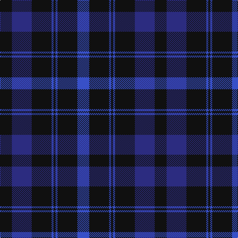

In pattern [BKBKBKBK](/stripes/bkbkbkbk/).

This was sourced from register-of-tartans.  It is a [8 stripe tartan](/stripes/stripes8/).

Original link https://www.tartanregister.gov.uk/tartanDetails.aspx?ref=3211

## Attestations

This cloth appears in 2 source records; the oldest owns this page.

- 01/01/1983 — Oban (register-of-tartans, [record](https://www.tartanregister.gov.uk/tartanDetails.aspx?ref=3211))
- pre 1983 — Oban (Fashion) (tartans-authority, [record](http://www.tartansauthority.com/tartan-ferret/display/5529/))

## Register references

External register numbers recorded for this tartan.

- Scottish Register of Tartans: [3211](https://www.tartanregister.gov.uk/tartanDetails.aspx?ref=3211)
- Scottish Tartans Authority (ITI): 5529

## Thread count
K/24 DBa40 K40 B4 K4 B4 K40 B/24

## Palette
Each colour and its ΔE from the base-6 reference it is a variant of.

| Colour | Shade | Base | ΔE (OKLab) |
|---|---|---|---|
| B | <code style="background-color:#3850C8;">#3850C8</code> `#3850C8` | B <code style="background-color:#2A418A;">#2A418A</code> | 0.11 |
| Ba | <code style="background-color:#1474B4;">#1474B4</code> `#1474B4` | B <code style="background-color:#2A418A;">#2A418A</code> | 0.15 |
| DB | <code style="background-color:#003C64;">#003C64</code> `#003C64` | B <code style="background-color:#2A418A;">#2A418A</code> | 0.08 |
| DBa | <code style="background-color:#2C2C80;">#2C2C80</code> `#2C2C80` | B <code style="background-color:#2A418A;">#2A418A</code> | 0.06 |
| K | <code style="background-color:#101010;">#101010</code> `#101010` | K <code style="background-color:#000000;">#000000</code> | 0.17 |

# Sample pattern

## Nearest tartans

The nearest existing variants by ΔTartan distance.

1. [Marchmont (Personal)](/setts/s7/k1db12k12g1k12db12g1~x4/) — ΔT 1.06
1. [Royal Scotsman Train (Corporate)](/setts/s6/db5k2db14k14db2lr2~x2/) — ΔT 1.16
1. [Perthshire, New /Tourist Board](/setts/s6/db37r10dg22db11dg3r3~x2/) — ΔT 1.19
1. [Morgan (MacKay Blue) Clan Tartan Tartan Number: 264. Earliest known date: 1842 The design comes from the Vestiarium Scoticum (1842). The authors, the Sobieski Stuart brothers, enjoyed a popular following among the Scottish gentry in the early Victorian era, and in the spirit of the times, added mystery, romance and some spurious historical documentation to the subject of tartan. Of the better known tartans, the book offers some minor variation, but in other cases it provides the only recorded version of many tartans in use today. See products available Copyright © Blair Urquhart, Comrie, 2015](/setts/s6/db1k3db1k3db8r1~x4/) — ΔT 1.20
1. [Pride of Kinross](/setts/s8/k20db2k6db2k4db27w2db8~x2/) — ΔT 1.36
1. [Van Loo Tartan Tartan Number: 6717. Earliest known date: pre 2005 Nothing See products available Copyright © Blair Urquhart, Comrie, 2015](/setts/s7/t5db30k25t5db30dp3t5~x2/) — ΔT 1.41
1. [Scottish Nuclear](/setts/s6/db9k4lb1k4db9r1~x4/) — ΔT 1.42
1. [MacKay (Blue) #2](/setts/s5/k15db4k15db28r2~x2/) — ΔT 1.42
1. [Marchmont (Personal)](/setts/s12/db12k12g1k12db12g1db12k12g1k12db12k1~x4/) — ΔT 1.42
1. [Pringle, James (Fashion)](/setts/s7/db20dp2db3dp2db14g18db4~x2/) — ΔT 1.50

## Neighbour map

Every grey dot is one of 14299 variants placed by the first two principal components of the ΔTartan feature space (44% of its variance). Red is this tartan; blue dots are its nearest — click one to open its page.

<svg viewBox="0 0 640 380" role="img" style="max-width:100%;height:auto;border:1px solid #e0e0e0;border-radius:4px;display:block" xmlns="http://www.w3.org/2000/svg"><image href="/nn/cloud.v1.png" width="640" height="380"/><a href="/setts/s7/k1db12k12g1k12db12g1~x4/"><circle cx="366.9" cy="264.5" r="4" fill="#3465a4"><title>Marchmont (Personal)</title></circle></a><a href="/setts/s6/db5k2db14k14db2lr2~x2/"><circle cx="353.1" cy="270.6" r="4" fill="#3465a4"><title>Royal Scotsman Train (Corporate)</title></circle></a><a href="/setts/s6/db37r10dg22db11dg3r3~x2/"><circle cx="387.9" cy="265.7" r="4" fill="#3465a4"><title>Perthshire, New /Tourist Board</title></circle></a><a href="/setts/s6/db1k3db1k3db8r1~x4/"><circle cx="404.3" cy="271.9" r="4" fill="#3465a4"><title>Morgan (MacKay Blue) Clan Tartan Tartan Number: 264. Earliest known date: 1842 The design comes from the Vestiarium Scoticum (1842). The authors, the Sobieski Stuart brothers, enjoyed a popular following among the Scottish gentry in the early Victorian era, and in the spirit of the times, added mystery, romance and some spurious historical documentation to the subject of tartan. Of the better known tartans, the book offers some minor variation, but in other cases it provides the only recorded version of many tartans in use today. See products available Copyright © Blair Urquhart, Comrie, 2015</title></circle></a><a href="/setts/s8/k20db2k6db2k4db27w2db8~x2/"><circle cx="389.9" cy="221.9" r="4" fill="#3465a4"><title>Pride of Kinross</title></circle></a><a href="/setts/s7/t5db30k25t5db30dp3t5~x2/"><circle cx="349.2" cy="240.3" r="4" fill="#3465a4"><title>Van Loo Tartan Tartan Number: 6717. Earliest known date: pre 2005 Nothing See products available Copyright © Blair Urquhart, Comrie, 2015</title></circle></a><a href="/setts/s6/db9k4lb1k4db9r1~x4/"><circle cx="382.3" cy="257.2" r="4" fill="#3465a4"><title>Scottish Nuclear</title></circle></a><a href="/setts/s5/k15db4k15db28r2~x2/"><circle cx="378.4" cy="270.1" r="4" fill="#3465a4"><title>MacKay (Blue) #2</title></circle></a><a href="/setts/s12/db12k12g1k12db12g1db12k12g1k12db12k1~x4/"><circle cx="353.1" cy="258.0" r="4" fill="#3465a4"><title>Marchmont (Personal)</title></circle></a><a href="/setts/s7/db20dp2db3dp2db14g18db4~x2/"><circle cx="434.9" cy="263.9" r="4" fill="#3465a4"><title>Pringle, James (Fashion)</title></circle></a><circle cx="367.7" cy="263.7" r="5" fill="#c00000"/></svg>

ID: /setts/s8/k6db10k10b1k1b1k10b6~x4/
