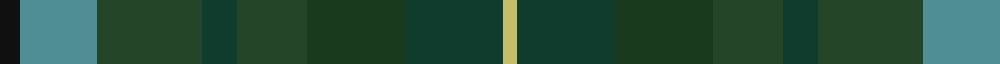
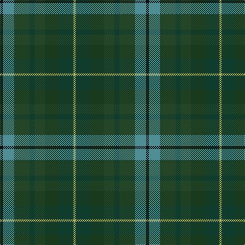

In pattern [KGGGGGGY](/patterns/kggggggy/).

This was sourced from register-of-tartans.  It is a [8 stripes tartan](/stripes/stripes8/).

Original link https://www.tartanregister.gov.uk/tartanDetails.aspx?ref=10812

## Thread count
K/6 B22 DG30 DGa10 DG20 DGb28 DGa28 LG/4

## Palette
Each colour and its ΔE from the base-6 reference it is a variant of.

| Colour | Shade | Base | ΔE (OKLab) |
|---|---|---|---|
| B | <code style="background-color:#4F8E95;">#4F8E95</code> `#4F8E95` | G <code style="background-color:#006400;">#006400</code> | 0.22 |
| DG | <code style="background-color:#244528;">#244528</code> `#244528` | G <code style="background-color:#006400;">#006400</code> | 0.12 |
| DGa | <code style="background-color:#0F3C2D;">#0F3C2D</code> `#0F3C2D` | G <code style="background-color:#006400;">#006400</code> | 0.15 |
| DGb | <code style="background-color:#193A1D;">#193A1D</code> `#193A1D` | G <code style="background-color:#006400;">#006400</code> | 0.15 |
| K | <code style="background-color:#101010;">#101010</code> `#101010` | K <code style="background-color:#000000;">#000000</code> | 0.17 |
| LG | <code style="background-color:#C4BE6A;">#C4BE6A</code> `#C4BE6A` | Y <code style="background-color:#E8C000;">#E8C000</code> | 0.07 |

# Sample pattern

## Nearest tartans

The nearest existing variants by ΔTartan distance.

1. [Linden Family Tartan Tartan Number: 5772. Earliest known date: Jan 2003 Blue and white from the saltire. Purple and green from the thistle. The name Linden is associated with the colour green. The Linden tree is a lime tree. See products available Copyright © Blair Urquhart, Comrie, 2015](/setts/s8/b8k18g40ba4ga40k10b12y4-b002c48-ba780078-g004810-ga002c18-k101010-yc0b8b4/) — ΔT 1.65
1. [Greyfriars](/setts/s11/b30r6g16ba8ga10ba14ga24y4g10ba3g28-b214ea9-ba513871-g4b3b19-ga304824-r7e1907-yda9135/) — ΔT 1.75
1. [Brocliande (Fashion))](/setts/s8/k6b22g30ga10g20gb28ga28y4-b2888c4-g5c6428-ga285800-gb003820-k101010-yd09800/) — ΔT 1.81
1. [House of Bruar](/setts/s10/b52ba56g52ba16ga6ba16g52ba56b52bb12-b4c3428-ba14283c-bb4c0000-g006818-ga8c7038/) — ΔT 1.85
1. [Baron of Crawfordjohn (Personal)](/setts/s7/b16ba20b44g14ga20g44bb6-b003c64-ba2c2c80-bb780078-g003820-ga408060/) — ΔT 1.89
1. [House of Bruar (Corporate)](/setts/s6/b12ba52bb56g52bb16ga6-b4c0000-ba4c3428-bb14283c-g006818-ga8c7038/) — ΔT 1.91
1. [Haughfoot](/setts/s10/k30b8ba30g48ga8g48ba30b8k30r8-b5c8ca8-ba14283c-g003820-ga789484-k101010-rc80000/) — ΔT 1.99
1. [Isle of Rona (District)](/setts/s6/r8b38g20ra20ga30y4-b505874-g307840-ga744c00-rc80000-ra888888-yb49830/) — ΔT 2.04
1. [Cairngorm #2](/setts/s7/b10ba8b44k30g44r8g8-b445464-ba607c88-g406454-k101010-r982c2c/) — ΔT 2.06
1. [Crawfordjohn Personal Tartan Tartan Number: 6864. Earliest known date: 2005 A tartan for the Barony of Crawfordjohn designed by the present baron, Travis K Svensson. See products available Copyright © Blair Urquhart, Comrie, 2015](/setts/s12/b20ba44g14ga20g44bb6g44ga20g14ba44b20ba16-b2c2c80-ba003c64-bb780078-g003820-ga006818/) — ΔT 2.06

## Neighbour map

Every grey dot is one of 15726 variants placed by the first two principal components of the ΔTartan feature space (44% of its variance). Red is this tartan; blue dots are its nearest — click one to open its page.

<svg viewBox="0 0 640 380" role="img" style="max-width:100%;height:auto;border:1px solid #e0e0e0;border-radius:4px;display:block" xmlns="http://www.w3.org/2000/svg"><image href="/nn/cloud.v1.png" width="640" height="380"/><a href="/setts/s8/b8k18g40ba4ga40k10b12y4-b002c48-ba780078-g004810-ga002c18-k101010-yc0b8b4/"><circle cx="193.8" cy="221.4" r="4" fill="#3465a4"><title>Linden Family Tartan Tartan Number: 5772. Earliest known date: Jan 2003 Blue and white from the saltire. Purple and green from the thistle. The name Linden is associated with the colour green. The Linden tree is a lime tree. See products available Copyright © Blair Urquhart, Comrie, 2015</title></circle></a><a href="/setts/s11/b30r6g16ba8ga10ba14ga24y4g10ba3g28-b214ea9-ba513871-g4b3b19-ga304824-r7e1907-yda9135/"><circle cx="207.7" cy="219.1" r="4" fill="#3465a4"><title>Greyfriars</title></circle></a><a href="/setts/s8/k6b22g30ga10g20gb28ga28y4-b2888c4-g5c6428-ga285800-gb003820-k101010-yd09800/"><circle cx="140.3" cy="240.7" r="4" fill="#3465a4"><title>Brocliande (Fashion))</title></circle></a><a href="/setts/s10/b52ba56g52ba16ga6ba16g52ba56b52bb12-b4c3428-ba14283c-bb4c0000-g006818-ga8c7038/"><circle cx="245.2" cy="256.9" r="4" fill="#3465a4"><title>House of Bruar</title></circle></a><a href="/setts/s7/b16ba20b44g14ga20g44bb6-b003c64-ba2c2c80-bb780078-g003820-ga408060/"><circle cx="237.3" cy="281.7" r="4" fill="#3465a4"><title>Baron of Crawfordjohn (Personal)</title></circle></a><a href="/setts/s6/b12ba52bb56g52bb16ga6-b4c0000-ba4c3428-bb14283c-g006818-ga8c7038/"><circle cx="247.7" cy="262.3" r="4" fill="#3465a4"><title>House of Bruar (Corporate)</title></circle></a><a href="/setts/s10/k30b8ba30g48ga8g48ba30b8k30r8-b5c8ca8-ba14283c-g003820-ga789484-k101010-rc80000/"><circle cx="173.7" cy="237.8" r="4" fill="#3465a4"><title>Haughfoot</title></circle></a><a href="/setts/s6/r8b38g20ra20ga30y4-b505874-g307840-ga744c00-rc80000-ra888888-yb49830/"><circle cx="187.7" cy="242.9" r="4" fill="#3465a4"><title>Isle of Rona (District)</title></circle></a><a href="/setts/s7/b10ba8b44k30g44r8g8-b445464-ba607c88-g406454-k101010-r982c2c/"><circle cx="214.4" cy="259.4" r="4" fill="#3465a4"><title>Cairngorm #2</title></circle></a><a href="/setts/s12/b20ba44g14ga20g44bb6g44ga20g14ba44b20ba16-b2c2c80-ba003c64-bb780078-g003820-ga006818/"><circle cx="246.4" cy="276.7" r="4" fill="#3465a4"><title>Crawfordjohn Personal Tartan Tartan Number: 6864. Earliest known date: 2005 A tartan for the Barony of Crawfordjohn designed by the present baron, Travis K Svensson. See products available Copyright © Blair Urquhart, Comrie, 2015</title></circle></a><circle cx="171.6" cy="261.4" r="5" fill="#c00000"/></svg>

ID: /setts/s8/k6g22ga30gb10ga20gc28gb28y4-g4f8e95-ga244528-gb0f3c2d-gc193a1d-k101010-yc4be6a/
