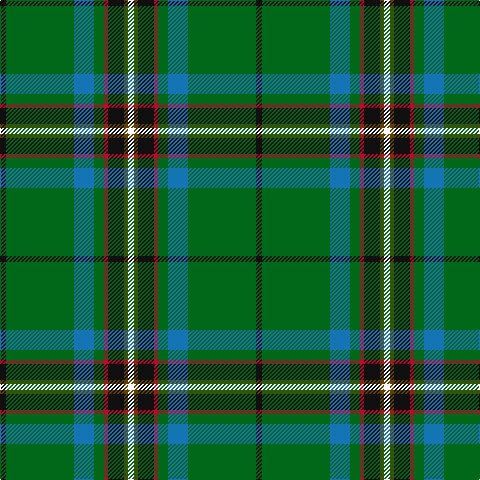

In pattern [KGBGRKGW](/patterns/kgbgrkgw/).

This was sourced from tartans-authority.  It is a [8 stripes tartan](/stripes/stripes8/).

Original link http://www.tartansauthority.com/tartan-ferret/display/10670/

## Thread count
K/6 G68 B20 G10 R4 K16 T4 W/6

## Palette
Each colour and its ΔE from the base-6 reference it is a variant of.

| Colour | Shade | Base | ΔE (OKLab) |
|---|---|---|---|
| B | <code style="background-color:#1474B4;">#1474B4</code> `#1474B4` | B <code style="background-color:#2A418A;">#2A418A</code> | 0.15 |
| G | <code style="background-color:#006818;">#006818</code> `#006818` | G <code style="background-color:#006100;">#006100</code> | 0.02 |
| K | <code style="background-color:#101010;">#101010</code> `#101010` | K <code style="background-color:#000000;">#000000</code> | 0.17 |
| R | <code style="background-color:#C8002C;">#C8002C</code> `#C8002C` | R <code style="background-color:#CC0000;">#CC0000</code> | 0.03 |
| T | <code style="background-color:#604000;">#604000</code> `#604000` | G <code style="background-color:#006100;">#006100</code> | 0.14 |
| W | <code style="background-color:#FCFCFC;">#FCFCFC</code> `#FCFCFC` | W <code style="background-color:#F7F7F7;">#F7F7F7</code> | 0.01 |

# Sample pattern

## Nearest tartans

The nearest existing variants by ΔTartan distance.

1. [U.S. Army (Military)](/setts/s6/b12k34g8ga102y6gb8-b2c2c80-g8c7038-ga006818-gb408060-k101010-ye8c000/) — ΔT 0.99
1. [Washington District Tartan Tartan Number: 2148. Earliest known date: 1988 The Washington State tartan was a project of the Vancouver U.S.A. Country Dancers. It was designed by Margaret McLeod van Nus and Frank Cannonito in order to commemorate the Washington State Centennial celebrations. Governor Booth Gardner signed the bill into law, adopting the design on behalf of the House of Representatives in 1991. The tartan is accredited by the Scottish Tartans Society. See products available Copyright © Blair Urquhart, Comrie, 2015](/setts/s7/w6r8b26g74ba6k6y4-b2c2c80-ba2888c4-g006818-k101010-rc80000-we0e0e0-ye8c000/) — ΔT 1.01
1. [Mounth, The, (rejected)](/setts/s7/g72ga10b34w4g28gb6ba4-b000050-ba800080-g008000-ga003000-gb808080-we0e0e0/) — ΔT 1.08
1. [160th SOAR(A) Night Stalkers (Mil.)](/setts/s9/k4b16k12g70k16y4w4k4y4-b1474b4-g006818-k101010-wfcfcfc-ybc8c00/) — ΔT 1.11
1. [Henderson/MacKendrick](/setts/s9/w4b24g16b4g64k4g16k24y4-b2c2c80-g006818-k101010-we0e0e0-ye8c000/) — ΔT 1.12
1. [MacKendrick](/setts/s9/w2b12g8b2g32k2g8k12y2-b2c2c80-g006818-k101010-we0e0e0-ye8c000/) — ΔT 1.12
1. [Washington](/setts/s7/w6r8b26g74ba6k6y4-b304080-ba8080d0-g008000-k000000-rc00000-we0e0e0-yf0c000/) — ΔT 1.14
1. [Carrick Hunting District Tartan Tartan Number: 721. Earliest known date: 1930 This sample comes from the MacGregor-Hastie collection which forms the basis of the cloth archive of the Scottish Tartans Society. Some of the samples, including this one, were unmarked. One can assume that the sample dates between 1930 and 1950. See products available Copyright © Blair Urquhart, Comrie, 2015](/setts/s8/g26b2g2b2g6ba10k8y4-b780078-ba2c2c80-g006818-k101010-ye8c000/) — ΔT 1.16
1. [U.S. Army](/setts/s10/k34g8ga102y6gb8y6ga102g8k34b12-b2c2c80-g8c7038-ga006818-gb408060-k101010-ye8c000/) — ΔT 1.22
1. [Bottle Green (Fashion)](/setts/s12/g60y8k12ya4k4g8k4b10ga8k4ga6g4-b2c2c80-g006818-ga808080-k101010-ya08858-yad09800/) — ΔT 1.23

## Neighbour map

Every grey dot is one of 15726 variants placed by the first two principal components of the ΔTartan feature space (44% of its variance). Red is this tartan; blue dots are its nearest — click one to open its page.

<svg viewBox="0 0 640 380" role="img" style="max-width:100%;height:auto;border:1px solid #e0e0e0;border-radius:4px;display:block" xmlns="http://www.w3.org/2000/svg"><image href="/nn/cloud.v1.png" width="640" height="380"/><a href="/setts/s6/b12k34g8ga102y6gb8-b2c2c80-g8c7038-ga006818-gb408060-k101010-ye8c000/"><circle cx="335.6" cy="154.8" r="4" fill="#3465a4"><title>U.S. Army (Military)</title></circle></a><a href="/setts/s7/w6r8b26g74ba6k6y4-b2c2c80-ba2888c4-g006818-k101010-rc80000-we0e0e0-ye8c000/"><circle cx="278.5" cy="112.1" r="4" fill="#3465a4"><title>Washington District Tartan Tartan Number: 2148. Earliest known date: 1988 The Washington State tartan was a project of the Vancouver U.S.A. Country Dancers. It was designed by Margaret McLeod van Nus and Frank Cannonito in order to commemorate the Washington State Centennial celebrations. Governor Booth Gardner signed the bill into law, adopting the design on behalf of the House of Representatives in 1991. The tartan is accredited by the Scottish Tartans Society. See products available Copyright © Blair Urquhart, Comrie, 2015</title></circle></a><a href="/setts/s7/g72ga10b34w4g28gb6ba4-b000050-ba800080-g008000-ga003000-gb808080-we0e0e0/"><circle cx="318.5" cy="148.0" r="4" fill="#3465a4"><title>Mounth, The, (rejected)</title></circle></a><a href="/setts/s9/k4b16k12g70k16y4w4k4y4-b1474b4-g006818-k101010-wfcfcfc-ybc8c00/"><circle cx="286.3" cy="131.5" r="4" fill="#3465a4"><title>160th SOAR(A) Night Stalkers (Mil.)</title></circle></a><a href="/setts/s9/w4b24g16b4g64k4g16k24y4-b2c2c80-g006818-k101010-we0e0e0-ye8c000/"><circle cx="323.2" cy="162.1" r="4" fill="#3465a4"><title>Henderson/MacKendrick</title></circle></a><a href="/setts/s9/w2b12g8b2g32k2g8k12y2-b2c2c80-g006818-k101010-we0e0e0-ye8c000/"><circle cx="323.2" cy="162.1" r="4" fill="#3465a4"><title>MacKendrick</title></circle></a><a href="/setts/s7/w6r8b26g74ba6k6y4-b304080-ba8080d0-g008000-k000000-rc00000-we0e0e0-yf0c000/"><circle cx="265.5" cy="106.1" r="4" fill="#3465a4"><title>Washington</title></circle></a><a href="/setts/s8/g26b2g2b2g6ba10k8y4-b780078-ba2c2c80-g006818-k101010-ye8c000/"><circle cx="285.7" cy="170.0" r="4" fill="#3465a4"><title>Carrick Hunting District Tartan Tartan Number: 721. Earliest known date: 1930 This sample comes from the MacGregor-Hastie collection which forms the basis of the cloth archive of the Scottish Tartans Society. Some of the samples, including this one, were unmarked. One can assume that the sample dates between 1930 and 1950. See products available Copyright © Blair Urquhart, Comrie, 2015</title></circle></a><a href="/setts/s10/k34g8ga102y6gb8y6ga102g8k34b12-b2c2c80-g8c7038-ga006818-gb408060-k101010-ye8c000/"><circle cx="350.2" cy="139.1" r="4" fill="#3465a4"><title>U.S. Army</title></circle></a><a href="/setts/s12/g60y8k12ya4k4g8k4b10ga8k4ga6g4-b2c2c80-g006818-ga808080-k101010-ya08858-yad09800/"><circle cx="283.3" cy="116.8" r="4" fill="#3465a4"><title>Bottle Green (Fashion)</title></circle></a><circle cx="295.8" cy="132.4" r="5" fill="#c00000"/></svg>

ID: /setts/s8/k6g68b20g10r4k16ga4w6-b1474b4-g006818-ga604000-k101010-rc8002c-wfcfcfc/
