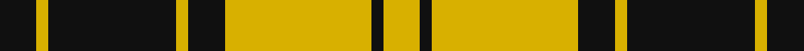

In pattern [KYKYKYKY](/stripes/kykykyky/).

This was sourced from register-of-tartans.  It is a [8 stripe tartan](/stripes/stripes8/).

Original link https://www.tartanregister.gov.uk/tartanDetails.aspx?ref=2585

## Also known as

This cloth is also recorded under:

- MacLachlan
- MacLachlan 4

## Attestations

This cloth appears in 4 source records; the oldest owns this page.

- 01/01/1842 — MacLachlan (Chief's Dress) (register-of-tartans, [record](https://www.tartanregister.gov.uk/tartanDetails.aspx?ref=2585))
- 1842 — MacLachlan - 1842 (Chief's Dress) (tartans-authority, [record](http://www.tartansauthority.com/tartan-ferret/display/1277/))
- undated — MacLachlan 4 (weddslist, [record](http://www.weddslist.com/cgi-bin/tartans/pg.pl?source=sts))
- undated — MacLachlan VS (weddslist, [record](http://www.weddslist.com/cgi-bin/tartans/pg.pl?source=tinsel))

## Register references

External register numbers recorded for this tartan.

- Scottish Register of Tartans: [2585](https://www.tartanregister.gov.uk/tartanDetails.aspx?ref=2585)
- Scottish Tartans Authority (ITI): 1277
- Scottish Tartans World Register: 1277

## Thread count
K/12 Y4 K42 Y4 K12 Y48 K4 Y/12

## Palette
Each colour and the base-6 reference it is a variant of.

| Colour | Shade | Base |
|---|---|---|
| K | <code style="background-color:#101010;">#101010</code> `oklch(17.3% 0.000 89.9)` <small>#101010</small> | K <code style="background-color:#000000;">#000000</code> |
| Y | <code style="background-color:#D8B000;">#D8B000</code> `oklch(77.1% 0.158 92.3)` <small>#D8B000</small> | Y <code style="background-color:#F2BF00;">#F2BF00</code> |

# Sample pattern

## Nearest tartans

The nearest existing variants by ΔTartan distance.

1. [MacLachlan VS](/setts/s8/k6ly2k21ly2k6ly24k2ly6/) — ΔT 0.90
1. [Justus Black & Gold (Angus) (Persona](/setts/s9/k3lo1k8lo9k1lo1k1lo1k2~x4/) — ΔT 1.07
1. [Unnamed C21st - Fashion](/setts/s6/k4ly32k16r3k16ly4~x2/) — ΔT 1.32
1. [MacLeod #3](/setts/s6/k6ly1k6ly9r1ly2~x2/) — ΔT 1.44
1. [Baillieville](/setts/s7/ly1k4ly1k4ly11m1ly1~x4/) — ΔT 1.45
1. [MacLeod (Snuffbox)](/setts/s9/k1ly12r1ly2k4r1k4ly2k1~x4/) — ΔT 1.52
1. [Big Spruce Brewing](/setts/s6/dg11ly1dg1ly6k1ly1~x8/) — ΔT 1.53
1. [MacLeod of Lewis (Vestiarium Scoticum)](/setts/s5/k8ly1k8ly12r1~x4/) — ΔT 1.56
1. [Baileville (Personal)](/setts/s7/ly1k4ly1k4ly11r1ly1~x4/) — ΔT 1.62
1. [Justus Black & Gold (Angus) (Personal)](/setts/s16/k3lo1k8lo9k1lo1k1lo1k2~x4/) — ΔT 1.63

## Neighbour map

Every grey dot is one of 14299 variants placed by the first two principal components of the ΔTartan feature space (44% of its variance). Red is this tartan; blue dots are its nearest — click one to open its page.

<svg viewBox="0 0 640 380" role="img" style="max-width:100%;height:auto;border:1px solid #e0e0e0;border-radius:4px;display:block" xmlns="http://www.w3.org/2000/svg"><image href="/nn/cloud.v1.png" width="640" height="380"/><a href="/setts/s8/k6ly2k21ly2k6ly24k2ly6/"><circle cx="312.4" cy="199.0" r="4" fill="#3465a4"><title>MacLachlan VS</title></circle></a><a href="/setts/s9/k3lo1k8lo9k1lo1k1lo1k2~x4/"><circle cx="346.4" cy="206.8" r="4" fill="#3465a4"><title>Justus Black &amp; Gold (Angus) (Persona</title></circle></a><a href="/setts/s6/k4ly32k16r3k16ly4~x2/"><circle cx="267.6" cy="198.2" r="4" fill="#3465a4"><title>Unnamed C21st - Fashion</title></circle></a><a href="/setts/s6/k6ly1k6ly9r1ly2~x2/"><circle cx="256.2" cy="216.7" r="4" fill="#3465a4"><title>MacLeod #3</title></circle></a><a href="/setts/s7/ly1k4ly1k4ly11m1ly1~x4/"><circle cx="330.9" cy="173.4" r="4" fill="#3465a4"><title>Baillieville</title></circle></a><a href="/setts/s9/k1ly12r1ly2k4r1k4ly2k1~x4/"><circle cx="313.0" cy="156.4" r="4" fill="#3465a4"><title>MacLeod (Snuffbox)</title></circle></a><a href="/setts/s6/dg11ly1dg1ly6k1ly1~x8/"><circle cx="330.1" cy="192.0" r="4" fill="#3465a4"><title>Big Spruce Brewing</title></circle></a><a href="/setts/s5/k8ly1k8ly12r1~x4/"><circle cx="297.0" cy="219.8" r="4" fill="#3465a4"><title>MacLeod of Lewis (Vestiarium Scoticum)</title></circle></a><a href="/setts/s7/ly1k4ly1k4ly11r1ly1~x4/"><circle cx="335.7" cy="173.9" r="4" fill="#3465a4"><title>Baileville (Personal)</title></circle></a><a href="/setts/s16/k3lo1k8lo9k1lo1k1lo1k2~x4/"><circle cx="319.5" cy="178.4" r="4" fill="#3465a4"><title>Justus Black &amp; Gold (Angus) (Personal)</title></circle></a><circle cx="322.7" cy="195.8" r="5" fill="#c00000"/></svg>

ID: /setts/s8/k6ly2k21ly2k6ly24k2ly6~x2/
