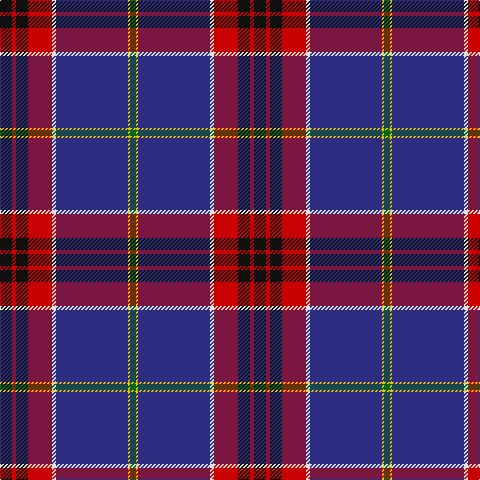

In pattern [GYBWRKRK](/stripes/gybwrkrk/).

This was sourced from register-of-tartans.  It is a [8 stripe tartan](/stripes/stripes8/).

Original link https://www.tartanregister.gov.uk/tartanDetails.aspx?ref=1280

## Attestations

This cloth appears in 2 source records; the oldest owns this page.

- 01/01/2007 — Fremont Presbyterian Church (P) (register-of-tartans, [record](https://www.tartanregister.gov.uk/tartanDetails.aspx?ref=1280))
- pre 2007 — Fremont Presbyterian Church (Corp.) (tartans-authority, [record](http://www.tartansauthority.com/tartan-ferret/display/7325/))

## Register references

External register numbers recorded for this tartan.

- Scottish Register of Tartans: [1280](https://www.tartanregister.gov.uk/tartanDetails.aspx?ref=1280)
- Scottish Tartans Authority (ITI): 7325

## Thread count
K/12 R4 K12 R24 LN4 DB72 Y2 G/6

## Palette
Each colour and the base-6 reference it is a variant of.

| Colour | Shade | Base |
|---|---|---|
| DB | <code style="background-color:#2C2C80;">#2C2C80</code> `oklch(35.0% 0.138 276.6)` <small>#2C2C80</small> | B <code style="background-color:#2A418A;">#2A418A</code> |
| G | <code style="background-color:#006818;">#006818</code> `oklch(45.0% 0.142 145.0)` <small>#006818</small> | G <code style="background-color:#006100;">#006100</code> |
| K | <code style="background-color:#101010;">#101010</code> `oklch(17.3% 0.000 89.9)` <small>#101010</small> | K <code style="background-color:#000000;">#000000</code> |
| LN | <code style="background-color:#E0E0E0;">#E0E0E0</code> `oklch(90.7% 0.000 89.9)` <small>#E0E0E0</small> | W <code style="background-color:#F7F7F7;">#F7F7F7</code> |
| R | <code style="background-color:#C80000;">#C80000</code> `oklch(52.3% 0.215 29.2)` <small>#C80000</small> | R <code style="background-color:#CC0000;">#CC0000</code> |
| Y | <code style="background-color:#E8C000;">#E8C000</code> `oklch(81.9% 0.168 93.7)` <small>#E8C000</small> | Y <code style="background-color:#F2BF00;">#F2BF00</code> |

# Sample pattern

## Nearest tartans

The nearest existing variants by ΔTartan distance.

1. [Voluntary Service Aberdeen](/setts/s10/o4w1k35n1dt2m4w1dt14m8w1~x2/) — ΔT 1.08
1. [Queen's University Ont. (Corporate)](/setts/s12/db54lo9db16lo2dp3w3dp3r27db13lo3g5w2~x2/) — ΔT 1.15
1. [Stewart Blue MINI Tartan Tartan Number: 5566. Earliest known date: Generated for display purpose only for Dupion Silk. reduced copy of the 556 Stewart Blue. See products available Copyright © Blair Urquhart, Comrie, 2015](/setts/s9/db20k3ly1w1g3r3k1r2w1~x2/) — ΔT 1.17
1. [Scragg, Moran (Personal)](/setts/s10/g1b28k11r5w1r5k11ly1k2g1~x2/) — ΔT 1.24
1. [St Andrew's College](/setts/s9/db18w2db2r3db21k28ly1k1g2~x2/) — ΔT 1.25
1. [Sidey Dress Tartan (Name)](/setts/s10/db4w1k2db25k12b1k2r16k2lo1~x2/) — ΔT 1.27
1. [Town of Petawawa](/setts/s9/dg4w1db2lo2k3db3w1dp22lo1~x4/) — ΔT 1.27
1. [Longhaugh Primary School](/setts/s8/g20db2w2db12dp29r1dp1k3~x2/) — ΔT 1.30
1. [Wcwm 9275-1510-5](/setts/s10/dp60lo2dp10k9lb2k2b2k2y28lo3~x2/) — ΔT 1.30
1. [Brighton Mac Dermott (Fashion)](/setts/s9/n47lo1k27o4dg5lo1o8b1k1~x2/) — ΔT 1.31

## Neighbour map

Every grey dot is one of 14299 variants placed by the first two principal components of the ΔTartan feature space (44% of its variance). Red is this tartan; blue dots are its nearest — click one to open its page.

<svg viewBox="0 0 640 380" role="img" style="max-width:100%;height:auto;border:1px solid #e0e0e0;border-radius:4px;display:block" xmlns="http://www.w3.org/2000/svg"><image href="/nn/cloud.v1.png" width="640" height="380"/><a href="/setts/s10/o4w1k35n1dt2m4w1dt14m8w1~x2/"><circle cx="288.9" cy="84.0" r="4" fill="#3465a4"><title>Voluntary Service Aberdeen</title></circle></a><a href="/setts/s12/db54lo9db16lo2dp3w3dp3r27db13lo3g5w2~x2/"><circle cx="333.5" cy="93.1" r="4" fill="#3465a4"><title>Queen's University Ont. (Corporate)</title></circle></a><a href="/setts/s9/db20k3ly1w1g3r3k1r2w1~x2/"><circle cx="305.8" cy="96.8" r="4" fill="#3465a4"><title>Stewart Blue MINI Tartan Tartan Number: 5566. Earliest known date: Generated for display purpose only for Dupion Silk. reduced copy of the 556 Stewart Blue. See products available Copyright © Blair Urquhart, Comrie, 2015</title></circle></a><a href="/setts/s10/g1b28k11r5w1r5k11ly1k2g1~x2/"><circle cx="247.3" cy="99.0" r="4" fill="#3465a4"><title>Scragg, Moran (Personal)</title></circle></a><a href="/setts/s9/db18w2db2r3db21k28ly1k1g2~x2/"><circle cx="322.0" cy="120.9" r="4" fill="#3465a4"><title>St Andrew's College</title></circle></a><a href="/setts/s10/db4w1k2db25k12b1k2r16k2lo1~x2/"><circle cx="259.4" cy="106.1" r="4" fill="#3465a4"><title>Sidey Dress Tartan (Name)</title></circle></a><a href="/setts/s9/dg4w1db2lo2k3db3w1dp22lo1~x4/"><circle cx="317.0" cy="104.8" r="4" fill="#3465a4"><title>Town of Petawawa</title></circle></a><a href="/setts/s8/g20db2w2db12dp29r1dp1k3~x2/"><circle cx="229.6" cy="98.9" r="4" fill="#3465a4"><title>Longhaugh Primary School</title></circle></a><a href="/setts/s10/dp60lo2dp10k9lb2k2b2k2y28lo3~x2/"><circle cx="353.7" cy="77.1" r="4" fill="#3465a4"><title>Wcwm 9275-1510-5</title></circle></a><a href="/setts/s9/n47lo1k27o4dg5lo1o8b1k1~x2/"><circle cx="316.0" cy="81.5" r="4" fill="#3465a4"><title>Brighton Mac Dermott (Fashion)</title></circle></a><circle cx="312.1" cy="93.8" r="5" fill="#c00000"/></svg>

ID: /setts/s8/k6r2k6r12w2db36ly1g3~x2/
