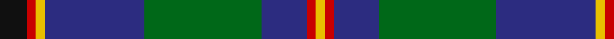

In pattern [KRYBGBRY](/patterns/krybgbry/).

This was sourced from house-of-tartan.  It is a [8 stripes tartan](/stripes/stripes8/).

Original link http://www.house-of-tartan.scotland.net/house/TartanViewjs.asp?colr=Def&tnam=1216

## Thread count
K/6 R2 Y2 DB22 G26 DB10 R2 Y/2

## Palette
Each colour and its ΔE from the base-6 reference it is a variant of.

| Colour | Shade | Base | ΔE (OKLab) |
|---|---|---|---|
| DB | <code style="background-color:#2C2C80;">#2C2C80</code> `#2C2C80` | B <code style="background-color:#2A418A;">#2A418A</code> | 0.06 |
| G | <code style="background-color:#006818;">#006818</code> `#006818` | G <code style="background-color:#006100;">#006100</code> | 0.02 |
| K | <code style="background-color:#101010;">#101010</code> `#101010` | K <code style="background-color:#000000;">#000000</code> | 0.17 |
| R | <code style="background-color:#C80000;">#C80000</code> `#C80000` | R <code style="background-color:#CC0000;">#CC0000</code> | 0.01 |
| Y | <code style="background-color:#E8C000;">#E8C000</code> `#E8C000` | Y <code style="background-color:#F2BF00;">#F2BF00</code> | 0.02 |

# Sample pattern

## Nearest tartans

The nearest existing variants by ΔTartan distance.

1. [Heckenberg Htg (Personal)](/setts/s7/b6g26ba2r6ba2b20y2-b2c2c80-ba5c8ca8-g006818-rc80000-yfccc00/) — ΔT 0.55
1. [Maitland Chief](/setts/s9/g10b48g14k20g48y4b4y4r4-b2c2c80-g006818-k101010-rc80000-ye8c000/) — ΔT 0.66
1. [Scottish Chamber Orchestra, The](/setts/s9/w6b40k6b4k10b4k6g30r4-b003c64-g5c6428-k101010-rc80000-w00fcfc/) — ΔT 0.67
1. [MX-5 Owners' Club](/setts/s7/r12b54ba4g4ba4g60w8-b2c2c80-ba2888c4-g006818-rc80000-wfcfcfc/) — ΔT 0.68
1. [Wishart Htg (Clan)](/setts/s7/k14b8g62b6y4b54w8-b2c2c80-g004c00-k000000-wc8c8c8-ye8c000/) — ΔT 0.71
1. [Jones Htg (Name)](/setts/s10/b8ba4b4ba16k6b16g6b8g48ga4-b780078-ba2888c4-g006818-ga289c18-k101010/) — ΔT 0.72
1. [State Seal of Washington (Fashion)](/setts/s7/b10g56w10k40y10b94y8-b1474b4-g604000-k101010-we8ccb8-ybc8c00/) — ΔT 0.74
1. [Carmichael](/setts/s6/k10g64b64r6b6y6-b2c2c80-g006818-k000000-rc80000-ye8c000/) — ΔT 0.79
1. [Dunbartonshire](/setts/s9/g44k8g4r16b4r16b52w8b4-b304080-g008000-k000000-r802040-w90d0f0/) — ΔT 0.79
1. [MacThomas Clan Tartan Tartan Number: 407. Earliest known date: 1975 Designed by David Thomas - former director of the Strathmore Woollen Co. in Forfar who still (in 2011) weave this tartan. Adopted by Clan Society in 1975, and registered with Lord Lyon in 1979. See products available Copyright © Blair Urquhart, Comrie, 2015](/setts/s7/b6r4b44k22g48w4g6-b2c2c80-g006818-k101010-ra00048-wc49cd8/) — ΔT 0.79

## Neighbour map

Every grey dot is one of 15726 variants placed by the first two principal components of the ΔTartan feature space (44% of its variance). Red is this tartan; blue dots are its nearest — click one to open its page.

<svg viewBox="0 0 640 380" role="img" style="max-width:100%;height:auto;border:1px solid #e0e0e0;border-radius:4px;display:block" xmlns="http://www.w3.org/2000/svg"><image href="/nn/cloud.v1.png" width="640" height="380"/><a href="/setts/s7/b6g26ba2r6ba2b20y2-b2c2c80-ba5c8ca8-g006818-rc80000-yfccc00/"><circle cx="232.1" cy="175.1" r="4" fill="#3465a4"><title>Heckenberg Htg (Personal)</title></circle></a><a href="/setts/s9/g10b48g14k20g48y4b4y4r4-b2c2c80-g006818-k101010-rc80000-ye8c000/"><circle cx="237.2" cy="169.3" r="4" fill="#3465a4"><title>Maitland Chief</title></circle></a><a href="/setts/s9/w6b40k6b4k10b4k6g30r4-b003c64-g5c6428-k101010-rc80000-w00fcfc/"><circle cx="216.6" cy="173.7" r="4" fill="#3465a4"><title>Scottish Chamber Orchestra, The</title></circle></a><a href="/setts/s7/r12b54ba4g4ba4g60w8-b2c2c80-ba2888c4-g006818-rc80000-wfcfcfc/"><circle cx="238.3" cy="155.9" r="4" fill="#3465a4"><title>MX-5 Owners' Club</title></circle></a><a href="/setts/s7/k14b8g62b6y4b54w8-b2c2c80-g004c00-k000000-wc8c8c8-ye8c000/"><circle cx="242.0" cy="165.9" r="4" fill="#3465a4"><title>Wishart Htg (Clan)</title></circle></a><a href="/setts/s10/b8ba4b4ba16k6b16g6b8g48ga4-b780078-ba2888c4-g006818-ga289c18-k101010/"><circle cx="233.9" cy="156.1" r="4" fill="#3465a4"><title>Jones Htg (Name)</title></circle></a><a href="/setts/s7/b10g56w10k40y10b94y8-b1474b4-g604000-k101010-we8ccb8-ybc8c00/"><circle cx="215.1" cy="174.3" r="4" fill="#3465a4"><title>State Seal of Washington (Fashion)</title></circle></a><a href="/setts/s6/k10g64b64r6b6y6-b2c2c80-g006818-k000000-rc80000-ye8c000/"><circle cx="246.8" cy="185.5" r="4" fill="#3465a4"><title>Carmichael</title></circle></a><a href="/setts/s9/g44k8g4r16b4r16b52w8b4-b304080-g008000-k000000-r802040-w90d0f0/"><circle cx="190.8" cy="158.5" r="4" fill="#3465a4"><title>Dunbartonshire</title></circle></a><a href="/setts/s7/b6r4b44k22g48w4g6-b2c2c80-g006818-k101010-ra00048-wc49cd8/"><circle cx="229.1" cy="189.9" r="4" fill="#3465a4"><title>MacThomas Clan Tartan Tartan Number: 407. Earliest known date: 1975 Designed by David Thomas - former director of the Strathmore Woollen Co. in Forfar who still (in 2011) weave this tartan. Adopted by Clan Society in 1975, and registered with Lord Lyon in 1979. See products available Copyright © Blair Urquhart, Comrie, 2015</title></circle></a><circle cx="236.5" cy="167.0" r="5" fill="#c00000"/></svg>

ID: /setts/s8/k6r2y2b22g26b10r2y2-b2c2c80-g006818-k101010-rc80000-ye8c000/
