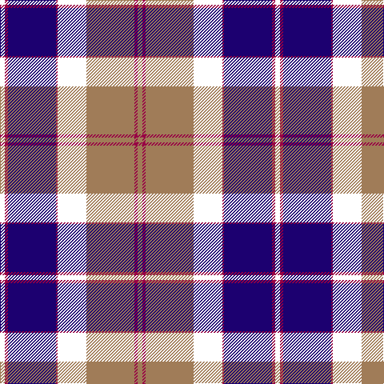

In pattern [KRBRKRRR](/patterns/krbrkrrr/).

This was sourced from house-of-tartan.  It is a [8 stripes tartan](/stripes/stripes8/).

Original link http://www.house-of-tartan.scotland.net/house/TartanViewjs.asp?colr=Def&tnam=3653

## Thread count
B/6 R4 DB60 R2 W36 LT60 R4 LT/6

## Palette
Each colour and its ΔE from the base-6 reference it is a variant of.

| Colour | Shade | Base | ΔE (OKLab) |
|---|---|---|---|
| DB | <code style="background-color:#1C0070;">#1C0070</code> `#1C0070` | B <code style="background-color:#2C4084;">#2C4084</code> | 0.14 |
| LT | <code style="background-color:#A07C58;">#A07C58</code> `#A07C58` | R <code style="background-color:#C80000;">#C80000</code> | 0.19 |
| R | <code style="background-color:#980044;">#980044</code> `#980044` | R <code style="background-color:#C80000;">#C80000</code> | 0.12 |

# Sample pattern

## Nearest tartans

The nearest existing variants by ΔTartan distance.

1. [Ferguson, Unidentified](/setts/s7/b144k80g46r8g46k4w8-b800080-g008000-k000000-rc00000-we0e0e0/) — ΔT 0.85
1. [The KpgM](/setts/s10/r24ra4b6k6b60k40ba12k20ra3ba8-b304080-ba600030-k000000-rc00000-ra906030/) — ΔT 1.17
1. [Bell Rock Lighthouse 200th Anniversary, The](/setts/s10/w12b16ba8b4ba62k32r2k4r8ra6-b58607e-ba202c54-k000000-r810519-raff0000-wffffff/) — ΔT 1.19
1. [Sheboom](/setts/s8/k70r4k6b26g16w8g16b16-b780078-g408060-k101010-r9c68a4-wfcfcfc/) — ΔT 1.26
1. [SheBoom](/setts/s8/k70b4k6ba26g16w8g16ba16-b9058d8-ba780078-g408060-k101010-we0e0e0/) — ΔT 1.29
1. [Bell Rock Lighthouse 200th Aniversar](/setts/s10/w10wa14b8wa4b50k26r2k4r8ra6-b202060-k101010-ra00000-rac80000-wfcfcfc-waa8ace8/) — ΔT 1.32
1. [Sidey (Dundee) Dress (Personal)](/setts/s10/b8w2k4b50k24ba2k4r32k4y2-b000080-ba0000cd-k101010-rff0000-wffffff-yffa500/) — ΔT 1.35
1. [Midnight Balmoral (Personal)](/setts/s9/b8w2k72ba4r8w2ba28r16w2-b778899-ba000080-k101010-re3170d-wffffff/) — ΔT 1.38
1. [McFly School](/setts/s13/r28k4b6k2y4k2b6k28b4b2k1k1w2-b1c0070-k101010-r888888-wc0c0c0-yd09800/) — ΔT 1.38
1. [Climb, The](/setts/s8/y4g18k32r4b60y6g12w2-b5f749c-g23321b-k000000-rca2625-wf9f5ef-yb7d38b/) — ΔT 1.39

## Neighbour map

Every grey dot is one of 15726 variants placed by the first two principal components of the ΔTartan feature space (44% of its variance). Red is this tartan; blue dots are its nearest — click one to open its page.

<svg viewBox="0 0 640 380" role="img" style="max-width:100%;height:auto;border:1px solid #e0e0e0;border-radius:4px;display:block" xmlns="http://www.w3.org/2000/svg"><image href="/nn/cloud.v1.png" width="640" height="380"/><a href="/setts/s7/b144k80g46r8g46k4w8-b800080-g008000-k000000-rc00000-we0e0e0/"><circle cx="236.8" cy="119.0" r="4" fill="#3465a4"><title>Ferguson, Unidentified</title></circle></a><a href="/setts/s10/r24ra4b6k6b60k40ba12k20ra3ba8-b304080-ba600030-k000000-rc00000-ra906030/"><circle cx="192.5" cy="136.4" r="4" fill="#3465a4"><title>The KpgM</title></circle></a><a href="/setts/s10/w12b16ba8b4ba62k32r2k4r8ra6-b58607e-ba202c54-k000000-r810519-raff0000-wffffff/"><circle cx="211.9" cy="86.7" r="4" fill="#3465a4"><title>Bell Rock Lighthouse 200th Anniversary, The</title></circle></a><a href="/setts/s8/k70r4k6b26g16w8g16b16-b780078-g408060-k101010-r9c68a4-wfcfcfc/"><circle cx="235.7" cy="145.6" r="4" fill="#3465a4"><title>Sheboom</title></circle></a><a href="/setts/s8/k70b4k6ba26g16w8g16ba16-b9058d8-ba780078-g408060-k101010-we0e0e0/"><circle cx="239.9" cy="147.5" r="4" fill="#3465a4"><title>SheBoom</title></circle></a><a href="/setts/s10/w10wa14b8wa4b50k26r2k4r8ra6-b202060-k101010-ra00000-rac80000-wfcfcfc-waa8ace8/"><circle cx="188.7" cy="95.4" r="4" fill="#3465a4"><title>Bell Rock Lighthouse 200th Aniversar</title></circle></a><a href="/setts/s10/b8w2k4b50k24ba2k4r32k4y2-b000080-ba0000cd-k101010-rff0000-wffffff-yffa500/"><circle cx="221.2" cy="89.7" r="4" fill="#3465a4"><title>Sidey (Dundee) Dress (Personal)</title></circle></a><a href="/setts/s9/b8w2k72ba4r8w2ba28r16w2-b778899-ba000080-k101010-re3170d-wffffff/"><circle cx="292.1" cy="91.9" r="4" fill="#3465a4"><title>Midnight Balmoral (Personal)</title></circle></a><a href="/setts/s13/r28k4b6k2y4k2b6k28b4b2k1k1w2-b1c0070-k101010-r888888-wc0c0c0-yd09800/"><circle cx="238.1" cy="89.2" r="4" fill="#3465a4"><title>McFly School</title></circle></a><a href="/setts/s8/y4g18k32r4b60y6g12w2-b5f749c-g23321b-k000000-rca2625-wf9f5ef-yb7d38b/"><circle cx="201.1" cy="99.3" r="4" fill="#3465a4"><title>Climb, The</title></circle></a><circle cx="207.5" cy="115.5" r="5" fill="#c00000"/></svg>

ID: /setts/s8/k6r4b60r2k36ra60r4ra6-b1c0070-k000000-r980044-raa07c58/
