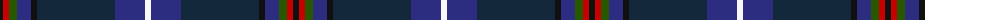

In pattern [KRGBKBBW](/patterns/krgbkbbw/).

This was sourced from register-of-tartans.  It is a [8 stripes tartan](/stripes/stripes8/).

Original link https://www.tartanregister.gov.uk/tartanDetails.aspx?ref=70

## Attestations

This cloth appears in 2 source records; the oldest owns this page.

- 01/01/2006 — American National (register-of-tartans, [record](https://www.tartanregister.gov.uk/tartanDetails.aspx?ref=70))
- pre 2006 — American National (Fashion) (tartans-authority, [record](http://www.tartansauthority.com/tartan-ferret/display/6882/))

## Thread count
K/6 R6 G8 DB14 K6 DN78 DB30 W/6

## Palette
Each colour and its ΔE from the base-6 reference it is a variant of.

| Colour | Shade | Base | ΔE (OKLab) |
|---|---|---|---|
| DB | <code style="background-color:#2C2C80;">#2C2C80</code> `#2C2C80` | B <code style="background-color:#2C4084;">#2C4084</code> | 0.05 |
| DN | <code style="background-color:#14283C;">#14283C</code> `#14283C` | B <code style="background-color:#2C4084;">#2C4084</code> | 0.14 |
| G | <code style="background-color:#285800;">#285800</code> `#285800` | G <code style="background-color:#006400;">#006400</code> | 0.04 |
| K | <code style="background-color:#101010;">#101010</code> `#101010` | K <code style="background-color:#000000;">#000000</code> | 0.17 |
| R | <code style="background-color:#C80000;">#C80000</code> `#C80000` | R <code style="background-color:#C80000;">#C80000</code> | 0.00 |
| W | <code style="background-color:#F8F8F8;">#F8F8F8</code> `#F8F8F8` | W <code style="background-color:#F4F4F0;">#F4F4F0</code> | 0.01 |

# Sample pattern

## Nearest tartans

The nearest existing variants by ΔTartan distance.

1. [Purves (2014)](/setts/s8/k8w2g24ka6b32r2b2r2-b202060-g003820-k320000-ka101010-rc80000-wfcfcfc/) — ΔT 0.98
1. [Dugan (Personal)](/setts/s10/k20b8k68ba6g6ba6g6ba52bb4w6-b506878-ba1c1c50-bb84407c-g006818-k101010-wccd8e4/) — ΔT 0.98
1. [Six Frigates (US)](/setts/s10/b6k2y4k2ba20k34ba4b2g2r2-b5f749c-ba141e46-g603800-k1c1714-rc82828-ye0a126/) — ΔT 1.08
1. [Edinburgh Crystal Corporate Tartan Tartan Number: 2307. Earliest known date: pre 1997 Designed by Sandra Campbell an employee of Edinburgh Crystal. See products available Copyright © Blair Urquhart, Comrie, 2015](/setts/s8/b120w8k24ba12r12ba12k24w8-b14283c-ba2c2c80-k101010-rc80000-wc0c0c0/) — ΔT 1.11
1. [Boyle (Personal)](/setts/s10/b8ba6r4ba52k6b6g6b6g34y6-b2c2c80-ba202060-g006818-k101010-r880000-ybc8c00/) — ΔT 1.13
1. [American National Fashion Tartan Tartan Number: 6882. Earliest known date: 01/01/2006 Designed by Erica Randall of The House of Edgar for Houston Kilts of Glasgow. Letter of appreciation on Scottish Tartans Authority file from President Bush thanking Ken MacDonald of Houston Kilts for 'the kilt outfit'./Threadcount and colours aren't 100% original. Generated manually./ See products available Copyright © Blair Urquhart, Comrie, 2015](/setts/s8/k6r6g8b14k6ka78b30w6-b080848-g003c14-k101010-ka000028-rdc0000-we0e0e0/) — ΔT 1.14
1. [Laurentian University](/setts/s8/b4ba8w4ba56g56y6ba8ga4-b5c5c5c-ba203074-g005430-ga604000-we0e0e0-ye8c000/) — ΔT 1.16
1. [Stewmann (Personal)](/setts/s9/g48b8g6ba22bb16ba74k6ba4r8-b5c8ca8-ba2c2c80-bb440044-g003820-k101010-re87878/) — ΔT 1.17
1. [Suzugamine (Corporate)](/setts/s9/b8g10ga38ba10g10k10g10b72y6-b2c2c80-ba780078-g384020-ga006818-k000000-yd8d898/) — ΔT 1.19
1. [Spirit of Fife (Corporate)](/setts/s8/g20w4b6ga4r28ba52g4ba12-b14283c-ba003c64-g005448-ga408060-rb468ac-wf8f8f8/) — ΔT 1.22

## Neighbour map

Every grey dot is one of 15726 variants placed by the first two principal components of the ΔTartan feature space (44% of its variance). Red is this tartan; blue dots are its nearest — click one to open its page.

<svg viewBox="0 0 640 380" role="img" style="max-width:100%;height:auto;border:1px solid #e0e0e0;border-radius:4px;display:block" xmlns="http://www.w3.org/2000/svg"><image href="/nn/cloud.v1.png" width="640" height="380"/><a href="/setts/s8/k8w2g24ka6b32r2b2r2-b202060-g003820-k320000-ka101010-rc80000-wfcfcfc/"><circle cx="257.6" cy="156.3" r="4" fill="#3465a4"><title>Purves (2014)</title></circle></a><a href="/setts/s10/k20b8k68ba6g6ba6g6ba52bb4w6-b506878-ba1c1c50-bb84407c-g006818-k101010-wccd8e4/"><circle cx="295.1" cy="143.6" r="4" fill="#3465a4"><title>Dugan (Personal)</title></circle></a><a href="/setts/s10/b6k2y4k2ba20k34ba4b2g2r2-b5f749c-ba141e46-g603800-k1c1714-rc82828-ye0a126/"><circle cx="291.5" cy="130.8" r="4" fill="#3465a4"><title>Six Frigates (US)</title></circle></a><a href="/setts/s8/b120w8k24ba12r12ba12k24w8-b14283c-ba2c2c80-k101010-rc80000-wc0c0c0/"><circle cx="326.2" cy="159.1" r="4" fill="#3465a4"><title>Edinburgh Crystal Corporate Tartan Tartan Number: 2307. Earliest known date: pre 1997 Designed by Sandra Campbell an employee of Edinburgh Crystal. See products available Copyright © Blair Urquhart, Comrie, 2015</title></circle></a><a href="/setts/s10/b8ba6r4ba52k6b6g6b6g34y6-b2c2c80-ba202060-g006818-k101010-r880000-ybc8c00/"><circle cx="237.6" cy="149.8" r="4" fill="#3465a4"><title>Boyle (Personal)</title></circle></a><a href="/setts/s8/k6r6g8b14k6ka78b30w6-b080848-g003c14-k101010-ka000028-rdc0000-we0e0e0/"><circle cx="286.3" cy="162.3" r="4" fill="#3465a4"><title>American National Fashion Tartan Tartan Number: 6882. Earliest known date: 01/01/2006 Designed by Erica Randall of The House of Edgar for Houston Kilts of Glasgow. Letter of appreciation on Scottish Tartans Authority file from President Bush thanking Ken MacDonald of Houston Kilts for 'the kilt outfit'./Threadcount and colours aren't 100% original. Generated manually./ See products available Copyright © Blair Urquhart, Comrie, 2015</title></circle></a><a href="/setts/s8/b4ba8w4ba56g56y6ba8ga4-b5c5c5c-ba203074-g005430-ga604000-we0e0e0-ye8c000/"><circle cx="295.3" cy="154.6" r="4" fill="#3465a4"><title>Laurentian University</title></circle></a><a href="/setts/s9/g48b8g6ba22bb16ba74k6ba4r8-b5c8ca8-ba2c2c80-bb440044-g003820-k101010-re87878/"><circle cx="320.2" cy="157.0" r="4" fill="#3465a4"><title>Stewmann (Personal)</title></circle></a><a href="/setts/s9/b8g10ga38ba10g10k10g10b72y6-b2c2c80-ba780078-g384020-ga006818-k000000-yd8d898/"><circle cx="218.7" cy="151.0" r="4" fill="#3465a4"><title>Suzugamine (Corporate)</title></circle></a><a href="/setts/s8/g20w4b6ga4r28ba52g4ba12-b14283c-ba003c64-g005448-ga408060-rb468ac-wf8f8f8/"><circle cx="247.4" cy="162.2" r="4" fill="#3465a4"><title>Spirit of Fife (Corporate)</title></circle></a><circle cx="287.4" cy="156.0" r="5" fill="#c00000"/></svg>

ID: /setts/s8/k6r6g8b14k6ba78b30w6-b2c2c80-ba14283c-g285800-k101010-rc80000-wf8f8f8/
