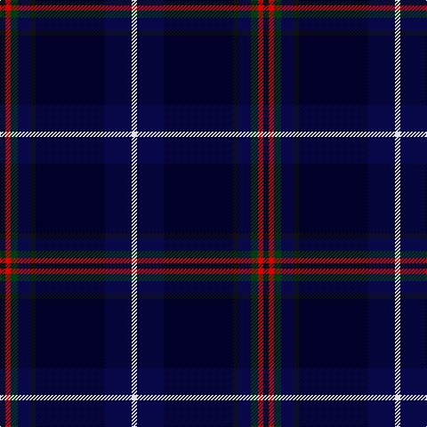

In pattern [KRGBKKBW](/patterns/krgbkkbw/).

This was sourced from house-of-tartan.  It is a [8 stripes tartan](/stripes/stripes8/).

Original link http://www.house-of-tartan.scotland.net/house/TartanViewjs.asp?colr=Def&tnam=6882

## Thread count
K/6 R6 DG8 DB14 K6 DBa78 DB30 LN/6

## Palette
Each colour and its ΔE from the base-6 reference it is a variant of.

| Colour | Shade | Base | ΔE (OKLab) |
|---|---|---|---|
| DB | <code style="background-color:#080848;">#080848</code> `#080848` | B <code style="background-color:#2C4084;">#2C4084</code> | 0.19 |
| DBa | <code style="background-color:#000028;">#000028</code> `#000028` | K <code style="background-color:#000000;">#000000</code> | 0.15 |
| DG | <code style="background-color:#003C14;">#003C14</code> `#003C14` | G <code style="background-color:#006400;">#006400</code> | 0.14 |
| K | <code style="background-color:#101010;">#101010</code> `#101010` | K <code style="background-color:#000000;">#000000</code> | 0.17 |
| LN | <code style="background-color:#E0E0E0;">#E0E0E0</code> `#E0E0E0` | W <code style="background-color:#F4F4F0;">#F4F4F0</code> | 0.06 |
| R | <code style="background-color:#DC0000;">#DC0000</code> `#DC0000` | R <code style="background-color:#C80000;">#C80000</code> | 0.04 |

# Sample pattern

## Nearest tartans

The nearest existing variants by ΔTartan distance.

1. [American National](/setts/s8/k6r6g8b14k6ba78b30w6-b2c2c80-ba14283c-g285800-k101010-rc80000-wf8f8f8/) — ΔT 1.14
1. [Dugan (Personal)](/setts/s10/k20b8k68ba6g6ba6g6ba52bb4w6-b506878-ba1c1c50-bb84407c-g006818-k101010-wccd8e4/) — ΔT 1.26
1. [Bavidge](/setts/s12/b92k14b18ba5b5ba5b5g32bb16k5bb7y8-b000050-ba304080-bb300030-g003000-k000000-yf0c000/) — ΔT 1.33
1. [Edinburgh and Lothian Tourist Board](/setts/s7/k80b16r6b12ka6b12ra8-b141e46-k000028-ka101010-rc87814-radc0000/) — ΔT 1.33
1. [Purves (2014)](/setts/s8/k8w2g24ka6b32r2b2r2-b202060-g003820-k320000-ka101010-rc80000-wfcfcfc/) — ΔT 1.46
1. [Thistle of Scotland](/setts/s9/r6b48k32ka6g4ka4g4ka56w6-b000064-g006818-k000000-ka000034-rb468ac-wc8c8c8/) — ΔT 1.47
1. [Heirloom Dark Alba (Fashion)](/setts/s9/k8y4k68b20ya8b8ba8b46w6-b202060-ba780078-k101010-we0e0e0-ybc8c00-yaa0a0a0/) — ΔT 1.57
1. [Edinburgh Crystal Corporate Tartan Tartan Number: 2307. Earliest known date: pre 1997 Designed by Sandra Campbell an employee of Edinburgh Crystal. See products available Copyright © Blair Urquhart, Comrie, 2015](/setts/s8/b120w8k24ba12r12ba12k24w8-b14283c-ba2c2c80-k101010-rc80000-wc0c0c0/) — ΔT 1.58
1. [Six Frigates (US)](/setts/s10/b6k2y4k2ba20k34ba4b2g2r2-b5f749c-ba141e46-g603800-k1c1714-rc82828-ye0a126/) — ΔT 1.59
1. [Fed. of Circles & Solitaries (Corp.)](/setts/s10/b18k60b18ba6b10r6b10y6b10g6-b202060-ba2888c4-g006818-k101010-rc80000-ye8c000/) — ΔT 1.60

## Neighbour map

Every grey dot is one of 15726 variants placed by the first two principal components of the ΔTartan feature space (44% of its variance). Red is this tartan; blue dots are its nearest — click one to open its page.

<svg viewBox="0 0 640 380" role="img" style="max-width:100%;height:auto;border:1px solid #e0e0e0;border-radius:4px;display:block" xmlns="http://www.w3.org/2000/svg"><image href="/nn/cloud.v1.png" width="640" height="380"/><a href="/setts/s8/k6r6g8b14k6ba78b30w6-b2c2c80-ba14283c-g285800-k101010-rc80000-wf8f8f8/"><circle cx="287.4" cy="156.0" r="4" fill="#3465a4"><title>American National</title></circle></a><a href="/setts/s10/k20b8k68ba6g6ba6g6ba52bb4w6-b506878-ba1c1c50-bb84407c-g006818-k101010-wccd8e4/"><circle cx="295.1" cy="143.6" r="4" fill="#3465a4"><title>Dugan (Personal)</title></circle></a><a href="/setts/s12/b92k14b18ba5b5ba5b5g32bb16k5bb7y8-b000050-ba304080-bb300030-g003000-k000000-yf0c000/"><circle cx="317.2" cy="123.7" r="4" fill="#3465a4"><title>Bavidge</title></circle></a><a href="/setts/s7/k80b16r6b12ka6b12ra8-b141e46-k000028-ka101010-rc87814-radc0000/"><circle cx="363.9" cy="184.6" r="4" fill="#3465a4"><title>Edinburgh and Lothian Tourist Board</title></circle></a><a href="/setts/s8/k8w2g24ka6b32r2b2r2-b202060-g003820-k320000-ka101010-rc80000-wfcfcfc/"><circle cx="257.6" cy="156.3" r="4" fill="#3465a4"><title>Purves (2014)</title></circle></a><a href="/setts/s9/r6b48k32ka6g4ka4g4ka56w6-b000064-g006818-k000000-ka000034-rb468ac-wc8c8c8/"><circle cx="197.8" cy="153.0" r="4" fill="#3465a4"><title>Thistle of Scotland</title></circle></a><a href="/setts/s9/k8y4k68b20ya8b8ba8b46w6-b202060-ba780078-k101010-we0e0e0-ybc8c00-yaa0a0a0/"><circle cx="252.4" cy="141.1" r="4" fill="#3465a4"><title>Heirloom Dark Alba (Fashion)</title></circle></a><a href="/setts/s8/b120w8k24ba12r12ba12k24w8-b14283c-ba2c2c80-k101010-rc80000-wc0c0c0/"><circle cx="326.2" cy="159.1" r="4" fill="#3465a4"><title>Edinburgh Crystal Corporate Tartan Tartan Number: 2307. Earliest known date: pre 1997 Designed by Sandra Campbell an employee of Edinburgh Crystal. See products available Copyright © Blair Urquhart, Comrie, 2015</title></circle></a><a href="/setts/s10/b6k2y4k2ba20k34ba4b2g2r2-b5f749c-ba141e46-g603800-k1c1714-rc82828-ye0a126/"><circle cx="291.5" cy="130.8" r="4" fill="#3465a4"><title>Six Frigates (US)</title></circle></a><a href="/setts/s10/b18k60b18ba6b10r6b10y6b10g6-b202060-ba2888c4-g006818-k101010-rc80000-ye8c000/"><circle cx="232.6" cy="160.3" r="4" fill="#3465a4"><title>Fed. of Circles &amp; Solitaries (Corp.)</title></circle></a><circle cx="286.3" cy="162.3" r="5" fill="#c00000"/></svg>

ID: /setts/s8/k6r6g8b14k6ka78b30w6-b080848-g003c14-k101010-ka000028-rdc0000-we0e0e0/
