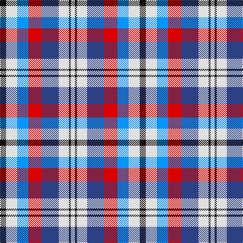

In pattern [KWBRBWKW](/stripes/kwbrbwkw/).

This was sourced from register-of-tartans.  It is a [8 stripe tartan](/stripes/stripes8/).

Original link https://www.tartanregister.gov.uk/tartanDetails.aspx?ref=1084

## Also known as

This cloth is also recorded under:

- Edinburgh, Military Tattoo dress

## Attestations

This cloth appears in 2 source records; the oldest owns this page.

- undated — Edinburgh Military Tattoo Dress (register-of-tartans, [record](https://www.tartanregister.gov.uk/tartanDetails.aspx?ref=1084))
- undated — Edinburgh, Military Tattoo dress (weddslist, [record](http://www.weddslist.com/cgi-bin/tartans/pg.pl?source=sts))

## Register references

External register numbers recorded for this tartan.

- Scottish Register of Tartans: [1084](https://www.tartanregister.gov.uk/tartanDetails.aspx?ref=1084)
- Scottish Tartans World Register: 1223

## Thread count
K/12 LN22 B22 R26 Ba34 LN20 K4 LN/8

## Palette
Each colour and the base-6 reference it is a variant of.

| Colour | Shade | Base |
|---|---|---|
| B | <code style="background-color:#0596FA;">#0596FA</code> `oklch(66.0% 0.180 248.9)` <small>#0596FA</small> | B <code style="background-color:#2A418A;">#2A418A</code> |
| Ba | <code style="background-color:#2C4084;">#2C4084</code> `oklch(39.4% 0.117 268.3)` <small>#2C4084</small> | B <code style="background-color:#2A418A;">#2A418A</code> |
| K | <code style="background-color:#101010;">#101010</code> `oklch(17.3% 0.000 89.9)` <small>#101010</small> | K <code style="background-color:#000000;">#000000</code> |
| LN | <code style="background-color:#E0E0E0;">#E0E0E0</code> `oklch(90.7% 0.000 89.9)` <small>#E0E0E0</small> | W <code style="background-color:#F7F7F7;">#F7F7F7</code> |
| R | <code style="background-color:#DC0000;">#DC0000</code> `oklch(56.2% 0.230 29.2)` <small>#DC0000</small> | R <code style="background-color:#CC0000;">#CC0000</code> |

# Sample pattern

## Nearest tartans

The nearest existing variants by ΔTartan distance.

1. [Edinburgh Tatttoo Dress (Corporate)](/setts/s8/k6w11t11r13db17w10k2w4~x2/) — ΔT 0.28
1. [Wombles 3 (Corporate)](/setts/s9/w4db8w1db1g6db3r6db1w4~x4/) — ΔT 1.09
1. [Unidentified Printing](/setts/s7/r2db4r6db2lb6k1ly2~x2/) — ΔT 1.14
1. [Wombles 6 (Corporate)](/setts/s9/w4db8w1lo1db6lo3r6lo1w4~x4/) — ΔT 1.17
1. [Womble](/setts/s9/w4db8w1lo1db6lo3r6lo1w4~x2/) — ΔT 1.21
1. [Wombles #2](/setts/s9/w4db8w1db1dg6db3r6db1w4~x2/) — ΔT 1.21
1. [Wombles 2 (Corporate)](/setts/s9/w4db8w1db1r6db3lo6db1w4~x4/) — ΔT 1.24
1. [Wombles 4 (Corporate)](/setts/s9/w4db8w1db1lo6db3r6db1w4~x4/) — ΔT 1.24
1. [Womble](/setts/s9/w4db8w1db1g6db3r6db1w4~x2/) — ΔT 1.26
1. [Womble](/setts/s9/w4db8w1db1lo6db3r6db1w4~x2/) — ΔT 1.26

## Neighbour map

Every grey dot is one of 14299 variants placed by the first two principal components of the ΔTartan feature space (44% of its variance). Red is this tartan; blue dots are its nearest — click one to open its page.

<svg viewBox="0 0 640 380" role="img" style="max-width:100%;height:auto;border:1px solid #e0e0e0;border-radius:4px;display:block" xmlns="http://www.w3.org/2000/svg"><image href="/nn/cloud.v1.png" width="640" height="380"/><a href="/setts/s8/k6w11t11r13db17w10k2w4~x2/"><circle cx="55.7" cy="186.5" r="4" fill="#3465a4"><title>Edinburgh Tatttoo Dress (Corporate)</title></circle></a><a href="/setts/s9/w4db8w1db1g6db3r6db1w4~x4/"><circle cx="39.6" cy="173.9" r="4" fill="#3465a4"><title>Wombles 3 (Corporate)</title></circle></a><a href="/setts/s7/r2db4r6db2lb6k1ly2~x2/"><circle cx="84.4" cy="203.6" r="4" fill="#3465a4"><title>Unidentified Printing</title></circle></a><a href="/setts/s9/w4db8w1lo1db6lo3r6lo1w4~x4/"><circle cx="42.6" cy="168.2" r="4" fill="#3465a4"><title>Wombles 6 (Corporate)</title></circle></a><a href="/setts/s9/w4db8w1lo1db6lo3r6lo1w4~x2/"><circle cx="43.1" cy="170.7" r="4" fill="#3465a4"><title>Womble</title></circle></a><a href="/setts/s9/w4db8w1db1dg6db3r6db1w4~x2/"><circle cx="45.7" cy="178.1" r="4" fill="#3465a4"><title>Wombles #2</title></circle></a><a href="/setts/s9/w4db8w1db1r6db3lo6db1w4~x4/"><circle cx="43.0" cy="167.2" r="4" fill="#3465a4"><title>Wombles 2 (Corporate)</title></circle></a><a href="/setts/s9/w4db8w1db1lo6db3r6db1w4~x4/"><circle cx="43.0" cy="167.2" r="4" fill="#3465a4"><title>Wombles 4 (Corporate)</title></circle></a><a href="/setts/s9/w4db8w1db1g6db3r6db1w4~x2/"><circle cx="43.5" cy="178.6" r="4" fill="#3465a4"><title>Womble</title></circle></a><a href="/setts/s9/w4db8w1db1lo6db3r6db1w4~x2/"><circle cx="43.1" cy="169.3" r="4" fill="#3465a4"><title>Womble</title></circle></a><circle cx="63.2" cy="191.0" r="5" fill="#c00000"/></svg>

ID: /setts/s8/k6w11b11r13db17w10k2w4~x2/
