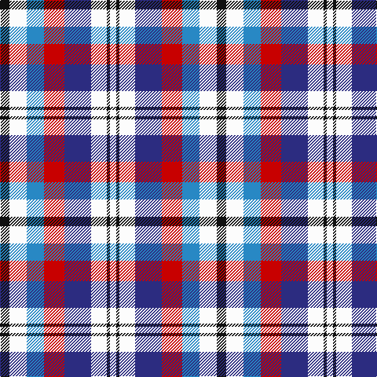

This page is one **sett** — a single exact thread-count. It belongs to the [tartan](/tartans/k6w11t11r13db17w10k2w4/)
(the same proportion at any scale), whose colour order is pattern [KWBRBWKW](/stripes/kwbrbwkw/).

Sourced from tartans-authority.  It is a [8 stripe tartan](/stripes/stripes8/).

Original link http://www.tartansauthority.com/tartan-ferret/display/1223/

## Thread count
K/12 W22 B22 R26 DB34 W20 K4 W/8

## Palette

Palette: <strong>Tartan Register</strong>
<table><thead><tr><th>Colour</th><th>Threads</th><th>Shade</th><th>Base</th><th>OKLCh</th></tr></thead><tbody><tr><td>K/</td><td style="text-align:right;font-variant-numeric:tabular-nums">12</td><td><code style="background-color:#101010;">#101010</code> <small style="color:#888">#101010</small></td><td>K <code style="background-color:#000000;">#000000</code></td><td><small style="color:#888">oklch(17.3% 0.000 89.9)</small></td></tr><tr><td>W</td><td style="text-align:right;font-variant-numeric:tabular-nums">22</td><td><code style="background-color:#FCFCFC;">#FCFCFC</code> <small style="color:#888">#FCFCFC</small></td><td>W <code style="background-color:#F7F7F7;">#F7F7F7</code></td><td><small style="color:#888">oklch(99.1% 0.000 89.9)</small></td></tr><tr><td>B</td><td style="text-align:right;font-variant-numeric:tabular-nums">22</td><td><code style="background-color:#2888C4;">#2888C4</code> <small style="color:#888">#2888C4</small></td><td>B <code style="background-color:#2A418A;">#2A418A</code></td><td><small style="color:#888">oklch(60.1% 0.125 241.5)</small></td></tr><tr><td>R</td><td style="text-align:right;font-variant-numeric:tabular-nums">26</td><td><code style="background-color:#C80000;">#C80000</code> <small style="color:#888">#C80000</small></td><td>R <code style="background-color:#CC0000;">#CC0000</code></td><td><small style="color:#888">oklch(52.3% 0.215 29.2)</small></td></tr><tr><td>DB</td><td style="text-align:right;font-variant-numeric:tabular-nums">34</td><td><code style="background-color:#2C2C80;">#2C2C80</code> <small style="color:#888">#2C2C80</small></td><td>B <code style="background-color:#2A418A;">#2A418A</code></td><td><small style="color:#888">oklch(35.0% 0.138 276.6)</small></td></tr><tr><td>W</td><td style="text-align:right;font-variant-numeric:tabular-nums">20</td><td><code style="background-color:#FCFCFC;">#FCFCFC</code> <small style="color:#888">#FCFCFC</small></td><td>W <code style="background-color:#F7F7F7;">#F7F7F7</code></td><td><small style="color:#888">oklch(99.1% 0.000 89.9)</small></td></tr><tr><td>K</td><td style="text-align:right;font-variant-numeric:tabular-nums">4</td><td><code style="background-color:#101010;">#101010</code> <small style="color:#888">#101010</small></td><td>K <code style="background-color:#000000;">#000000</code></td><td><small style="color:#888">oklch(17.3% 0.000 89.9)</small></td></tr><tr><td>W/</td><td style="text-align:right;font-variant-numeric:tabular-nums">8</td><td><code style="background-color:#FCFCFC;">#FCFCFC</code> <small style="color:#888">#FCFCFC</small></td><td>W <code style="background-color:#F7F7F7;">#F7F7F7</code></td><td><small style="color:#888">oklch(99.1% 0.000 89.9)</small></td></tr></tbody></table>

# Sample pattern

## Nearest tartans

The nearest existing variants by ΔTartan distance, with this tartan at the top so the swatches line up against it.

ΔTartan

Tartan

Sett

—

<a href="/ttd/edit/#slug=k6w11t11r13db17w10k2w4~x2">Edinburgh Tatttoo Dress (Corporate)</a> <a class="nn-out" href="/setts/s8/k6w11t11r13db17w10k2w4~x2/" title="open its dictionary page">↗</a>

0.28

<a href="/ttd/edit/#slug=k6w11b11r13db17w10k2w4~x2">Edinburgh Military Tattoo Dress</a> <a class="nn-out" href="/setts/s8/k6w11b11r13db17w10k2w4~x2/" title="open its dictionary page">↗</a>

1.09

<a href="/ttd/edit/#slug=w4db8w1db1g6db3r6db1w4~x4">Wombles 3 (Corporate)</a> <a class="nn-out" href="/setts/s9/w4db8w1db1g6db3r6db1w4~x4/" title="open its dictionary page">↗</a>

1.13

<a href="/ttd/edit/#slug=w4db8w1lo1db6lo3r6lo1w4~x4">Wombles 6 (Corporate)</a> <a class="nn-out" href="/setts/s9/w4db8w1lo1db6lo3r6lo1w4~x4/" title="open its dictionary page">↗</a>

1.17

<a href="/ttd/edit/#slug=r2db4r6db2lb6k1ly2~x2">Unidentified Printing</a> <a class="nn-out" href="/setts/s7/r2db4r6db2lb6k1ly2~x2/" title="open its dictionary page">↗</a>

1.17

<a href="/ttd/edit/#slug=w4db8w1lo1db6lo3r6lo1w4~x2">Womble</a> <a class="nn-out" href="/setts/s9/w4db8w1lo1db6lo3r6lo1w4~x2/" title="open its dictionary page">↗</a>

1.19

<a href="/ttd/edit/#slug=w4db8w1db1r6db3lo6db1w4~x4">Wombles 2 (Corporate)</a> <a class="nn-out" href="/setts/s9/w4db8w1db1r6db3lo6db1w4~x4/" title="open its dictionary page">↗</a>

1.19

<a href="/ttd/edit/#slug=w4db8w1db1lo6db3r6db1w4~x4">Wombles 4 (Corporate)</a> <a class="nn-out" href="/setts/s9/w4db8w1db1lo6db3r6db1w4~x4/" title="open its dictionary page">↗</a>

1.22

<a href="/ttd/edit/#slug=w4db8w1db1lo6db3r6db1w4~x2">Womble</a> <a class="nn-out" href="/setts/s9/w4db8w1db1lo6db3r6db1w4~x2/" title="open its dictionary page">↗</a>

1.22

<a href="/ttd/edit/#slug=w4db8w1db1r6db3lo6db1w4~x2">Womble</a> <a class="nn-out" href="/setts/s9/w4db8w1db1r6db3lo6db1w4~x2/" title="open its dictionary page">↗</a>

1.25

<a href="/ttd/edit/#slug=w4db8w1db1dg6db3r6db1w4~x2">Wombles #2</a> <a class="nn-out" href="/setts/s9/w4db8w1db1dg6db3r6db1w4~x2/" title="open its dictionary page">↗</a>

## Neighbour map

Every grey dot is one of 14299 variants placed by the first two principal components of the ΔTartan feature space (44% of its variance). Red is this tartan; blue dots are its nearest — click one to open its page.

<svg viewBox="0 0 640 380" role="img" style="max-width:100%;height:auto;border:1px solid #e0e0e0;border-radius:4px;display:block" xmlns="http://www.w3.org/2000/svg"><image href="/nn/cloud.v1.png" width="640" height="380"/><a href="/setts/s8/k6w11b11r13db17w10k2w4~x2/"><circle cx="63.2" cy="191.0" r="4" fill="#3465a4"><title>Edinburgh Military Tattoo Dress</title></circle></a><a href="/setts/s9/w4db8w1db1g6db3r6db1w4~x4/"><circle cx="39.6" cy="173.9" r="4" fill="#3465a4"><title>Wombles 3 (Corporate)</title></circle></a><a href="/setts/s9/w4db8w1lo1db6lo3r6lo1w4~x4/"><circle cx="42.6" cy="168.2" r="4" fill="#3465a4"><title>Wombles 6 (Corporate)</title></circle></a><a href="/setts/s7/r2db4r6db2lb6k1ly2~x2/"><circle cx="84.4" cy="203.6" r="4" fill="#3465a4"><title>Unidentified Printing</title></circle></a><a href="/setts/s9/w4db8w1lo1db6lo3r6lo1w4~x2/"><circle cx="43.1" cy="170.7" r="4" fill="#3465a4"><title>Womble</title></circle></a><a href="/setts/s9/w4db8w1db1r6db3lo6db1w4~x4/"><circle cx="43.0" cy="167.2" r="4" fill="#3465a4"><title>Wombles 2 (Corporate)</title></circle></a><a href="/setts/s9/w4db8w1db1lo6db3r6db1w4~x4/"><circle cx="43.0" cy="167.2" r="4" fill="#3465a4"><title>Wombles 4 (Corporate)</title></circle></a><a href="/setts/s9/w4db8w1db1lo6db3r6db1w4~x2/"><circle cx="43.1" cy="169.3" r="4" fill="#3465a4"><title>Womble</title></circle></a><a href="/setts/s9/w4db8w1db1r6db3lo6db1w4~x2/"><circle cx="43.1" cy="169.3" r="4" fill="#3465a4"><title>Womble</title></circle></a><a href="/setts/s9/w4db8w1db1dg6db3r6db1w4~x2/"><circle cx="45.7" cy="178.1" r="4" fill="#3465a4"><title>Wombles #2</title></circle></a><circle cx="55.7" cy="186.5" r="5" fill="#c00000"/></svg>

ID: /setts/s8/k6w11t11r13db17w10k2w4~x2/
