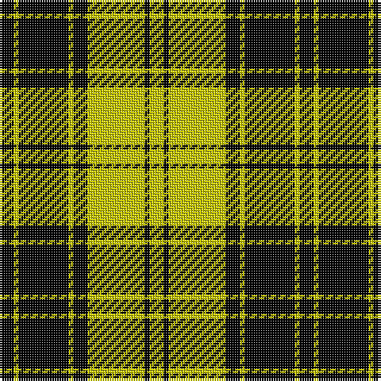

In pattern [KYKYKYKY](/patterns/kykykyky/).

This was sourced from weddslist.  It is a [8 stripes tartan](/stripes/stripes8/).

Original link http://www.weddslist.com/cgi-bin/tartans/pg.pl?source=rb

## Thread count
K/6 Y2 K21 Y2 K6 Y24 K2 Y/6

## Palette
Each colour and its ΔE from the base-6 reference it is a variant of.

| Colour | Shade | Base | ΔE (OKLab) |
|---|---|---|---|
| K | <code style="background-color:#000000;">#000000</code> `#000000` | K <code style="background-color:#000000;">#000000</code> | 0.00 |
| Y | <code style="background-color:#C8C800;">#C8C800</code> `#C8C800` | Y <code style="background-color:#F2BF00;">#F2BF00</code> | 0.07 |

# Sample pattern

## Nearest tartans

The nearest existing variants by ΔTartan distance.

1. [MacLachlan VS](/setts/s8/k6y2k21y2k6y24k2y6~k000000-yaaaa00~x2/) — ΔT 0.45
1. [MacLachlan VS](/setts/s8/k6y2k21y2k6y24k2y6~k000000-yaaaa00/) — ΔT 0.45
1. [MacLachlan 4](/setts/s8/k6y2k21y2k6y24k2y6~k000000-yf0c000~x2/) — ΔT 0.62
1. [MacLachlan (Chief's Dress)](/setts/s8/k6y2k21y2k6y24k2y6~k101010-yd8b000~x2/) — ΔT 0.90
1. [MacLachlan - 1842 (Chief's Dress)](/setts/s8/k6y2k21y2k6y24k2y6~k101010-ye8c000~x2/) — ΔT 0.97
1. [Justus Black & Gold (Angus) (Persona](/setts/s9/k3y1k8y9k1y1k1y1k2~k101010-ybc8c00~x4/) — ΔT 1.33
1. [MacLeod of Lewis](/setts/s5/k8y1k8y12r1~k000000-rc80000-yc8c800~x2/) — ΔT 1.57
1. [MacLeod](/setts/s6/k6y1k6y9r1y2~k000000-r900030-yf0c000~x2/) — ΔT 1.61
1. [Big Spruce Brewing](/setts/s6/g11y1g1y6k1y1~g003820-k101010-ye8c000~x8/) — ΔT 1.63
1. [MacLeod of Lewis](/setts/s5/k8y1k8y12r1~k000000-raa0000-yaaaa00~x2/) — ΔT 1.70

## Neighbour map

Every grey dot is one of 15726 variants placed by the first two principal components of the ΔTartan feature space (44% of its variance). Red is this tartan; blue dots are its nearest — click one to open its page.

<svg viewBox="0 0 640 380" role="img" style="max-width:100%;height:auto;border:1px solid #e0e0e0;border-radius:4px;display:block" xmlns="http://www.w3.org/2000/svg"><image href="/nn/cloud.v1.png" width="640" height="380"/><a href="/setts/s8/k6y2k21y2k6y24k2y6~k000000-yaaaa00~x2/"><circle cx="315.1" cy="210.3" r="4" fill="#3465a4"><title>MacLachlan VS</title></circle></a><a href="/setts/s8/k6y2k21y2k6y24k2y6~k000000-yaaaa00/"><circle cx="315.1" cy="210.3" r="4" fill="#3465a4"><title>MacLachlan VS</title></circle></a><a href="/setts/s8/k6y2k21y2k6y24k2y6~k000000-yf0c000~x2/"><circle cx="313.4" cy="202.9" r="4" fill="#3465a4"><title>MacLachlan 4</title></circle></a><a href="/setts/s8/k6y2k21y2k6y24k2y6~k101010-yd8b000~x2/"><circle cx="320.9" cy="203.4" r="4" fill="#3465a4"><title>MacLachlan (Chief's Dress)</title></circle></a><a href="/setts/s8/k6y2k21y2k6y24k2y6~k101010-ye8c000~x2/"><circle cx="316.3" cy="200.8" r="4" fill="#3465a4"><title>MacLachlan - 1842 (Chief's Dress)</title></circle></a><a href="/setts/s9/k3y1k8y9k1y1k1y1k2~k101010-ybc8c00~x4/"><circle cx="344.5" cy="213.2" r="4" fill="#3465a4"><title>Justus Black &amp; Gold (Angus) (Persona</title></circle></a><a href="/setts/s5/k8y1k8y12r1~k000000-rc80000-yc8c800~x2/"><circle cx="284.5" cy="230.2" r="4" fill="#3465a4"><title>MacLeod of Lewis</title></circle></a><a href="/setts/s6/k6y1k6y9r1y2~k000000-r900030-yf0c000~x2/"><circle cx="251.0" cy="225.7" r="4" fill="#3465a4"><title>MacLeod</title></circle></a><a href="/setts/s6/g11y1g1y6k1y1~g003820-k101010-ye8c000~x8/"><circle cx="327.9" cy="198.0" r="4" fill="#3465a4"><title>Big Spruce Brewing</title></circle></a><a href="/setts/s5/k8y1k8y12r1~k000000-raa0000-yaaaa00~x2/"><circle cx="289.6" cy="233.9" r="4" fill="#3465a4"><title>MacLeod of Lewis</title></circle></a><circle cx="309.9" cy="206.6" r="5" fill="#c00000"/></svg>

ID: /setts/s8/k6y2k21y2k6y24k2y6~k000000-yc8c800/
