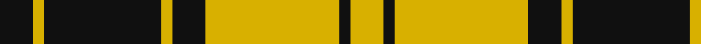
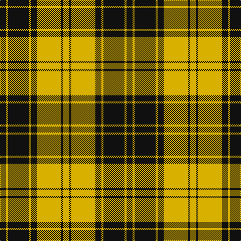

In pattern [KYKYKYKY](/patterns/kykykyky/).

This was sourced from register-of-tartans.  It is a [8 stripes tartan](/stripes/stripes8/).

Original link https://www.tartanregister.gov.uk/tartanDetails.aspx?ref=2585

## Register references

External register numbers recorded for this tartan.

- Scottish Register of Tartans: [2585](https://www.tartanregister.gov.uk/tartanDetails.aspx?ref=2585)
- Scottish Tartans Authority (ITI): 1277
- Scottish Tartans World Register: 1277

## Thread count
K/12 Y4 K42 Y4 K12 Y48 K4 Y/12

## Palette
Each colour and its ΔE from the base-6 reference it is a variant of.

| Colour | Shade | Base | ΔE (OKLab) |
|---|---|---|---|
| K | <code style="background-color:#101010;">#101010</code> `#101010` | K <code style="background-color:#000000;">#000000</code> | 0.17 |
| Y | <code style="background-color:#D8B000;">#D8B000</code> `#D8B000` | Y <code style="background-color:#F2BF00;">#F2BF00</code> | 0.06 |

# Sample pattern

## Nearest tartans

The nearest existing variants by ΔTartan distance.

1. [MacLachlan - 1842 (Chief's Dress)](/setts/s8/k6y2k21y2k6y24k2y6~k101010-ye8c000~x2/) — ΔT 0.26
1. [MacLachlan 4](/setts/s8/k6y2k21y2k6y24k2y6~k000000-yf0c000~x2/) — ΔT 0.65
1. [MacLachlan VS](/setts/s8/k6y2k21y2k6y24k2y6~k000000-yc8c800/) — ΔT 0.90
1. [Justus Black & Gold (Angus) (Persona](/setts/s9/k3y1k8y9k1y1k1y1k2~k101010-ybc8c00~x4/) — ΔT 1.06
1. [MacLachlan VS](/setts/s8/k6y2k21y2k6y24k2y6~k000000-yaaaa00~x2/) — ΔT 1.12
1. [MacLachlan VS](/setts/s8/k6y2k21y2k6y24k2y6~k000000-yaaaa00/) — ΔT 1.12
1. [Unnamed C21st - Fashion](/setts/s6/k4y32k16r3k16y4~k101010-re87878-yfccc00~x2/) — ΔT 1.32
1. [MacLeod, Snuffbox](/setts/s9/k1y12r1y2k4r1k4y2k1~k000000-rc00000-yf0c000~x4/) — ΔT 1.38
1. [MacLeod #3](/setts/s6/k6y1k6y9r1y2~k101010-r960028-ye8c000~x2/) — ΔT 1.44
1. [Baillieville](/setts/s7/y1k4y1k4y11r1y1~k000000-r802040-yf0c000~x4/) — ΔT 1.45

## Neighbour map

Every grey dot is one of 15726 variants placed by the first two principal components of the ΔTartan feature space (44% of its variance). Red is this tartan; blue dots are its nearest — click one to open its page.

<svg viewBox="0 0 640 380" role="img" style="max-width:100%;height:auto;border:1px solid #e0e0e0;border-radius:4px;display:block" xmlns="http://www.w3.org/2000/svg"><image href="/nn/cloud.v1.png" width="640" height="380"/><a href="/setts/s8/k6y2k21y2k6y24k2y6~k101010-ye8c000~x2/"><circle cx="316.3" cy="200.8" r="4" fill="#3465a4"><title>MacLachlan - 1842 (Chief's Dress)</title></circle></a><a href="/setts/s8/k6y2k21y2k6y24k2y6~k000000-yf0c000~x2/"><circle cx="313.4" cy="202.9" r="4" fill="#3465a4"><title>MacLachlan 4</title></circle></a><a href="/setts/s8/k6y2k21y2k6y24k2y6~k000000-yc8c800/"><circle cx="309.9" cy="206.6" r="4" fill="#3465a4"><title>MacLachlan VS</title></circle></a><a href="/setts/s9/k3y1k8y9k1y1k1y1k2~k101010-ybc8c00~x4/"><circle cx="344.5" cy="213.2" r="4" fill="#3465a4"><title>Justus Black &amp; Gold (Angus) (Persona</title></circle></a><a href="/setts/s8/k6y2k21y2k6y24k2y6~k000000-yaaaa00~x2/"><circle cx="315.1" cy="210.3" r="4" fill="#3465a4"><title>MacLachlan VS</title></circle></a><a href="/setts/s8/k6y2k21y2k6y24k2y6~k000000-yaaaa00/"><circle cx="315.1" cy="210.3" r="4" fill="#3465a4"><title>MacLachlan VS</title></circle></a><a href="/setts/s6/k4y32k16r3k16y4~k101010-re87878-yfccc00~x2/"><circle cx="266.0" cy="206.0" r="4" fill="#3465a4"><title>Unnamed C21st - Fashion</title></circle></a><a href="/setts/s9/k1y12r1y2k4r1k4y2k1~k000000-rc00000-yf0c000~x4/"><circle cx="306.9" cy="164.4" r="4" fill="#3465a4"><title>MacLeod, Snuffbox</title></circle></a><a href="/setts/s6/k6y1k6y9r1y2~k101010-r960028-ye8c000~x2/"><circle cx="254.5" cy="224.0" r="4" fill="#3465a4"><title>MacLeod #3</title></circle></a><a href="/setts/s7/y1k4y1k4y11r1y1~k000000-r802040-yf0c000~x4/"><circle cx="329.7" cy="182.6" r="4" fill="#3465a4"><title>Baillieville</title></circle></a><circle cx="320.9" cy="203.4" r="5" fill="#c00000"/></svg>

ID: /setts/s8/k6y2k21y2k6y24k2y6~k101010-yd8b000~x2/
