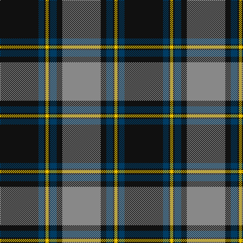

In pattern [KBKYKBKR](/patterns/kbkykbkr/).

This was sourced from tartans-authority.  It is a [8 stripes tartan](/stripes/stripes8/).

Original link http://www.tartansauthority.com/tartan-ferret/display/8069/

## Thread count
K/76 DB11 K3 Y6 K3 DB13 K11 N/76

## Palette
Each colour and its ΔE from the base-6 reference it is a variant of.

| Colour | Shade | Base | ΔE (OKLab) |
|---|---|---|---|
| DB | <code style="background-color:#003C64;">#003C64</code> `#003C64` | B <code style="background-color:#2C4084;">#2C4084</code> | 0.07 |
| K | <code style="background-color:#101010;">#101010</code> `#101010` | K <code style="background-color:#000000;">#000000</code> | 0.17 |
| N | <code style="background-color:#888888;">#888888</code> `#888888` | R <code style="background-color:#C80000;">#C80000</code> | 0.24 |
| Y | <code style="background-color:#E8C000;">#E8C000</code> `#E8C000` | Y <code style="background-color:#E8C000;">#E8C000</code> | 0.00 |

# Sample pattern

## Nearest tartans

The nearest existing variants by ΔTartan distance.

1. [Greater St Louis Area Firefighters Highland Guard](/setts/s9/b6r6k76b50y6b12r14b6y4-b2f4f4f-k101010-rff0000-yffe600/) — ΔT 0.90
1. [Ewbank](/setts/s9/r6b28y4k4b28k72y4k4y4-b1474b4-k101010-rc80000-ye8c000/) — ΔT 0.93
1. [Nunavut (District)](/setts/s10/k12b4ba4b6ba4b4ba60k40w12k8-b5c8ca8-ba5c5c5c-k101010-we0e0e0/) — ΔT 0.98
1. [Madras 3 (Fashion)](/setts/s9/k12b98g20k4g20k4y52k4g4-b2c2c80-g006818-k101010-yfcb464/) — ΔT 1.02
1. [Royal College of G.P.s (Corporate)](/setts/s8/y16k100r30g12r12b6r12y4-b2c2c80-g003820-k101010-r888888-yd87c00/) — ΔT 1.04
1. [Home (Clan)](/setts/s8/k72r6k6r6k18b72g6b4-b1474b4-g289c18-k101010-rc80000/) — ΔT 1.05
1. [Christmas Morning](/setts/s9/g6r24g30r4w2b60w2g4r4-b000080-g008b00-rff0000-wffffff/) — ΔT 1.05
1. [Scruffy Wallace](/setts/s10/b6k74b6k6b6k6b20y30k3w6-b4682b4-k101010-wffffff-y8fbc8f/) — ΔT 1.06
1. [George (Personal)](/setts/s9/r12b4r2b16r6b32g56w4g8-b2c2c80-g006818-rc80000-we0e0e0/) — ΔT 1.12
1. [Black Thistle](/setts/s9/b20k12g84k4g2k4r2k48r4-b3850c8-g408060-k101010-rc80000/) — ΔT 1.13

## Neighbour map

Every grey dot is one of 15726 variants placed by the first two principal components of the ΔTartan feature space (44% of its variance). Red is this tartan; blue dots are its nearest — click one to open its page.

<svg viewBox="0 0 640 380" role="img" style="max-width:100%;height:auto;border:1px solid #e0e0e0;border-radius:4px;display:block" xmlns="http://www.w3.org/2000/svg"><image href="/nn/cloud.v1.png" width="640" height="380"/><a href="/setts/s9/b6r6k76b50y6b12r14b6y4-b2f4f4f-k101010-rff0000-yffe600/"><circle cx="267.1" cy="143.2" r="4" fill="#3465a4"><title>Greater St Louis Area Firefighters Highland Guard</title></circle></a><a href="/setts/s9/r6b28y4k4b28k72y4k4y4-b1474b4-k101010-rc80000-ye8c000/"><circle cx="304.7" cy="141.9" r="4" fill="#3465a4"><title>Ewbank</title></circle></a><a href="/setts/s10/k12b4ba4b6ba4b4ba60k40w12k8-b5c8ca8-ba5c5c5c-k101010-we0e0e0/"><circle cx="259.1" cy="148.8" r="4" fill="#3465a4"><title>Nunavut (District)</title></circle></a><a href="/setts/s9/k12b98g20k4g20k4y52k4g4-b2c2c80-g006818-k101010-yfcb464/"><circle cx="249.6" cy="121.8" r="4" fill="#3465a4"><title>Madras 3 (Fashion)</title></circle></a><a href="/setts/s8/y16k100r30g12r12b6r12y4-b2c2c80-g003820-k101010-r888888-yd87c00/"><circle cx="293.2" cy="119.9" r="4" fill="#3465a4"><title>Royal College of G.P.s (Corporate)</title></circle></a><a href="/setts/s8/k72r6k6r6k18b72g6b4-b1474b4-g289c18-k101010-rc80000/"><circle cx="314.6" cy="158.4" r="4" fill="#3465a4"><title>Home (Clan)</title></circle></a><a href="/setts/s9/g6r24g30r4w2b60w2g4r4-b000080-g008b00-rff0000-wffffff/"><circle cx="256.5" cy="111.9" r="4" fill="#3465a4"><title>Christmas Morning</title></circle></a><a href="/setts/s10/b6k74b6k6b6k6b20y30k3w6-b4682b4-k101010-wffffff-y8fbc8f/"><circle cx="301.6" cy="118.9" r="4" fill="#3465a4"><title>Scruffy Wallace</title></circle></a><a href="/setts/s9/r12b4r2b16r6b32g56w4g8-b2c2c80-g006818-rc80000-we0e0e0/"><circle cx="302.5" cy="146.3" r="4" fill="#3465a4"><title>George (Personal)</title></circle></a><a href="/setts/s9/b20k12g84k4g2k4r2k48r4-b3850c8-g408060-k101010-rc80000/"><circle cx="331.5" cy="115.7" r="4" fill="#3465a4"><title>Black Thistle</title></circle></a><circle cx="294.6" cy="138.0" r="5" fill="#c00000"/></svg>

ID: /setts/s8/k76b11k3y6k3b13k11r76-b003c64-k101010-r888888-ye8c000/
