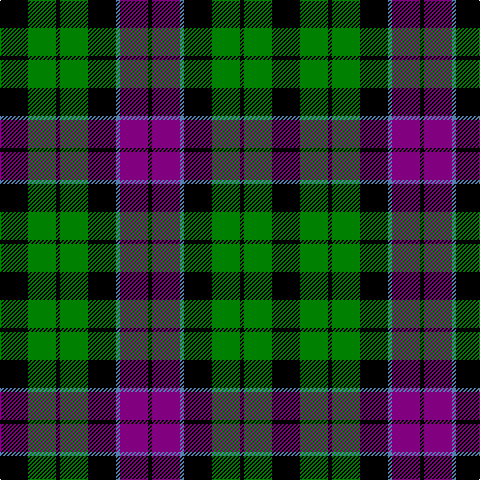

In pattern [KBBKGKGK](/patterns/kbbkgkgk/).

This was sourced from weddslist.  It is a [8 stripes tartan](/stripes/stripes8/).

Original link http://www.weddslist.com/cgi-bin/tartans/pg.pl?source=sts

## Thread count
K/28 G28 K4 G28 K28 B4 P28 K/4

## Palette
Each colour and its ΔE from the base-6 reference it is a variant of.

| Colour | Shade | Base | ΔE (OKLab) |
|---|---|---|---|
| B | <code style="background-color:#5480B0;">#5480B0</code> `#5480B0` | B <code style="background-color:#2A418A;">#2A418A</code> | 0.19 |
| G | <code style="background-color:#008000;">#008000</code> `#008000` | G <code style="background-color:#006100;">#006100</code> | 0.10 |
| K | <code style="background-color:#000000;">#000000</code> `#000000` | K <code style="background-color:#000000;">#000000</code> | 0.00 |
| P | <code style="background-color:#800080;">#800080</code> `#800080` | B <code style="background-color:#2A418A;">#2A418A</code> | 0.17 |

# Sample pattern

## Nearest tartans

The nearest existing variants by ΔTartan distance.

1. [Wilson's, No 64 or Abercrombie](/setts/s7/k6g6w1g6k6b6k1~b800080-g008000-k000000-we0e0e0~x4/) — ΔT 0.70
1. [Abercrombie, (Wilson's No 64)](/setts/s7/k6g6y1g6k6b6k1~b800080-g008000-k000000-yf0c000~x4/) — ΔT 0.71
1. [Sackett (Name)](/setts/s10/k8g8k1g8y1k8r8k1r8k8~g004028-k000000-r907048-ya0a0a0~x4/) — ΔT 0.77
1. [MacLaggan](/setts/s7/k7g6w1g6k7b7k1~b304080-g008000-k000000-we0e0e0~x4/) — ΔT 0.78
1. [Forbes Ancient](/setts/s7/b1k6b6k6g6k1w1~b304080-g008000-k000000-we0e0e0~x2/) — ΔT 0.85
1. [MacCallum](/setts/s7/k6g6r1g6k6b6k1~b304080-g008000-k000000-rc00000~x2/) — ΔT 0.87
1. [Wilson's, No 150 "Coburg"](/setts/s6/g18b2g4k14ba12k3~b5480b0-ba800080-g008000-k000000~x2/) — ΔT 0.90
1. [Wilson's, No 97](/setts/s7/k11g12k2g12k12b12w3~b800080-g008000-k000000-we0e0e0~x2/) — ΔT 0.91
1. [Fletcher](/setts/s7/b6k1b6k8r1g8k2~b304080-g008000-k000000-rc00000~x2/) — ΔT 0.92
1. [Newlands](/setts/s10/b9k9b9r2k18g12r2g4r2g4~b304080-g008000-k000000-rc00000~x2/) — ΔT 0.95

## Neighbour map

Every grey dot is one of 15726 variants placed by the first two principal components of the ΔTartan feature space (44% of its variance). Red is this tartan; blue dots are its nearest — click one to open its page.

<svg viewBox="0 0 640 380" role="img" style="max-width:100%;height:auto;border:1px solid #e0e0e0;border-radius:4px;display:block" xmlns="http://www.w3.org/2000/svg"><image href="/nn/cloud.v1.png" width="640" height="380"/><a href="/setts/s7/k6g6w1g6k6b6k1~b800080-g008000-k000000-we0e0e0~x4/"><circle cx="133.2" cy="252.4" r="4" fill="#3465a4"><title>Wilson's, No 64 or Abercrombie</title></circle></a><a href="/setts/s7/k6g6y1g6k6b6k1~b800080-g008000-k000000-yf0c000~x4/"><circle cx="134.2" cy="252.7" r="4" fill="#3465a4"><title>Abercrombie, (Wilson's No 64)</title></circle></a><a href="/setts/s10/k8g8k1g8y1k8r8k1r8k8~g004028-k000000-r907048-ya0a0a0~x4/"><circle cx="169.4" cy="227.9" r="4" fill="#3465a4"><title>Sackett (Name)</title></circle></a><a href="/setts/s7/k7g6w1g6k7b7k1~b304080-g008000-k000000-we0e0e0~x4/"><circle cx="148.6" cy="250.2" r="4" fill="#3465a4"><title>MacLaggan</title></circle></a><a href="/setts/s7/b1k6b6k6g6k1w1~b304080-g008000-k000000-we0e0e0~x2/"><circle cx="180.6" cy="242.4" r="4" fill="#3465a4"><title>Forbes Ancient</title></circle></a><a href="/setts/s7/k6g6r1g6k6b6k1~b304080-g008000-k000000-rc00000~x2/"><circle cx="137.5" cy="258.7" r="4" fill="#3465a4"><title>MacCallum</title></circle></a><a href="/setts/s6/g18b2g4k14ba12k3~b5480b0-ba800080-g008000-k000000~x2/"><circle cx="173.6" cy="222.1" r="4" fill="#3465a4"><title>Wilson's, No 150 &quot;Coburg&quot;</title></circle></a><a href="/setts/s7/k11g12k2g12k12b12w3~b800080-g008000-k000000-we0e0e0~x2/"><circle cx="118.0" cy="254.6" r="4" fill="#3465a4"><title>Wilson's, No 97</title></circle></a><a href="/setts/s7/b6k1b6k8r1g8k2~b304080-g008000-k000000-rc00000~x2/"><circle cx="154.4" cy="232.0" r="4" fill="#3465a4"><title>Fletcher</title></circle></a><a href="/setts/s10/b9k9b9r2k18g12r2g4r2g4~b304080-g008000-k000000-rc00000~x2/"><circle cx="146.1" cy="201.8" r="4" fill="#3465a4"><title>Newlands</title></circle></a><circle cx="160.3" cy="230.2" r="5" fill="#c00000"/></svg>

ID: /setts/s8/k7g7k1g7k7b1ba7k1~b5480b0-ba800080-g008000-k000000~x4/
