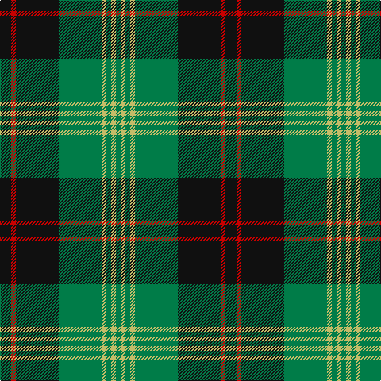

In pattern [GYGYGKRK](/stripes/gygygkrk/).

This was sourced from tartans-authority.  It is a [8 stripe tartan](/stripes/stripes8/).

Original link http://www.tartansauthority.com/tartan-ferret/display/6512/

## Thread count
K/14 R6 K54 G54 LG6 G6 LG6 G/6

## Palette
Each colour and the base-6 reference it is a variant of.

| Colour | Shade | Base |
|---|---|---|
| G | <code style="background-color:#007C48;">#007C48</code> `oklch(51.6% 0.125 156.1)` <small>#007C48</small> | G <code style="background-color:#006100;">#006100</code> |
| K | <code style="background-color:#101010;">#101010</code> `oklch(17.3% 0.000 89.9)` <small>#101010</small> | K <code style="background-color:#000000;">#000000</code> |
| LG | <code style="background-color:#C4BC68;">#C4BC68</code> `oklch(78.4% 0.107 103.7)` <small>#C4BC68</small> | Y <code style="background-color:#F2BF00;">#F2BF00</code> |
| R | <code style="background-color:#C80000;">#C80000</code> `oklch(52.3% 0.215 29.2)` <small>#C80000</small> | R <code style="background-color:#CC0000;">#CC0000</code> |

# Sample pattern

## Nearest tartans

The nearest existing variants by ΔTartan distance.

1. [Banff Centennial (Commemorative)](/setts/s8/k1b1k1b7dg8k1dg1ly1~x4/) — ΔT 0.91
1. [Hartmann (Personal)](/setts/s8/k4g32k4g4k8w3k8t4~x2/) — ΔT 0.98
1. [Crantock Trade Tartan Tartan Number: 707. Earliest known date: pre 2003 'Poached by Clan Laird from a Yorkshire mill and marketed as 'Crantock''(sic) (Scottish Tartans Society archives.) See products available Copyright © Blair Urquhart, Comrie, 2015](/setts/s8/g24dp3g3dp3g3dp7dg20r3~x2/) — ΔT 1.05
1. [Crantock](/setts/s8/g24p3g3p3g3p7dg20r3~x2/) — ΔT 1.07
1. [Michaluk (Personal)](/setts/s6/k3b4g20k20g3lo3~x4/) — ΔT 1.08
1. [MacHardy (Clans Originaux)](/setts/s8/g4r4k12w2k12g32r4k3~x2/) — ΔT 1.10
1. [Bro-Leon](/setts/s9/k4lo17k2lo2g7k2lo2k22db4~x2/) — ΔT 1.12
1. [Sin-Cos (Corporate)](/setts/s10/k60g64dg5g8dg5g64k60ly8k8ly8/) — ΔT 1.14
1. [Louise](/setts/s11/g2k1db9k7g1k1g1k1g9r1g1~x4/) — ΔT 1.19
1. [MacIver Hunting](/setts/s9/w2g12k3g3k16g3k3g12ly2~x2/) — ΔT 1.20

## Neighbour map

Every grey dot is one of 14299 variants placed by the first two principal components of the ΔTartan feature space (44% of its variance). Red is this tartan; blue dots are its nearest — click one to open its page.

<svg viewBox="0 0 640 380" role="img" style="max-width:100%;height:auto;border:1px solid #e0e0e0;border-radius:4px;display:block" xmlns="http://www.w3.org/2000/svg"><image href="/nn/cloud.v1.png" width="640" height="380"/><a href="/setts/s8/k1b1k1b7dg8k1dg1ly1~x4/"><circle cx="224.8" cy="195.7" r="4" fill="#3465a4"><title>Banff Centennial (Commemorative)</title></circle></a><a href="/setts/s8/k4g32k4g4k8w3k8t4~x2/"><circle cx="305.3" cy="190.7" r="4" fill="#3465a4"><title>Hartmann (Personal)</title></circle></a><a href="/setts/s8/g24dp3g3dp3g3dp7dg20r3~x2/"><circle cx="227.5" cy="196.1" r="4" fill="#3465a4"><title>Crantock Trade Tartan Tartan Number: 707. Earliest known date: pre 2003 'Poached by Clan Laird from a Yorkshire mill and marketed as 'Crantock''(sic) (Scottish Tartans Society archives.) See products available Copyright © Blair Urquhart, Comrie, 2015</title></circle></a><a href="/setts/s8/g24p3g3p3g3p7dg20r3~x2/"><circle cx="219.9" cy="191.9" r="4" fill="#3465a4"><title>Crantock</title></circle></a><a href="/setts/s6/k3b4g20k20g3lo3~x4/"><circle cx="234.0" cy="227.2" r="4" fill="#3465a4"><title>Michaluk (Personal)</title></circle></a><a href="/setts/s8/g4r4k12w2k12g32r4k3~x2/"><circle cx="296.8" cy="176.4" r="4" fill="#3465a4"><title>MacHardy (Clans Originaux)</title></circle></a><a href="/setts/s9/k4lo17k2lo2g7k2lo2k22db4~x2/"><circle cx="249.0" cy="168.6" r="4" fill="#3465a4"><title>Bro-Leon</title></circle></a><a href="/setts/s10/k60g64dg5g8dg5g64k60ly8k8ly8/"><circle cx="282.4" cy="189.9" r="4" fill="#3465a4"><title>Sin-Cos (Corporate)</title></circle></a><a href="/setts/s11/g2k1db9k7g1k1g1k1g9r1g1~x4/"><circle cx="194.9" cy="172.8" r="4" fill="#3465a4"><title>Louise</title></circle></a><a href="/setts/s9/w2g12k3g3k16g3k3g12ly2~x2/"><circle cx="273.8" cy="205.1" r="4" fill="#3465a4"><title>MacIver Hunting</title></circle></a><circle cx="252.2" cy="188.7" r="5" fill="#c00000"/></svg>

ID: /setts/s8/k7r3k27g27ly3g3ly3g3~x2/
