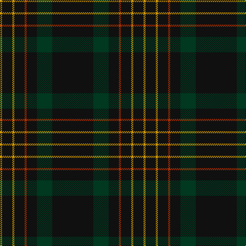

In pattern [KGKRKYKY](/patterns/kgkrkyky/).

This was sourced from register-of-tartans.  It is a [8 stripes tartan](/stripes/stripes8/).

Original link https://www.tartanregister.gov.uk/tartanDetails.aspx?ref=5109

## Thread count
DY/4 K20 DY4 K20 R4 K20 DG30 K/80

## Palette
Each colour and its ΔE from the base-6 reference it is a variant of.

| Colour | Shade | Base | ΔE (OKLab) |
|---|---|---|---|
| DG | <code style="background-color:#003820;">#003820</code> `#003820` | G <code style="background-color:#006100;">#006100</code> | 0.15 |
| DY | <code style="background-color:#D09800;">#D09800</code> `#D09800` | Y <code style="background-color:#F2BF00;">#F2BF00</code> | 0.12 |
| K | <code style="background-color:#101010;">#101010</code> `#101010` | K <code style="background-color:#000000;">#000000</code> | 0.17 |
| R | <code style="background-color:#B03000;">#B03000</code> `#B03000` | R <code style="background-color:#CC0000;">#CC0000</code> | 0.06 |

# Sample pattern

## Nearest tartans

The nearest existing variants by ΔTartan distance.

1. [Langhein Family Tartan Tartan Number: 3235. Earliest known date: April 2002 Based on Black Watch Sett See products available Copyright © Blair Urquhart, Comrie, 2015](/setts/s7/k80g30k20r4k20y4k20-g003820-k101010-rc80000-ye8c000/) — ΔT 0.64
1. [Langhein, Alex (Personal)](/setts/s7/k80g30k20r4k20y4k20-g005830-k101010-rb03000-yd09800/) — ΔT 0.77
1. [Kalkofen (Name)](/setts/s6/k80g30k20r4k20y4-g003820-k101010-rb03000-yd09800/) — ΔT 1.11
1. [CI (Corporate)](/setts/s9/k100b8r4k4r4b8k25ba10r4-b440044-ba1c1c50-k101010-r888888/) — ΔT 1.45
1. [Rikaco Vintage](/setts/s8/b148r18b8ra10b8r18b74ba18-b1c1c1c-ba000048-r9c68a4-raff0000/) — ΔT 1.49
1. [Witches' Blood, The](/setts/s10/k44b34k4b8k4b4k74b8k4r6-b505050-k101010-ra00000/) — ΔT 1.50
1. [Laird Abdullah (Personal)](/setts/s8/k20b4k4b16k80r8k10ra4-b5c5c5c-k101010-rc80000-rae87878/) — ΔT 1.52
1. [Burnetts & Struth](/setts/s5/b136ba14b32k32y8-b14283c-ba5c8ca8-k101010-ya08858/) — ΔT 1.67
1. [Clan Inebriated](/setts/s9/k84b8r4k4r4b8k24ba8r4-b780078-ba1c0070-k101010-r888888/) — ΔT 1.73
1. [Center](/setts/s8/k100b4k26w2k26b10g30r4-b2c4084-g005020-k101010-rdc0000-we0e0e0/) — ΔT 1.73

## Neighbour map

Every grey dot is one of 15726 variants placed by the first two principal components of the ΔTartan feature space (44% of its variance). Red is this tartan; blue dots are its nearest — click one to open its page.

<svg viewBox="0 0 640 380" role="img" style="max-width:100%;height:auto;border:1px solid #e0e0e0;border-radius:4px;display:block" xmlns="http://www.w3.org/2000/svg"><image href="/nn/cloud.v1.png" width="640" height="380"/><a href="/setts/s7/k80g30k20r4k20y4k20-g003820-k101010-rc80000-ye8c000/"><circle cx="567.4" cy="225.7" r="4" fill="#3465a4"><title>Langhein Family Tartan Tartan Number: 3235. Earliest known date: April 2002 Based on Black Watch Sett See products available Copyright © Blair Urquhart, Comrie, 2015</title></circle></a><a href="/setts/s7/k80g30k20r4k20y4k20-g005830-k101010-rb03000-yd09800/"><circle cx="547.2" cy="214.8" r="4" fill="#3465a4"><title>Langhein, Alex (Personal)</title></circle></a><a href="/setts/s6/k80g30k20r4k20y4-g003820-k101010-rb03000-yd09800/"><circle cx="564.9" cy="234.5" r="4" fill="#3465a4"><title>Kalkofen (Name)</title></circle></a><a href="/setts/s9/k100b8r4k4r4b8k25ba10r4-b440044-ba1c1c50-k101010-r888888/"><circle cx="584.6" cy="165.4" r="4" fill="#3465a4"><title>CI (Corporate)</title></circle></a><a href="/setts/s8/b148r18b8ra10b8r18b74ba18-b1c1c1c-ba000048-r9c68a4-raff0000/"><circle cx="538.2" cy="179.0" r="4" fill="#3465a4"><title>Rikaco Vintage</title></circle></a><a href="/setts/s10/k44b34k4b8k4b4k74b8k4r6-b505050-k101010-ra00000/"><circle cx="512.4" cy="199.7" r="4" fill="#3465a4"><title>Witches' Blood, The</title></circle></a><a href="/setts/s8/k20b4k4b16k80r8k10ra4-b5c5c5c-k101010-rc80000-rae87878/"><circle cx="537.0" cy="170.6" r="4" fill="#3465a4"><title>Laird Abdullah (Personal)</title></circle></a><a href="/setts/s5/b136ba14b32k32y8-b14283c-ba5c8ca8-k101010-ya08858/"><circle cx="549.4" cy="236.5" r="4" fill="#3465a4"><title>Burnetts &amp; Struth</title></circle></a><a href="/setts/s9/k84b8r4k4r4b8k24ba8r4-b780078-ba1c0070-k101010-r888888/"><circle cx="527.8" cy="157.1" r="4" fill="#3465a4"><title>Clan Inebriated</title></circle></a><a href="/setts/s8/k100b4k26w2k26b10g30r4-b2c4084-g005020-k101010-rdc0000-we0e0e0/"><circle cx="546.0" cy="144.1" r="4" fill="#3465a4"><title>Center</title></circle></a><circle cx="542.8" cy="206.3" r="5" fill="#c00000"/></svg>

ID: /setts/s8/k80g30k20r4k20y4k20y4-g003820-k101010-rb03000-yd09800/
