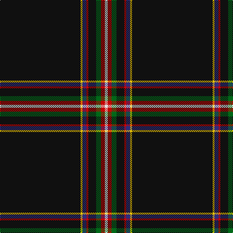

**Bands:** [KYBRKGRW](/stripes/kybrkgrw/) · **Stripes:** [K LY DB R K G R W](/stripes/stripes8/) K LY DB R K G R W

This was sourced from tartans-authority.  It is a [8 band tartan](/bands/bands8/).

Original link http://www.tartansauthority.com/tartan-ferret/display/6587/

## Thread count
K/166 Y4 DB8 R4 K16 G10 R8 LN/6

## Palette
Each colour and its ΔE from the base-6 reference it is a variant of.

| Colour | Shade | Base | ΔE (OKLab) |
|---|---|---|---|
| DB | <code style="background-color:#2C2C80;">#2C2C80</code> `#2C2C80` | B <code style="background-color:#2A418A;">#2A418A</code> | 0.06 |
| G | <code style="background-color:#006818;">#006818</code> `#006818` | G <code style="background-color:#006100;">#006100</code> | 0.02 |
| K | <code style="background-color:#101010;">#101010</code> `#101010` | K <code style="background-color:#000000;">#000000</code> | 0.17 |
| LN | <code style="background-color:#E0E0E0;">#E0E0E0</code> `#E0E0E0` | W <code style="background-color:#F7F7F7;">#F7F7F7</code> | 0.07 |
| R | <code style="background-color:#C80000;">#C80000</code> `#C80000` | R <code style="background-color:#CC0000;">#CC0000</code> | 0.01 |
| Y | <code style="background-color:#E8C000;">#E8C000</code> `#E8C000` | Y <code style="background-color:#F2BF00;">#F2BF00</code> | 0.02 |

# Sample pattern

## Nearest tartans

The nearest existing variants by ΔTartan distance.

1. [Modern Craft (Masonic)](/setts/s8/k108k4lr4w2lr4k1db2w2~x2/) — ΔT 1.13
1. [Modern Craft (Masonic)](/setts/s8/k108n4lb4w2lb4n1db2w2~x2/) — ΔT 1.25
1. [MacHattie Family Tartan Tartan Number: 5917. Earliest known date: 2003 A tartan for the McHattie family of Aberdeen See products available Copyright © Blair Urquhart, Comrie, 2015](/setts/s10/k45dt2r2r2ly1w1ly1r2r2dt2~x2/) — ΔT 1.31
1. [McHattie (Personal)](/setts/s5/k45b2r4ly1w1~x2/) — ΔT 1.45
1. [McHattie (Personal)](/setts/s5/k45db2r4ly1w1~x2/) — ΔT 1.47
1. [Fettes Personal Tartan Tartan Number: 7565. Earliest known date: 2008 Designed online for four kilts by Fiona Fettes. See products available Copyright © Blair Urquhart, Comrie, 2015](/setts/s5/k50dt3lp2r3w1~x2/) — ΔT 1.50
1. [McCuaig (Glenelg and the Western Isles) Hunting](/setts/s9/k20db2k2db4dg4ly2k40r2w3~x2/) — ΔT 1.55
1. [Colleges Scotland (Corp)](/setts/s7/b1k50r1k2n4db7w1~x2/) — ΔT 1.58
1. [Fettes (Personal)](/setts/s5/k50db3p2r3w1~x4/) — ΔT 1.59
1. [Forand (Personal)](/setts/s5/k100r1o10db10ly2~x2/) — ΔT 1.59

## Neighbour map

Every grey dot is one of 14313 variants placed by the first two principal components of the ΔTartan feature space (44% of its variance). Red is this tartan; blue dots are its nearest — click one to open its page.

<svg viewBox="0 0 640 380" role="img" style="max-width:100%;height:auto;border:1px solid #e0e0e0;border-radius:4px;display:block" xmlns="http://www.w3.org/2000/svg"><image href="/nn/cloud.v1.png" width="640" height="380"/><a href="/setts/s8/k108k4lr4w2lr4k1db2w2~x2/"><circle cx="621.8" cy="88.2" r="4" fill="#3465a4"><title>Modern Craft (Masonic)</title></circle></a><a href="/setts/s8/k108n4lb4w2lb4n1db2w2~x2/"><circle cx="609.6" cy="81.6" r="4" fill="#3465a4"><title>Modern Craft (Masonic)</title></circle></a><a href="/setts/s10/k45dt2r2r2ly1w1ly1r2r2dt2~x2/"><circle cx="511.8" cy="60.8" r="4" fill="#3465a4"><title>MacHattie Family Tartan Tartan Number: 5917. Earliest known date: 2003 A tartan for the McHattie family of Aberdeen See products available Copyright © Blair Urquhart, Comrie, 2015</title></circle></a><a href="/setts/s5/k45b2r4ly1w1~x2/"><circle cx="612.8" cy="129.6" r="4" fill="#3465a4"><title>McHattie (Personal)</title></circle></a><a href="/setts/s5/k45db2r4ly1w1~x2/"><circle cx="621.1" cy="133.7" r="4" fill="#3465a4"><title>McHattie (Personal)</title></circle></a><a href="/setts/s5/k50dt3lp2r3w1~x2/"><circle cx="624.3" cy="132.0" r="4" fill="#3465a4"><title>Fettes Personal Tartan Tartan Number: 7565. Earliest known date: 2008 Designed online for four kilts by Fiona Fettes. See products available Copyright © Blair Urquhart, Comrie, 2015</title></circle></a><a href="/setts/s9/k20db2k2db4dg4ly2k40r2w3~x2/"><circle cx="475.3" cy="122.6" r="4" fill="#3465a4"><title>McCuaig (Glenelg and the Western Isles) Hunting</title></circle></a><a href="/setts/s7/b1k50r1k2n4db7w1~x2/"><circle cx="581.6" cy="111.3" r="4" fill="#3465a4"><title>Colleges Scotland (Corp)</title></circle></a><a href="/setts/s5/k50db3p2r3w1~x4/"><circle cx="626.0" cy="135.6" r="4" fill="#3465a4"><title>Fettes (Personal)</title></circle></a><a href="/setts/s5/k100r1o10db10ly2~x2/"><circle cx="598.8" cy="139.6" r="4" fill="#3465a4"><title>Forand (Personal)</title></circle></a><circle cx="564.7" cy="87.5" r="5" fill="#c00000"/></svg>

ID: /setts/s8/k83ly2db4r2k8g5r4w3~x2/
