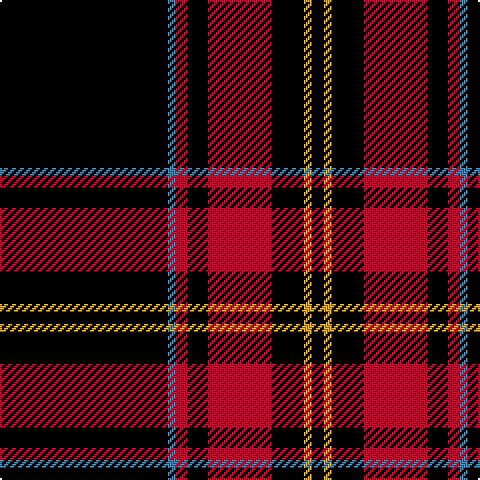

In pattern [KBRKRKYK](/patterns/kbrkrkyk/).

This was sourced from register-of-tartans.  It is a [8 stripes tartan](/stripes/stripes8/).

Original link https://www.tartanregister.gov.uk/tartanDetails.aspx?ref=10939

## Thread count
K/84 B4 R6 K10 R32 K16 Y4 K/6

## Palette
Each colour and its ΔE from the base-6 reference it is a variant of.

| Colour | Shade | Base | ΔE (OKLab) |
|---|---|---|---|
| B | <code style="background-color:#3C82AF;">#3C82AF</code> `#3C82AF` | B <code style="background-color:#2C4084;">#2C4084</code> | 0.20 |
| K | <code style="background-color:#000000;">#000000</code> `#000000` | K <code style="background-color:#000000;">#000000</code> | 0.00 |
| R | <code style="background-color:#C8002C;">#C8002C</code> `#C8002C` | R <code style="background-color:#C80000;">#C80000</code> | 0.03 |
| Y | <code style="background-color:#E0A126;">#E0A126</code> `#E0A126` | Y <code style="background-color:#E8C000;">#E8C000</code> | 0.08 |

# Sample pattern

## Nearest tartans

The nearest existing variants by ΔTartan distance.

1. [Valdres, Kvam and Vang](/setts/s11/k4w1r4k2g2r3k2k20r2k2r2-g008000-k000000-rc00000-we0e0e0/) — ΔT 0.85
1. [Perry, Pirrie](/setts/s5/k150r52w4k8y10-k000000-rc00000-we0e0e0-yf0c000/) — ΔT 1.34
1. [Perry, dress](/setts/s5/k130r54w4k8y10-k000000-r800000-we0e0e0-yf0c000/) — ΔT 1.35
1. [Perry, Ancient](/setts/s5/k130r54w4k8y10-k000000-rc00000-we0e0e0-yf0c000/) — ΔT 1.40
1. [Reiver Check](/setts/s10/k108w8k8w8k8w8k8w8k16r20-k000000-rc00000-we0e0e0/) — ΔT 1.52
1. [Bunnahabhain](/setts/s9/y16k14r6k14r6k76w4k6y12-k101010-rc80000-wf8f8f8-ybc8c00/) — ΔT 1.53
1. [State University of New York College at Buffalo](/setts/s8/k70r5k3w4b4w4k3r12-b64008c-k101010-rfa4b00-wc8c8c8/) — ΔT 1.53
1. [Valdres Kvam and Vang District Tartan Tartan Number: 2124. Earliest known date: 1850's One of the many designs produced in this secluded valley in the middle of Norway. Unlike Gudbrandsdalen, no connection with Scottish tartans can be found, but further research is planned. See products available Copyright © Blair Urquhart, Comrie, 2015](/setts/s11/k4w1r4k2g2r3k2k20r2k2r2-g006818-k101010-rc80000-we0e0e0/) — ΔT 1.59
1. [Stewart Mourning](/setts/s11/k68g11k16g4k4g4k4g19k14w4k14-g808080-k000000-we0e0e0/) — ΔT 1.59
1. [Brockton](/setts/s8/k4w2k4r12k12r6k56w4-k101010-r880000-wffffff/) — ΔT 1.62

## Neighbour map

Every grey dot is one of 15726 variants placed by the first two principal components of the ΔTartan feature space (44% of its variance). Red is this tartan; blue dots are its nearest — click one to open its page.

<svg viewBox="0 0 640 380" role="img" style="max-width:100%;height:auto;border:1px solid #e0e0e0;border-radius:4px;display:block" xmlns="http://www.w3.org/2000/svg"><image href="/nn/cloud.v1.png" width="640" height="380"/><a href="/setts/s11/k4w1r4k2g2r3k2k20r2k2r2-g008000-k000000-rc00000-we0e0e0/"><circle cx="409.5" cy="133.3" r="4" fill="#3465a4"><title>Valdres, Kvam and Vang</title></circle></a><a href="/setts/s5/k150r52w4k8y10-k000000-rc00000-we0e0e0-yf0c000/"><circle cx="460.8" cy="146.5" r="4" fill="#3465a4"><title>Perry, Pirrie</title></circle></a><a href="/setts/s5/k130r54w4k8y10-k000000-r800000-we0e0e0-yf0c000/"><circle cx="434.1" cy="159.0" r="4" fill="#3465a4"><title>Perry, dress</title></circle></a><a href="/setts/s5/k130r54w4k8y10-k000000-rc00000-we0e0e0-yf0c000/"><circle cx="425.9" cy="151.9" r="4" fill="#3465a4"><title>Perry, Ancient</title></circle></a><a href="/setts/s10/k108w8k8w8k8w8k8w8k16r20-k000000-rc00000-we0e0e0/"><circle cx="446.7" cy="155.7" r="4" fill="#3465a4"><title>Reiver Check</title></circle></a><a href="/setts/s9/y16k14r6k14r6k76w4k6y12-k101010-rc80000-wf8f8f8-ybc8c00/"><circle cx="428.9" cy="144.8" r="4" fill="#3465a4"><title>Bunnahabhain</title></circle></a><a href="/setts/s8/k70r5k3w4b4w4k3r12-b64008c-k101010-rfa4b00-wc8c8c8/"><circle cx="462.1" cy="120.8" r="4" fill="#3465a4"><title>State University of New York College at Buffalo</title></circle></a><a href="/setts/s11/k4w1r4k2g2r3k2k20r2k2r2-g006818-k101010-rc80000-we0e0e0/"><circle cx="429.1" cy="135.8" r="4" fill="#3465a4"><title>Valdres Kvam and Vang District Tartan Tartan Number: 2124. Earliest known date: 1850's One of the many designs produced in this secluded valley in the middle of Norway. Unlike Gudbrandsdalen, no connection with Scottish tartans can be found, but further research is planned. See products available Copyright © Blair Urquhart, Comrie, 2015</title></circle></a><a href="/setts/s11/k68g11k16g4k4g4k4g19k14w4k14-g808080-k000000-we0e0e0/"><circle cx="456.3" cy="167.0" r="4" fill="#3465a4"><title>Stewart Mourning</title></circle></a><a href="/setts/s8/k4w2k4r12k12r6k56w4-k101010-r880000-wffffff/"><circle cx="520.7" cy="155.5" r="4" fill="#3465a4"><title>Brockton</title></circle></a><circle cx="446.1" cy="148.7" r="5" fill="#c00000"/></svg>

ID: /setts/s8/k84b4r6k10r32k16y4k6-b3c82af-k000000-rc8002c-ye0a126/
