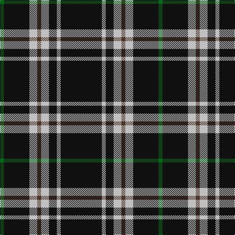

In pattern [GKWBWKWK](/patterns/gkwbwkwk/).

This was sourced from tartans-authority.  It is a [8 stripes tartan](/stripes/stripes8/).

Original link http://www.tartansauthority.com/tartan-ferret/display/3042/

## Attestations

This cloth appears in 2 source records; the oldest owns this page.

- 2000 March — Anzac (Fashion) (tartans-authority, [record](http://www.tartansauthority.com/tartan-ferret/display/3042/))
- undated — Anzac (register-of-tartans, [record](https://www.tartanregister.gov.uk/tartanDetails.aspx?ref=5232))

## Thread count
G/8 K52 N16 T8 N16 K16 N8 K/84

## Palette
Each colour and its ΔE from the base-6 reference it is a variant of.

| Colour | Shade | Base | ΔE (OKLab) |
|---|---|---|---|
| G | <code style="background-color:#006818;">#006818</code> `#006818` | G <code style="background-color:#006100;">#006100</code> | 0.02 |
| K | <code style="background-color:#101010;">#101010</code> `#101010` | K <code style="background-color:#000000;">#000000</code> | 0.17 |
| N | <code style="background-color:#C0C0C0;">#C0C0C0</code> `#C0C0C0` | W <code style="background-color:#F7F7F7;">#F7F7F7</code> | 0.17 |
| T | <code style="background-color:#4C3428;">#4C3428</code> `#4C3428` | B <code style="background-color:#2A418A;">#2A418A</code> | 0.17 |

# Sample pattern

## Nearest tartans

The nearest existing variants by ΔTartan distance.

1. [Cowe (Personal)](/setts/s7/k16b6k64ba28w6k50b6-b5c8ca8-ba1474b4-k101010-wfcfcfc/) — ΔT 0.89
1. [London Fog Black 2 (fashion)](/setts/s10/k18b9k18w2k2w2k18y9k18w2-b2888c4-k101010-wd4d4c4-yccc0a4/) — ΔT 1.05
1. [Jensen, Sven (Personal)](/setts/s9/g12k8w6k22w3k8w3k40g6-g006818-k101010-we0e0e0/) — ΔT 1.05
1. [Black 1990 (Name)](/setts/s6/k34r12k4w12k34y4-k101010-r880000-we0e0e0-ybc8c00/) — ΔT 1.15
1. [Black Clan/Family Tartan Tartan Number: 2761. Earliest known date: pre 1945 In 1990, taken to a TECA stand at one of the US Highland Games by a Timothy Wood, who explained that his faher had 'found' it in a shop in northern England during World War II. See products available Copyright © Blair Urquhart, Comrie, 2015](/setts/s6/k34r12k4w12k34y4-k101010-r880000-wc0c0c0-yd09800/) — ΔT 1.18
1. [Black (symmetrical)](/setts/s6/k34r12k4w12k34y4-k101010-r880000-wc0c0c0-ybc8c00/) — ΔT 1.19
1. [Benson (New England)](/setts/s7/k32b4k16r6y6r6k16-b1474b4-k101010-rc80000-yb8b8b8/) — ΔT 1.24
1. [St. Eloi](/setts/s6/r18y12k60w6k60y12-k00002c-r880000-we0e0e0-yd09800/) — ΔT 1.29
1. [Lundy Reform](/setts/s7/k8w20k4w4k40r4k4-k101010-rc80000-wc0c0c0/) — ΔT 1.29
1. [Believe - Colette](/setts/s7/b6k62w12k14b6k24w4-b646464-k101010-wffffff/) — ΔT 1.30

## Neighbour map

Every grey dot is one of 15726 variants placed by the first two principal components of the ΔTartan feature space (44% of its variance). Red is this tartan; blue dots are its nearest — click one to open its page.

<svg viewBox="0 0 640 380" role="img" style="max-width:100%;height:auto;border:1px solid #e0e0e0;border-radius:4px;display:block" xmlns="http://www.w3.org/2000/svg"><image href="/nn/cloud.v1.png" width="640" height="380"/><a href="/setts/s7/k16b6k64ba28w6k50b6-b5c8ca8-ba1474b4-k101010-wfcfcfc/"><circle cx="411.4" cy="211.8" r="4" fill="#3465a4"><title>Cowe (Personal)</title></circle></a><a href="/setts/s10/k18b9k18w2k2w2k18y9k18w2-b2888c4-k101010-wd4d4c4-yccc0a4/"><circle cx="383.2" cy="206.9" r="4" fill="#3465a4"><title>London Fog Black 2 (fashion)</title></circle></a><a href="/setts/s9/g12k8w6k22w3k8w3k40g6-g006818-k101010-we0e0e0/"><circle cx="415.6" cy="197.4" r="4" fill="#3465a4"><title>Jensen, Sven (Personal)</title></circle></a><a href="/setts/s6/k34r12k4w12k34y4-k101010-r880000-we0e0e0-ybc8c00/"><circle cx="372.3" cy="223.6" r="4" fill="#3465a4"><title>Black 1990 (Name)</title></circle></a><a href="/setts/s6/k34r12k4w12k34y4-k101010-r880000-wc0c0c0-yd09800/"><circle cx="380.4" cy="227.2" r="4" fill="#3465a4"><title>Black Clan/Family Tartan Tartan Number: 2761. Earliest known date: pre 1945 In 1990, taken to a TECA stand at one of the US Highland Games by a Timothy Wood, who explained that his faher had 'found' it in a shop in northern England during World War II. See products available Copyright © Blair Urquhart, Comrie, 2015</title></circle></a><a href="/setts/s6/k34r12k4w12k34y4-k101010-r880000-wc0c0c0-ybc8c00/"><circle cx="381.7" cy="227.9" r="4" fill="#3465a4"><title>Black (symmetrical)</title></circle></a><a href="/setts/s7/k32b4k16r6y6r6k16-b1474b4-k101010-rc80000-yb8b8b8/"><circle cx="403.9" cy="228.2" r="4" fill="#3465a4"><title>Benson (New England)</title></circle></a><a href="/setts/s6/r18y12k60w6k60y12-k00002c-r880000-we0e0e0-yd09800/"><circle cx="375.7" cy="216.0" r="4" fill="#3465a4"><title>St. Eloi</title></circle></a><a href="/setts/s7/k8w20k4w4k40r4k4-k101010-rc80000-wc0c0c0/"><circle cx="376.4" cy="197.0" r="4" fill="#3465a4"><title>Lundy Reform</title></circle></a><a href="/setts/s7/b6k62w12k14b6k24w4-b646464-k101010-wffffff/"><circle cx="472.0" cy="192.9" r="4" fill="#3465a4"><title>Believe - Colette</title></circle></a><circle cx="401.8" cy="189.0" r="5" fill="#c00000"/></svg>

ID: /setts/s8/k84w8k16w16b8w16k52g8-b4c3428-g006818-k101010-wc0c0c0/
