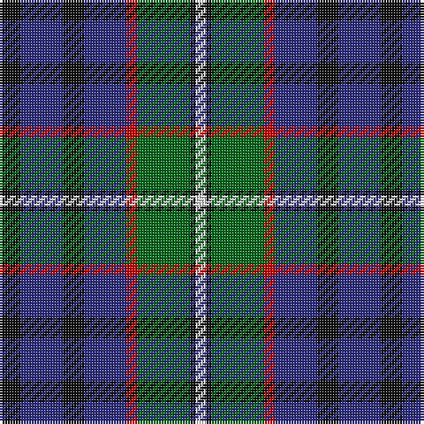

In pattern [KBKBRGKW](/patterns/kbkbrgkw/).

This was sourced from register-of-tartans.  It is a [8 stripes tartan](/stripes/stripes8/).

Original link https://www.tartanregister.gov.uk/tartanDetails.aspx?ref=2507

## Thread count
K/8 DB16 K8 DB16 R4 G20 K2 LN/4

## Palette
Each colour and its ΔE from the base-6 reference it is a variant of.

| Colour | Shade | Base | ΔE (OKLab) |
|---|---|---|---|
| DB | <code style="background-color:#2C2C80;">#2C2C80</code> `#2C2C80` | B <code style="background-color:#2A418A;">#2A418A</code> | 0.06 |
| G | <code style="background-color:#006818;">#006818</code> `#006818` | G <code style="background-color:#006100;">#006100</code> | 0.02 |
| K | <code style="background-color:#101010;">#101010</code> `#101010` | K <code style="background-color:#000000;">#000000</code> | 0.17 |
| LN | <code style="background-color:#E0E0E0;">#E0E0E0</code> `#E0E0E0` | W <code style="background-color:#F7F7F7;">#F7F7F7</code> | 0.07 |
| R | <code style="background-color:#C80000;">#C80000</code> `#C80000` | R <code style="background-color:#CC0000;">#CC0000</code> | 0.01 |

# Sample pattern

## Nearest tartans

The nearest existing variants by ΔTartan distance.

1. [MacLean, Donald (Personal)](/setts/s7/g32w6g6k20b24r4b6-b1c0070-g006818-k101010-r880000-wa8ace8/) — ΔT 0.77
1. [Robertson Hunting Clan Tartan Tartan Number: 334. Earliest known date: pre 2003 This sample comes from the MacGregor-Hastie collection which forms the basis of the cloth archive of the Scottish Tartans Society. Some of the samples, including this one, were unmarked. One can assume that the sample dates between 1930 and 1950. See products available Copyright © Blair Urquhart, Comrie, 2015](/setts/s10/b36k20g18k4r4k4g18k20b18w4-b2c2c80-g006818-k101010-rc80000-we0e0e0/) — ΔT 0.79
1. [Williamson/Smart (Personal)](/setts/s8/b20r6b20ra6k42g40k30ra6-b38409c-g006818-k101010-r888888-rac8002c/) — ΔT 0.81
1. [Newmill](/setts/s7/r10g40k26b84k26g40y10-b304080-g407050-k000030-r802040-yf0c000/) — ΔT 0.82
1. [Rose Hunting](/setts/s6/k16w4g40k40b40r8-b2c2c80-g006818-k101010-rc80000-wfcfcfc/) — ΔT 0.83
1. [MacPhail Hunting #2](/setts/s6/r8b48k24g28k8w6-b2c2c80-g006818-k101010-rc80000-wc0c0c0/) — ΔT 0.83
1. [Rose Hunting Clan Tartan Tartan Number: 1226. Earliest known date: 1831 First recorded in James Logan's, 'The Scottish Gael' in 1831. See products available Copyright © Blair Urquhart, Comrie, 2015](/setts/s6/k8w2g20k20b20r4-b2c2c80-g006818-k101010-rc80000-we0e0e0/) — ΔT 0.86
1. [MacFadzean/MacPhedran](/setts/s7/g12b48w4k48g52r8g8-b2c2c80-g408060-k101010-rc80000-wf8f8f8/) — ΔT 0.86
1. [Paterson Blue (Personal)](/setts/s6/b44w4k20g22r6g8-b2c2c80-g006818-k101010-rc80000-we0e0e0/) — ΔT 0.87
1. [MacLeish](/setts/s8/k36b24k10g8r12g24k4y8-b1c0070-g006818-k101010-rc80000-ybc8c00/) — ΔT 0.94

## Neighbour map

Every grey dot is one of 15726 variants placed by the first two principal components of the ΔTartan feature space (44% of its variance). Red is this tartan; blue dots are its nearest — click one to open its page.

<svg viewBox="0 0 640 380" role="img" style="max-width:100%;height:auto;border:1px solid #e0e0e0;border-radius:4px;display:block" xmlns="http://www.w3.org/2000/svg"><image href="/nn/cloud.v1.png" width="640" height="380"/><a href="/setts/s7/g32w6g6k20b24r4b6-b1c0070-g006818-k101010-r880000-wa8ace8/"><circle cx="160.0" cy="211.9" r="4" fill="#3465a4"><title>MacLean, Donald (Personal)</title></circle></a><a href="/setts/s10/b36k20g18k4r4k4g18k20b18w4-b2c2c80-g006818-k101010-rc80000-we0e0e0/"><circle cx="164.0" cy="202.7" r="4" fill="#3465a4"><title>Robertson Hunting Clan Tartan Tartan Number: 334. Earliest known date: pre 2003 This sample comes from the MacGregor-Hastie collection which forms the basis of the cloth archive of the Scottish Tartans Society. Some of the samples, including this one, were unmarked. One can assume that the sample dates between 1930 and 1950. See products available Copyright © Blair Urquhart, Comrie, 2015</title></circle></a><a href="/setts/s8/b20r6b20ra6k42g40k30ra6-b38409c-g006818-k101010-r888888-rac8002c/"><circle cx="169.5" cy="220.8" r="4" fill="#3465a4"><title>Williamson/Smart (Personal)</title></circle></a><a href="/setts/s7/r10g40k26b84k26g40y10-b304080-g407050-k000030-r802040-yf0c000/"><circle cx="158.8" cy="216.6" r="4" fill="#3465a4"><title>Newmill</title></circle></a><a href="/setts/s6/k16w4g40k40b40r8-b2c2c80-g006818-k101010-rc80000-wfcfcfc/"><circle cx="162.8" cy="220.1" r="4" fill="#3465a4"><title>Rose Hunting</title></circle></a><a href="/setts/s6/r8b48k24g28k8w6-b2c2c80-g006818-k101010-rc80000-wc0c0c0/"><circle cx="168.7" cy="217.5" r="4" fill="#3465a4"><title>MacPhail Hunting #2</title></circle></a><a href="/setts/s6/k8w2g20k20b20r4-b2c2c80-g006818-k101010-rc80000-we0e0e0/"><circle cx="166.9" cy="221.9" r="4" fill="#3465a4"><title>Rose Hunting Clan Tartan Tartan Number: 1226. Earliest known date: 1831 First recorded in James Logan's, 'The Scottish Gael' in 1831. See products available Copyright © Blair Urquhart, Comrie, 2015</title></circle></a><a href="/setts/s7/g12b48w4k48g52r8g8-b2c2c80-g408060-k101010-rc80000-wf8f8f8/"><circle cx="189.7" cy="184.5" r="4" fill="#3465a4"><title>MacFadzean/MacPhedran</title></circle></a><a href="/setts/s6/b44w4k20g22r6g8-b2c2c80-g006818-k101010-rc80000-we0e0e0/"><circle cx="200.0" cy="201.5" r="4" fill="#3465a4"><title>Paterson Blue (Personal)</title></circle></a><a href="/setts/s8/k36b24k10g8r12g24k4y8-b1c0070-g006818-k101010-rc80000-ybc8c00/"><circle cx="152.8" cy="207.1" r="4" fill="#3465a4"><title>MacLeish</title></circle></a><circle cx="163.6" cy="204.5" r="5" fill="#c00000"/></svg>

ID: /setts/s8/k8b16k8b16r4g20k2w4-b2c2c80-g006818-k101010-rc80000-we0e0e0/
