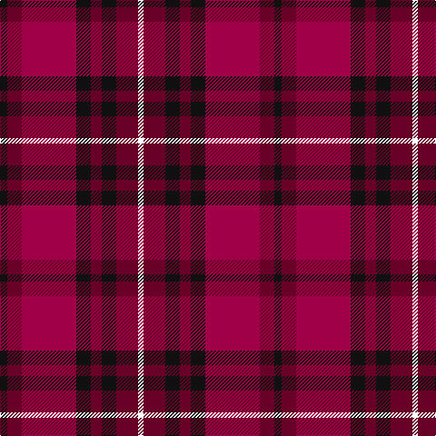

In pattern [KBRKBKBW](/patterns/kbrkbkbw/).

This was sourced from register-of-tartans.  It is a [8 stripes tartan](/stripes/stripes8/).

Original link https://www.tartanregister.gov.uk/tartanDetails.aspx?ref=11005

## Thread count
K/8 DR16 R60 K16 DR12 K16 DR24 W/6

## Palette
Each colour and its ΔE from the base-6 reference it is a variant of.

| Colour | Shade | Base | ΔE (OKLab) |
|---|---|---|---|
| DR | <code style="background-color:#680028;">#680028</code> `#680028` | B <code style="background-color:#2A418A;">#2A418A</code> | 0.21 |
| K | <code style="background-color:#101010;">#101010</code> `#101010` | K <code style="background-color:#000000;">#000000</code> | 0.17 |
| R | <code style="background-color:#A00048;">#A00048</code> `#A00048` | R <code style="background-color:#CC0000;">#CC0000</code> | 0.12 |
| W | <code style="background-color:#FFFFFF;">#FFFFFF</code> `#FFFFFF` | W <code style="background-color:#F7F7F7;">#F7F7F7</code> | 0.02 |

# Sample pattern

## Nearest tartans

The nearest existing variants by ΔTartan distance.

1. [Wounded Warriors Canada](/setts/s7/r18k8r18k50ra6b36k8-b780078-k101010-ra00000-raa07c00/) — ΔT 1.23
1. [Drumlithie - 1790 (Fashion)](/setts/s11/r4b6ra4r30b4g40b40r30b6ra4r4-b440044-g285800-rc80000-rad05054/) — ΔT 1.24
1. [Drumlithie Rock and Wheel Tartan Tartan Number: 1414. Earliest known date: pre 2003 tba See products available Copyright © Blair Urquhart, Comrie, 2015](/setts/s11/r4b6ra4r30b6g38b40r30b6ra4r4-b780078-g006818-rc80000-rad05054/) — ΔT 1.31
1. [Red Chapeau](/setts/s9/r54k6g6k6b36k6b36y6k12-b780078-g006818-k101010-rc80000-ye8c000/) — ΔT 1.32
1. [Fiddes](/setts/s8/g24r22b24ra6r64b16g16b16-b5a008c-g005020-rdc0000-rac82828/) — ΔT 1.34
1. [St George's School](/setts/s10/r20k8r8k12r56k20y8b60k8b14-b2c2c80-k101010-rc80000-ydc943c/) — ΔT 1.34
1. [Drumlithie, Rock and Wheel](/setts/s11/r4b6ra4r30b6g38b40r30b6ra4r4-b800080-g008000-rc00000-ra800000/) — ΔT 1.35
1. [Drumlithie](/setts/s11/r4b6ra4r30b4g40b40r30b6ra4r4-b780078-g006818-rc80000-rad05054/) — ΔT 1.35
1. [Graham of Menteith (Red)](/setts/s6/r72w6r10k42b48k6-b2c2c80-k101010-rc80000-wa8ace8/) — ΔT 1.41
1. [Wounded Warriors Canada](/setts/s7/r18k8r18k50y6b36k8-b780078-k101010-rc80000-ye8c000/) — ΔT 1.43

## Neighbour map

Every grey dot is one of 15726 variants placed by the first two principal components of the ΔTartan feature space (44% of its variance). Red is this tartan; blue dots are its nearest — click one to open its page.

<svg viewBox="0 0 640 380" role="img" style="max-width:100%;height:auto;border:1px solid #e0e0e0;border-radius:4px;display:block" xmlns="http://www.w3.org/2000/svg"><image href="/nn/cloud.v1.png" width="640" height="380"/><a href="/setts/s7/r18k8r18k50ra6b36k8-b780078-k101010-ra00000-raa07c00/"><circle cx="254.8" cy="223.9" r="4" fill="#3465a4"><title>Wounded Warriors Canada</title></circle></a><a href="/setts/s11/r4b6ra4r30b4g40b40r30b6ra4r4-b440044-g285800-rc80000-rad05054/"><circle cx="241.0" cy="171.5" r="4" fill="#3465a4"><title>Drumlithie - 1790 (Fashion)</title></circle></a><a href="/setts/s11/r4b6ra4r30b6g38b40r30b6ra4r4-b780078-g006818-rc80000-rad05054/"><circle cx="249.6" cy="174.3" r="4" fill="#3465a4"><title>Drumlithie Rock and Wheel Tartan Tartan Number: 1414. Earliest known date: pre 2003 tba See products available Copyright © Blair Urquhart, Comrie, 2015</title></circle></a><a href="/setts/s9/r54k6g6k6b36k6b36y6k12-b780078-g006818-k101010-rc80000-ye8c000/"><circle cx="224.7" cy="163.8" r="4" fill="#3465a4"><title>Red Chapeau</title></circle></a><a href="/setts/s8/g24r22b24ra6r64b16g16b16-b5a008c-g005020-rdc0000-rac82828/"><circle cx="248.1" cy="197.7" r="4" fill="#3465a4"><title>Fiddes</title></circle></a><a href="/setts/s10/r20k8r8k12r56k20y8b60k8b14-b2c2c80-k101010-rc80000-ydc943c/"><circle cx="205.7" cy="186.9" r="4" fill="#3465a4"><title>St George's School</title></circle></a><a href="/setts/s11/r4b6ra4r30b6g38b40r30b6ra4r4-b800080-g008000-rc00000-ra800000/"><circle cx="243.4" cy="172.2" r="4" fill="#3465a4"><title>Drumlithie, Rock and Wheel</title></circle></a><a href="/setts/s11/r4b6ra4r30b4g40b40r30b6ra4r4-b780078-g006818-rc80000-rad05054/"><circle cx="249.2" cy="172.0" r="4" fill="#3465a4"><title>Drumlithie</title></circle></a><a href="/setts/s6/r72w6r10k42b48k6-b2c2c80-k101010-rc80000-wa8ace8/"><circle cx="248.1" cy="194.9" r="4" fill="#3465a4"><title>Graham of Menteith (Red)</title></circle></a><a href="/setts/s7/r18k8r18k50y6b36k8-b780078-k101010-rc80000-ye8c000/"><circle cx="228.9" cy="209.9" r="4" fill="#3465a4"><title>Wounded Warriors Canada</title></circle></a><circle cx="234.7" cy="199.7" r="5" fill="#c00000"/></svg>

ID: /setts/s8/k8b16r60k16b12k16b24w6-b680028-k101010-ra00048-wffffff/
