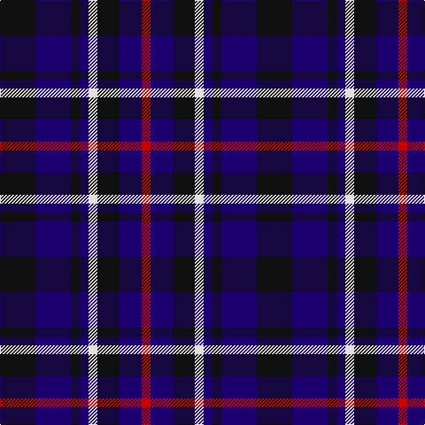

In pattern [KBKBWKBR](/patterns/kbkbwkbr/).

This was sourced from register-of-tartans.  It is a [8 stripes tartan](/stripes/stripes8/).

Original link https://www.tartanregister.gov.uk/tartanDetails.aspx?ref=2110

## Attestations

This cloth appears in 2 source records; the oldest owns this page.

- 01/05/2003 — Lexington Fire Department (register-of-tartans, [record](https://www.tartanregister.gov.uk/tartanDetails.aspx?ref=2110))
- pre May 2003 — Lexington Fire Department (Corporate (tartans-authority, [record](http://www.tartansauthority.com/tartan-ferret/display/5830/))

## Thread count
K/40 DB40 K10 DB10 LN10 K25 DB25 R/10

## Palette
Each colour and its ΔE from the base-6 reference it is a variant of.

| Colour | Shade | Base | ΔE (OKLab) |
|---|---|---|---|
| DB | <code style="background-color:#1C0070;">#1C0070</code> `#1C0070` | B <code style="background-color:#2A418A;">#2A418A</code> | 0.14 |
| K | <code style="background-color:#101010;">#101010</code> `#101010` | K <code style="background-color:#000000;">#000000</code> | 0.17 |
| LN | <code style="background-color:#E0E0E0;">#E0E0E0</code> `#E0E0E0` | W <code style="background-color:#F7F7F7;">#F7F7F7</code> | 0.07 |
| R | <code style="background-color:#C80000;">#C80000</code> `#C80000` | R <code style="background-color:#CC0000;">#CC0000</code> | 0.01 |

# Sample pattern

## Nearest tartans

The nearest existing variants by ΔTartan distance.

1. [Broz Sanz Elementary (Corporate)](/setts/s9/k4b1k1b1k1b4r2b4w2~b2c2c80-k101010-rc80000-we0e0e0~x4/) — ΔT 1.17
1. [Scottish N. A. Business Council (Co](/setts/s10/r2b6ba6b2r2b4ba6r2b2w1~b1c0070-ba003c64-rc80000-we0e0e0~x4/) — ΔT 1.33
1. [Allianz Deutschland 2012](/setts/s7/b6ba3b6ba20k20ba8w4~b20608c-ba141c50-k000000-we8e8e8~x2/) — ΔT 1.42
1. [Old Brigade](/setts/s6/b9k9r3b9k9y1~b000080-k101010-rff0000-yffe600~x4/) — ΔT 1.45
1. [Clergy "Two Spirit" (Personal)](/setts/s11/b1ba3b1ba2b1k6w1k6ba6b1k1~b5c8ca8-ba2c2c80-k101010-wc49cd8~x2/) — ΔT 1.47
1. [Hamilton (Personal)](/setts/s10/b3g3b18r14b5r14b5r14b21g3~b000088-g004c00-r880000~x2/) — ΔT 1.48
1. [Heritage of Scotland](/setts/s7/b6w3b21k16ba6k3ba6~b2c2c80-ba780078-k101010-wf8f8f8~x2/) — ΔT 1.48
1. [Scottish Express International](/setts/s6/b1k4w1k4ba7k1~b9058d8-ba1c0070-k101010-wa8ace8~x4/) — ΔT 1.49
1. [St. Johnstone F.C. (Sports)](/setts/s7/k6w3k8b7y2b7w1~b2c2c80-k101010-wc0c0c0-yd09800~x4/) — ΔT 1.51
1. [Allianz Deutschland 2012 (Corporate)](/setts/s7/b6ba3b6ba20k20ba8w4~b2c2c80-ba202060-k101010-wfcfcfc~x2/) — ΔT 1.56

## Neighbour map

Every grey dot is one of 15726 variants placed by the first two principal components of the ΔTartan feature space (44% of its variance). Red is this tartan; blue dots are its nearest — click one to open its page.

<svg viewBox="0 0 640 380" role="img" style="max-width:100%;height:auto;border:1px solid #e0e0e0;border-radius:4px;display:block" xmlns="http://www.w3.org/2000/svg"><image href="/nn/cloud.v1.png" width="640" height="380"/><a href="/setts/s9/k4b1k1b1k1b4r2b4w2~b2c2c80-k101010-rc80000-we0e0e0~x4/"><circle cx="183.7" cy="247.0" r="4" fill="#3465a4"><title>Broz Sanz Elementary (Corporate)</title></circle></a><a href="/setts/s10/r2b6ba6b2r2b4ba6r2b2w1~b1c0070-ba003c64-rc80000-we0e0e0~x4/"><circle cx="196.5" cy="243.0" r="4" fill="#3465a4"><title>Scottish N. A. Business Council (Co</title></circle></a><a href="/setts/s7/b6ba3b6ba20k20ba8w4~b20608c-ba141c50-k000000-we8e8e8~x2/"><circle cx="195.9" cy="235.9" r="4" fill="#3465a4"><title>Allianz Deutschland 2012</title></circle></a><a href="/setts/s6/b9k9r3b9k9y1~b000080-k101010-rff0000-yffe600~x4/"><circle cx="230.5" cy="262.9" r="4" fill="#3465a4"><title>Old Brigade</title></circle></a><a href="/setts/s11/b1ba3b1ba2b1k6w1k6ba6b1k1~b5c8ca8-ba2c2c80-k101010-wc49cd8~x2/"><circle cx="227.1" cy="218.9" r="4" fill="#3465a4"><title>Clergy &quot;Two Spirit&quot; (Personal)</title></circle></a><a href="/setts/s10/b3g3b18r14b5r14b5r14b21g3~b000088-g004c00-r880000~x2/"><circle cx="227.4" cy="231.9" r="4" fill="#3465a4"><title>Hamilton (Personal)</title></circle></a><a href="/setts/s7/b6w3b21k16ba6k3ba6~b2c2c80-ba780078-k101010-wf8f8f8~x2/"><circle cx="223.4" cy="233.8" r="4" fill="#3465a4"><title>Heritage of Scotland</title></circle></a><a href="/setts/s6/b1k4w1k4ba7k1~b9058d8-ba1c0070-k101010-wa8ace8~x4/"><circle cx="282.7" cy="253.8" r="4" fill="#3465a4"><title>Scottish Express International</title></circle></a><a href="/setts/s7/k6w3k8b7y2b7w1~b2c2c80-k101010-wc0c0c0-yd09800~x4/"><circle cx="177.5" cy="242.8" r="4" fill="#3465a4"><title>St. Johnstone F.C. (Sports)</title></circle></a><a href="/setts/s7/b6ba3b6ba20k20ba8w4~b2c2c80-ba202060-k101010-wfcfcfc~x2/"><circle cx="232.1" cy="248.4" r="4" fill="#3465a4"><title>Allianz Deutschland 2012 (Corporate)</title></circle></a><circle cx="198.6" cy="267.2" r="5" fill="#c00000"/></svg>

ID: /setts/s8/k8b8k2b2w2k5b5r2~b1c0070-k101010-rc80000-we0e0e0~x5/
