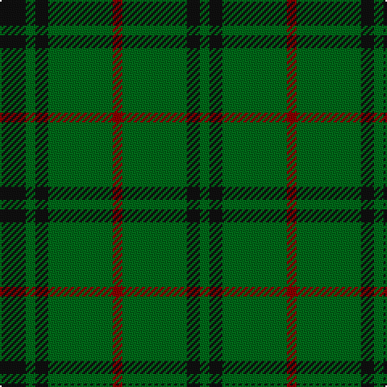

This page is one **sett** — a single exact thread-count. It belongs to the [tartan](/tartans/k8g3k4g20dr3/)
(the same proportion at any scale), whose colour order is pattern [GKGRGKGK](/stripes/gkgrgkgk/).

Sourced from tartans-authority.  It is a [8 stripe tartan](/stripes/stripes8/).

Original link http://www.tartansauthority.com/tartan-ferret/display/1088/

## Thread count
K/16 G6 K8 G40 DR6 G40 K8 G/6

## Palette
Each colour and the base-6 reference it is a variant of.

| Colour | Shade | Base |
|---|---|---|
| DR | <code style="background-color:#880000;">#880000</code> `oklch(39.4% 0.162 29.2)` <small>#880000</small> | R <code style="background-color:#CC0000;">#CC0000</code> |
| G | <code style="background-color:#006818;">#006818</code> `oklch(45.0% 0.142 145.0)` <small>#006818</small> | G <code style="background-color:#006100;">#006100</code> |
| K | <code style="background-color:#101010;">#101010</code> `oklch(17.3% 0.000 89.9)` <small>#101010</small> | K <code style="background-color:#000000;">#000000</code> |

# Sample pattern

## Nearest tartans

The nearest existing variants by ΔTartan distance, with this tartan at the top so the swatches line up against it.

ΔTartan

Tartan

Sett

—

<a href="/ttd/edit/#slug=k8g3k4g20r3~x2">MacArthur-Fox (Personal)</a> <a class="nn-out" href="/setts/s8/k8g3k4g20r3~x2/" title="open its dictionary page">↗</a>

1.08

<a href="/ttd/edit/#slug=g2db2g6db4g3db4g18ly2~x4">Crow (Name)</a> <a class="nn-out" href="/setts/s8/g2db2g6db4g3db4g18ly2~x4/" title="open its dictionary page">↗</a>

1.21

<a href="/ttd/edit/#slug=g24r4g3k14g5r2g10~x2">Northcroft (Personal)</a> <a class="nn-out" href="/setts/s7/g24r4g3k14g5r2g10~x2/" title="open its dictionary page">↗</a>

1.26

<a href="/ttd/edit/#slug=g18ly2g18k4g2k15~x2">MacArthur (Highland Society)</a> <a class="nn-out" href="/setts/s6/g18ly2g18k4g2k15~x2/" title="open its dictionary page">↗</a>

1.44

<a href="/ttd/edit/#slug=g34m4g4m4g4m12g20w5~x2">Leeds, University of (Dance)</a> <a class="nn-out" href="/setts/s8/g34m4g4m4g4m12g20w5~x2/" title="open its dictionary page">↗</a>

1.53

<a href="/ttd/edit/#slug=dg10o1dg1o1lr2dg1o1~x4">Green Watch</a> <a class="nn-out" href="/setts/s7/dg10o1dg1o1lr2dg1o1~x4/" title="open its dictionary page">↗</a>

1.54

<a href="/ttd/edit/#slug=g23r3g7r3g23dp7~x2">Highland Spring (1997)</a> <a class="nn-out" href="/setts/s6/g23r3g7r3g23dp7~x2/" title="open its dictionary page">↗</a>

1.59

<a href="/ttd/edit/#slug=db1dg4r1dg1lo1dg4db1~x12">Justus Hunting (Personal)</a> <a class="nn-out" href="/setts/s7/db1dg4r1dg1lo1dg4db1~x12/" title="open its dictionary page">↗</a>

1.62

<a href="/ttd/edit/#slug=lo1dg11k6dg3lo1dg1lo1~x4">Angle, Green (Fashion)</a> <a class="nn-out" href="/setts/s7/lo1dg11k6dg3lo1dg1lo1~x4/" title="open its dictionary page">↗</a>

1.62

<a href="/ttd/edit/#slug=dg6do2m1dg15m3do1dg15g6m1~x2">McCall, F W (Personal)</a> <a class="nn-out" href="/setts/s9/dg6do2m1dg15m3do1dg15g6m1~x2/" title="open its dictionary page">↗</a>

1.66

<a href="/ttd/edit/#slug=dp7g23r3g7~x2">Highland Spring (1997) (Corporate)</a> <a class="nn-out" href="/setts/s4/dp7g23r3g7~x2/" title="open its dictionary page">↗</a>

## Neighbour map

Every grey dot is one of 14299 variants placed by the first two principal components of the ΔTartan feature space (44% of its variance). Red is this tartan; blue dots are its nearest — click one to open its page.

<svg viewBox="0 0 640 380" role="img" style="max-width:100%;height:auto;border:1px solid #e0e0e0;border-radius:4px;display:block" xmlns="http://www.w3.org/2000/svg"><image href="/nn/cloud.v1.png" width="640" height="380"/><a href="/setts/s8/g2db2g6db4g3db4g18ly2~x4/"><circle cx="439.5" cy="235.0" r="4" fill="#3465a4"><title>Crow (Name)</title></circle></a><a href="/setts/s7/g24r4g3k14g5r2g10~x2/"><circle cx="418.0" cy="239.4" r="4" fill="#3465a4"><title>Northcroft (Personal)</title></circle></a><a href="/setts/s6/g18ly2g18k4g2k15~x2/"><circle cx="386.4" cy="265.0" r="4" fill="#3465a4"><title>MacArthur (Highland Society)</title></circle></a><a href="/setts/s8/g34m4g4m4g4m12g20w5~x2/"><circle cx="430.4" cy="226.3" r="4" fill="#3465a4"><title>Leeds, University of (Dance)</title></circle></a><a href="/setts/s7/dg10o1dg1o1lr2dg1o1~x4/"><circle cx="459.3" cy="214.5" r="4" fill="#3465a4"><title>Green Watch</title></circle></a><a href="/setts/s6/g23r3g7r3g23dp7~x2/"><circle cx="515.8" cy="278.0" r="4" fill="#3465a4"><title>Highland Spring (1997)</title></circle></a><a href="/setts/s7/db1dg4r1dg1lo1dg4db1~x12/"><circle cx="360.1" cy="271.1" r="4" fill="#3465a4"><title>Justus Hunting (Personal)</title></circle></a><a href="/setts/s7/lo1dg11k6dg3lo1dg1lo1~x4/"><circle cx="396.8" cy="226.0" r="4" fill="#3465a4"><title>Angle, Green (Fashion)</title></circle></a><a href="/setts/s9/dg6do2m1dg15m3do1dg15g6m1~x2/"><circle cx="453.2" cy="205.8" r="4" fill="#3465a4"><title>McCall, F W (Personal)</title></circle></a><a href="/setts/s4/dp7g23r3g7~x2/"><circle cx="471.7" cy="289.2" r="4" fill="#3465a4"><title>Highland Spring (1997) (Corporate)</title></circle></a><circle cx="436.1" cy="263.1" r="5" fill="#c00000"/></svg>

ID: /setts/s8/k8g3k4g20r3~x2/
