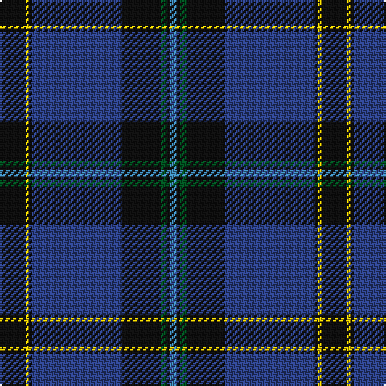

In pattern [BKGKBKYK](/stripes/bkgkbkyk/).

This was sourced from register-of-tartans.  It is a [8 stripe tartan](/stripes/stripes8/).

Original link https://www.tartanregister.gov.uk/tartanDetails.aspx?ref=1766

## Register references

External register numbers recorded for this tartan.

- Scottish Register of Tartans: [1766](https://www.tartanregister.gov.uk/tartanDetails.aspx?ref=1766)
- Scottish Tartans World Register: 327

## Thread count
K/16 Y2 K2 Ba56 K24 G4 K2 B/4

## Palette
Each colour and its ΔE from the base-6 reference it is a variant of.

| Colour | Shade | Base | ΔE (OKLab) |
|---|---|---|---|
| B | <code style="background-color:#3C82AF;">#3C82AF</code> `#3C82AF` | B <code style="background-color:#2A418A;">#2A418A</code> | 0.19 |
| Ba | <code style="background-color:#2C4084;">#2C4084</code> `#2C4084` | B <code style="background-color:#2A418A;">#2A418A</code> | 0.01 |
| G | <code style="background-color:#005020;">#005020</code> `#005020` | G <code style="background-color:#006100;">#006100</code> | 0.07 |
| K | <code style="background-color:#101010;">#101010</code> `#101010` | K <code style="background-color:#000000;">#000000</code> | 0.17 |
| Y | <code style="background-color:#E8C000;">#E8C000</code> `#E8C000` | Y <code style="background-color:#F2BF00;">#F2BF00</code> | 0.02 |

# Sample pattern

## Nearest tartans

The nearest existing variants by ΔTartan distance.

1. [Sinclair-Brown (Personal)](/setts/s8/db64k11r2k4r2k4g32lo4~x2/) — ΔT 0.86
1. [MacLaurin of Brioch](/setts/s7/db36k10dg3r3dg6k1ly2~x2/) — ΔT 0.97
1. [MacNeill](/setts/s9/db5r3db21k5db5k40k2k2w1~x2/) — ΔT 1.02
1. [McClafferty](/setts/s10/r3g10k12db3k2db2k2db30r4w1~x2/) — ΔT 1.09
1. [Binder Wedding (Personal)](/setts/s8/g1db1k1db30k30w2db5ly1~x2/) — ΔT 1.09
1. [Al-Fadhli (Personal)](/setts/s10/db3dg3db24k34w1k34db24r3db3w3~x2/) — ΔT 1.13
1. [Strachan (Name)](/setts/s9/r2k3db42k3ly2k3g22k3r2~x2/) — ΔT 1.18
1. [Moray Council](/setts/s8/db8r2db33dt15g12lo2g2r2~x2/) — ΔT 1.18
1. [Royal Marines Condor](/setts/s7/k8r4k36db48r6g3lo2~x2/) — ΔT 1.19
1. [Home or Hume (Vestiarium Scoticum)](/setts/s8/k28r1k2r1k8db24dg2db3~x2/) — ΔT 1.19

## Neighbour map

Every grey dot is one of 14299 variants placed by the first two principal components of the ΔTartan feature space (44% of its variance). Red is this tartan; blue dots are its nearest — click one to open its page.

<svg viewBox="0 0 640 380" role="img" style="max-width:100%;height:auto;border:1px solid #e0e0e0;border-radius:4px;display:block" xmlns="http://www.w3.org/2000/svg"><image href="/nn/cloud.v1.png" width="640" height="380"/><a href="/setts/s8/db64k11r2k4r2k4g32lo4~x2/"><circle cx="347.9" cy="132.3" r="4" fill="#3465a4"><title>Sinclair-Brown (Personal)</title></circle></a><a href="/setts/s7/db36k10dg3r3dg6k1ly2~x2/"><circle cx="393.9" cy="136.1" r="4" fill="#3465a4"><title>MacLaurin of Brioch</title></circle></a><a href="/setts/s9/db5r3db21k5db5k40k2k2w1~x2/"><circle cx="411.2" cy="130.8" r="4" fill="#3465a4"><title>MacNeill</title></circle></a><a href="/setts/s10/r3g10k12db3k2db2k2db30r4w1~x2/"><circle cx="341.0" cy="140.1" r="4" fill="#3465a4"><title>McClafferty</title></circle></a><a href="/setts/s8/g1db1k1db30k30w2db5ly1~x2/"><circle cx="358.5" cy="127.2" r="4" fill="#3465a4"><title>Binder Wedding (Personal)</title></circle></a><a href="/setts/s10/db3dg3db24k34w1k34db24r3db3w3~x2/"><circle cx="349.0" cy="142.5" r="4" fill="#3465a4"><title>Al-Fadhli (Personal)</title></circle></a><a href="/setts/s9/r2k3db42k3ly2k3g22k3r2~x2/"><circle cx="322.3" cy="132.5" r="4" fill="#3465a4"><title>Strachan (Name)</title></circle></a><a href="/setts/s8/db8r2db33dt15g12lo2g2r2~x2/"><circle cx="326.9" cy="180.8" r="4" fill="#3465a4"><title>Moray Council</title></circle></a><a href="/setts/s7/k8r4k36db48r6g3lo2~x2/"><circle cx="320.8" cy="163.4" r="4" fill="#3465a4"><title>Royal Marines Condor</title></circle></a><a href="/setts/s8/k28r1k2r1k8db24dg2db3~x2/"><circle cx="424.4" cy="177.9" r="4" fill="#3465a4"><title>Home or Hume (Vestiarium Scoticum)</title></circle></a><circle cx="370.7" cy="149.7" r="5" fill="#c00000"/></svg>

ID: /setts/s8/k8ly1k1db28k12dg2k1t2~x2/
