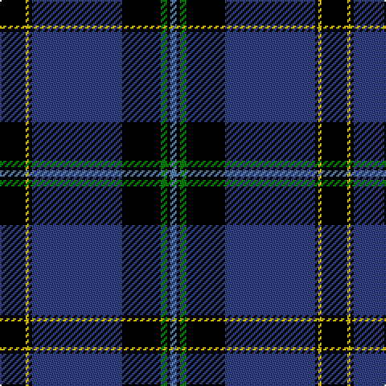

This page is one **sett** — a single exact thread-count. It belongs to the [tartan](/tartans/k8ly1k1db28k12g2k1t2/)
(the same proportion at any scale), whose colour order is pattern [BKGKBKYK](/stripes/bkgkbkyk/).

Sourced from weddslist.  It is a [8 stripe tartan](/stripes/stripes8/).

Original link http://www.weddslist.com/cgi-bin/tartans/pg.pl?source=sts

## Also known as

This cloth is also recorded under:

- Hope-Weir / Weir

2 attestations — the source records this cloth was collapsed from (oldest owns this page)

<ul>
<li>undated — Hope-Weir / Weir (weddslist, <a href="http://www.weddslist.com/cgi-bin/tartans/pg.pl?source=sts">record</a>)</li>
<li>undated — Weir Clan Tartan Tartan Number: 327. Earliest known date: pre 2003 This sample comes from the MacGregor-Hastie collection which forms the basis of the cloth archive of the Scottish Tartans Society. Some of the samples, including this one, were unmarked. One can assume that the sample dates between 1930 and 1950. See products available Copyright © Blair Urquhart, Comrie, 2015 (house-of-tartan, <a href="http://www.house-of-tartan.scotland.net/house/TartanViewjs.asp?colr=Def&tnam=327">record</a>)</li>
</ul>

## Thread count
K/16 Y2 K2 B56 K24 G4 K2 Ba/4

## Palette

Palette: <strong>Ingles Buchan</strong> <small style="color:#888">(1 of 5 colours)</small>
<table><thead><tr><th>Colour</th><th>Threads</th><th>Shade</th><th>Base</th><th>OKLCh</th></tr></thead><tbody><tr><td>K/</td><td style="text-align:right;font-variant-numeric:tabular-nums">16</td><td><code style="background-color:#000000;">#000000</code> <small style="color:#888">#000000</small></td><td>K <code style="background-color:#000000;">#000000</code></td><td><small style="color:#888">oklch(0.0% 0.000 0.0)</small></td></tr><tr><td>Y</td><td style="text-align:right;font-variant-numeric:tabular-nums">2</td><td><code style="background-color:#F0C000;">#F0C000</code> <small style="color:#888">#F0C000</small></td><td>Y <code style="background-color:#F2BF00;">#F2BF00</code></td><td><small style="color:#888">oklch(82.7% 0.169 90.5)</small></td></tr><tr><td>K</td><td style="text-align:right;font-variant-numeric:tabular-nums">2</td><td><code style="background-color:#000000;">#000000</code> <small style="color:#888">#000000</small></td><td>K <code style="background-color:#000000;">#000000</code></td><td><small style="color:#888">oklch(0.0% 0.000 0.0)</small></td></tr><tr><td>B</td><td style="text-align:right;font-variant-numeric:tabular-nums">56</td><td><code style="background-color:#304080;">#304080</code> <small style="color:#888">#304080</small></td><td>B <code style="background-color:#2A418A;">#2A418A</code></td><td><small style="color:#888">oklch(39.4% 0.109 270.2)</small></td></tr><tr><td>K</td><td style="text-align:right;font-variant-numeric:tabular-nums">24</td><td><code style="background-color:#000000;">#000000</code> <small style="color:#888">#000000</small></td><td>K <code style="background-color:#000000;">#000000</code></td><td><small style="color:#888">oklch(0.0% 0.000 0.0)</small></td></tr><tr><td>G</td><td style="text-align:right;font-variant-numeric:tabular-nums">4</td><td><code style="background-color:#008000;">#008000</code> <small style="color:#888">#008000</small></td><td>G <code style="background-color:#006100;">#006100</code></td><td><small style="color:#888">oklch(52.0% 0.177 142.5)</small></td></tr><tr><td>K</td><td style="text-align:right;font-variant-numeric:tabular-nums">2</td><td><code style="background-color:#000000;">#000000</code> <small style="color:#888">#000000</small></td><td>K <code style="background-color:#000000;">#000000</code></td><td><small style="color:#888">oklch(0.0% 0.000 0.0)</small></td></tr><tr><td>Ba/</td><td style="text-align:right;font-variant-numeric:tabular-nums">4</td><td><code style="background-color:#5480B0;">#5480B0</code> <small style="color:#888">#5480B0</small></td><td>B <code style="background-color:#2A418A;">#2A418A</code></td><td><small style="color:#888">oklch(58.8% 0.089 251.5)</small></td></tr></tbody></table>

# Sample pattern

## Nearest tartans

The nearest existing variants by ΔTartan distance, with this tartan at the top so the swatches line up against it.

ΔTartan

Tartan

Sett

—

<a href="/ttd/edit/#slug=k8ly1k1db28k12g2k1t2~x2">Hope-Weir / Weir</a> <a class="nn-out" href="/setts/s8/k8ly1k1db28k12g2k1t2~x2/" title="open its dictionary page">↗</a>

1.08

<a href="/ttd/edit/#slug=w2k40dg22lo3dg2r3dg2w2~x2">Tartan Day SA</a> <a class="nn-out" href="/setts/s8/w2k40dg22lo3dg2r3dg2w2~x2/" title="open its dictionary page">↗</a>

1.08

<a href="/ttd/edit/#slug=g1db1k1db30k30w2db5ly1~x2">Binder Wedding (Personal)</a> <a class="nn-out" href="/setts/s8/g1db1k1db30k30w2db5ly1~x2/" title="open its dictionary page">↗</a>

1.09

<a href="/ttd/edit/#slug=w3db2ly1db2ly1db31k28r2k2~x2">Hill (Name)</a> <a class="nn-out" href="/setts/s9/w3db2ly1db2ly1db31k28r2k2~x2/" title="open its dictionary page">↗</a>

1.15

<a href="/ttd/edit/#slug=w4k2w2k28dt4k2dt2r1k13r1dg13r2~x2">Niagara Region</a> <a class="nn-out" href="/setts/s12/w4k2w2k28dt4k2dt2r1k13r1dg13r2~x2/" title="open its dictionary page">↗</a>

1.16

<a href="/ttd/edit/#slug=k1w1k18db20w1r1lo1~x4">Fuller of Hopewell (Personal)</a> <a class="nn-out" href="/setts/s7/k1w1k18db20w1r1lo1~x4/" title="open its dictionary page">↗</a>

1.19

<a href="/ttd/edit/#slug=r4k9dg9k40r2k2w2~x2">Genet, Edmond Charles 'Citizen' (Personal)</a> <a class="nn-out" href="/setts/s7/r4k9dg9k40r2k2w2~x2/" title="open its dictionary page">↗</a>

1.22

<a href="/ttd/edit/#slug=k28r1k2r1k8db24g2db3~x2">Home, or Hume</a> <a class="nn-out" href="/setts/s8/k28r1k2r1k8db24g2db3~x2/" title="open its dictionary page">↗</a>

1.25

<a href="/ttd/edit/#slug=db36k10g3r3g6k1ly2~x2">MacLaurin, of Brioch</a> <a class="nn-out" href="/setts/s7/db36k10g3r3g6k1ly2~x2/" title="open its dictionary page">↗</a>

1.25

<a href="/ttd/edit/#slug=r4k2w6k2db40k80dg10w6r3">Italian American</a> <a class="nn-out" href="/setts/s9/r4k2w6k2db40k80dg10w6r3/" title="open its dictionary page">↗</a>

1.25

<a href="/ttd/edit/#slug=k8r3b4g4b48k48g4k4ly3b8">Kingsbarns Golf Links</a> <a class="nn-out" href="/setts/s10/k8r3b4g4b48k48g4k4ly3b8/" title="open its dictionary page">↗</a>

## Neighbour map

Every grey dot is one of 14299 variants placed by the first two principal components of the ΔTartan feature space (44% of its variance). Red is this tartan; blue dots are its nearest — click one to open its page.

<svg viewBox="0 0 640 380" role="img" style="max-width:100%;height:auto;border:1px solid #e0e0e0;border-radius:4px;display:block" xmlns="http://www.w3.org/2000/svg"><image href="/nn/cloud.v1.png" width="640" height="380"/><a href="/setts/s8/w2k40dg22lo3dg2r3dg2w2~x2/"><circle cx="302.7" cy="128.3" r="4" fill="#3465a4"><title>Tartan Day SA</title></circle></a><a href="/setts/s8/g1db1k1db30k30w2db5ly1~x2/"><circle cx="358.5" cy="127.2" r="4" fill="#3465a4"><title>Binder Wedding (Personal)</title></circle></a><a href="/setts/s9/w3db2ly1db2ly1db31k28r2k2~x2/"><circle cx="337.8" cy="113.6" r="4" fill="#3465a4"><title>Hill (Name)</title></circle></a><a href="/setts/s12/w4k2w2k28dt4k2dt2r1k13r1dg13r2~x2/"><circle cx="339.7" cy="110.7" r="4" fill="#3465a4"><title>Niagara Region</title></circle></a><a href="/setts/s7/k1w1k18db20w1r1lo1~x4/"><circle cx="313.5" cy="144.1" r="4" fill="#3465a4"><title>Fuller of Hopewell (Personal)</title></circle></a><a href="/setts/s7/r4k9dg9k40r2k2w2~x2/"><circle cx="358.5" cy="146.8" r="4" fill="#3465a4"><title>Genet, Edmond Charles 'Citizen' (Personal)</title></circle></a><a href="/setts/s8/k28r1k2r1k8db24g2db3~x2/"><circle cx="368.5" cy="152.6" r="4" fill="#3465a4"><title>Home, or Hume</title></circle></a><a href="/setts/s7/db36k10g3r3g6k1ly2~x2/"><circle cx="353.3" cy="115.7" r="4" fill="#3465a4"><title>MacLaurin, of Brioch</title></circle></a><a href="/setts/s9/r4k2w6k2db40k80dg10w6r3/"><circle cx="341.6" cy="97.0" r="4" fill="#3465a4"><title>Italian American</title></circle></a><a href="/setts/s10/k8r3b4g4b48k48g4k4ly3b8/"><circle cx="253.9" cy="129.4" r="4" fill="#3465a4"><title>Kingsbarns Golf Links</title></circle></a><circle cx="320.6" cy="125.7" r="5" fill="#c00000"/></svg>

ID: /setts/s8/k8ly1k1db28k12g2k1t2~x2/
