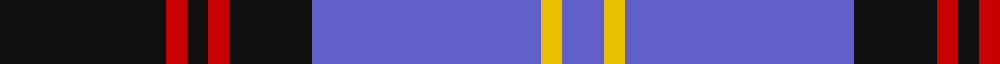
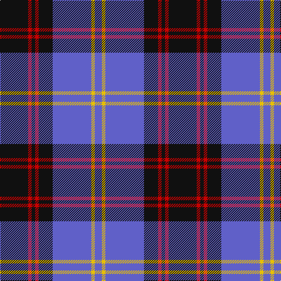

In pattern [BYBKRKRK](/stripes/bybkrkrk/).

This was sourced from register-of-tartans.  It is a [8 stripe tartan](/stripes/stripes8/).

Original link https://www.tartanregister.gov.uk/tartanDetails.aspx?ref=3621

## Attestations

This cloth appears in 2 source records; the oldest owns this page.

- 01/05/2006 — Rutherford (register-of-tartans, [record](https://www.tartanregister.gov.uk/tartanDetails.aspx?ref=3621))
- 2006 May — Rutherford (Name) (tartans-authority, [record](http://www.tartansauthority.com/tartan-ferret/display/6926/))

## Register references

External register numbers recorded for this tartan.

- Scottish Register of Tartans: [3621](https://www.tartanregister.gov.uk/tartanDetails.aspx?ref=3621)
- Scottish Tartans Authority (ITI): 6926

## Thread count
K/48 R6 K6 R6 K24 B66 Y6 B/12

## Palette
Each colour and its ΔE from the base-6 reference it is a variant of.

| Colour | Shade | Base | ΔE (OKLab) |
|---|---|---|---|
| B | <code style="background-color:#6060C8;">#6060C8</code> `#6060C8` | B <code style="background-color:#2A418A;">#2A418A</code> | 0.15 |
| K | <code style="background-color:#101010;">#101010</code> `#101010` | K <code style="background-color:#000000;">#000000</code> | 0.17 |
| R | <code style="background-color:#C80000;">#C80000</code> `#C80000` | R <code style="background-color:#CC0000;">#CC0000</code> | 0.01 |
| Y | <code style="background-color:#E8C000;">#E8C000</code> `#E8C000` | Y <code style="background-color:#F2BF00;">#F2BF00</code> | 0.02 |

# Sample pattern

## Nearest tartans

The nearest existing variants by ΔTartan distance.

1. [Highlands School (North Carolina)](/setts/s8/lo12db2lo2db30dt2db2dt13lb4~x2/) — ΔT 0.96
1. [Scottish Knights Templar MTS (Corp)](/setts/s10/lb4r2db20k6lb5k4lb3k2r2db2~x2/) — ΔT 1.11
1. [Shalom (Fashion)](/setts/s11/k15lb3k3w4k3lb3k15db4k4db30k4~x2/) — ΔT 1.12
1. [Int. Police Association (Official)](/setts/s7/db7r3db26t2db2t26ly4~x2/) — ΔT 1.12
1. [Rhys (Welsh Name)](/setts/s10/lo6db3lo3db15db7lo7db5lo17db46lo4/) — ΔT 1.17
1. [Highlands School (N. Carolina) Corporate Tartan Tartan Number: 2109. Earliest known date: 1990 Highlands in North Carolina is the home of the Scottish Tartans Society's Museum Extension. The school tartan was designed by Bob Martin who is a 'Fellow of the Society'. Blue and Gold are the school colours. See products available Copyright © Blair Urquhart, Comrie, 2015](/setts/s8/ly12db2ly2db30db3db2db13w4~x2/) — ΔT 1.19
1. [Kinnaird (Australia) (Name)](/setts/s8/o33k4o4k5o4k7db41r4~x2/) — ΔT 1.20
1. [Scottish Knights Templar Int. (Corp)](/setts/s9/r3db20k6lb5k4lb3k2r1db2~x2/) — ΔT 1.21
1. [Highlands School, (North Carolina)](/setts/s8/y12db2y2db30db3db2db13w4~x2/) — ΔT 1.25
1. [Murdoch Clebration (Personal)](/setts/s8/k21db8r4db2r2db23k4w2~x2/) — ΔT 1.25

## Neighbour map

Every grey dot is one of 14299 variants placed by the first two principal components of the ΔTartan feature space (44% of its variance). Red is this tartan; blue dots are its nearest — click one to open its page.

<svg viewBox="0 0 640 380" role="img" style="max-width:100%;height:auto;border:1px solid #e0e0e0;border-radius:4px;display:block" xmlns="http://www.w3.org/2000/svg"><image href="/nn/cloud.v1.png" width="640" height="380"/><a href="/setts/s8/lo12db2lo2db30dt2db2dt13lb4~x2/"><circle cx="273.2" cy="160.4" r="4" fill="#3465a4"><title>Highlands School (North Carolina)</title></circle></a><a href="/setts/s10/lb4r2db20k6lb5k4lb3k2r2db2~x2/"><circle cx="208.9" cy="161.7" r="4" fill="#3465a4"><title>Scottish Knights Templar MTS (Corp)</title></circle></a><a href="/setts/s11/k15lb3k3w4k3lb3k15db4k4db30k4~x2/"><circle cx="280.1" cy="180.1" r="4" fill="#3465a4"><title>Shalom (Fashion)</title></circle></a><a href="/setts/s7/db7r3db26t2db2t26ly4~x2/"><circle cx="288.6" cy="179.7" r="4" fill="#3465a4"><title>Int. Police Association (Official)</title></circle></a><a href="/setts/s10/lo6db3lo3db15db7lo7db5lo17db46lo4/"><circle cx="285.4" cy="158.8" r="4" fill="#3465a4"><title>Rhys (Welsh Name)</title></circle></a><a href="/setts/s8/ly12db2ly2db30db3db2db13w4~x2/"><circle cx="260.4" cy="155.7" r="4" fill="#3465a4"><title>Highlands School (N. Carolina) Corporate Tartan Tartan Number: 2109. Earliest known date: 1990 Highlands in North Carolina is the home of the Scottish Tartans Society's Museum Extension. The school tartan was designed by Bob Martin who is a 'Fellow of the Society'. Blue and Gold are the school colours. See products available Copyright © Blair Urquhart, Comrie, 2015</title></circle></a><a href="/setts/s8/o33k4o4k5o4k7db41r4~x2/"><circle cx="248.1" cy="181.7" r="4" fill="#3465a4"><title>Kinnaird (Australia) (Name)</title></circle></a><a href="/setts/s9/r3db20k6lb5k4lb3k2r1db2~x2/"><circle cx="266.3" cy="145.7" r="4" fill="#3465a4"><title>Scottish Knights Templar Int. (Corp)</title></circle></a><a href="/setts/s8/y12db2y2db30db3db2db13w4~x2/"><circle cx="280.3" cy="170.6" r="4" fill="#3465a4"><title>Highlands School, (North Carolina)</title></circle></a><a href="/setts/s8/k21db8r4db2r2db23k4w2~x2/"><circle cx="308.9" cy="198.5" r="4" fill="#3465a4"><title>Murdoch Clebration (Personal)</title></circle></a><circle cx="261.8" cy="180.2" r="5" fill="#c00000"/></svg>

ID: /setts/s8/k8r1k1r1k4b11ly1b2~x6/
