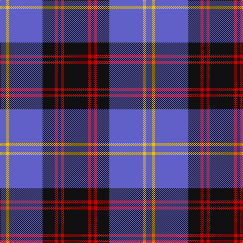

In pattern [BYBKRKRK](/patterns/bybkrkrk/).

This was sourced from register-of-tartans.  It is a [8 stripes tartan](/stripes/stripes8/).

Original link https://www.tartanregister.gov.uk/tartanDetails.aspx?ref=3621

## Attestations

This cloth appears in 2 source records; the oldest owns this page.

- 01/05/2006 — Rutherford (register-of-tartans, [record](https://www.tartanregister.gov.uk/tartanDetails.aspx?ref=3621))
- 2006 May — Rutherford (Name) (tartans-authority, [record](http://www.tartansauthority.com/tartan-ferret/display/6926/))

## Thread count
B/12 Y6 B66 K24 R6 K6 R6 K/48

## Palette
Each colour and its ΔE from the base-6 reference it is a variant of.

| Colour | Shade | Base | ΔE (OKLab) |
|---|---|---|---|
| B | <code style="background-color:#6060C8;">#6060C8</code> `#6060C8` | B <code style="background-color:#2A418A;">#2A418A</code> | 0.15 |
| K | <code style="background-color:#101010;">#101010</code> `#101010` | K <code style="background-color:#000000;">#000000</code> | 0.17 |
| R | <code style="background-color:#C80000;">#C80000</code> `#C80000` | R <code style="background-color:#CC0000;">#CC0000</code> | 0.01 |
| Y | <code style="background-color:#E8C000;">#E8C000</code> `#E8C000` | Y <code style="background-color:#F2BF00;">#F2BF00</code> | 0.02 |

# Sample pattern

## Nearest tartans

The nearest existing variants by ΔTartan distance.

1. [DeCloud-McMasters (Personal)](/setts/s8/r3b2w2b26k22w3b3w3x2~b2c2c80-k101010-rc80000-wfcfcfc/) — ΔT 0.83
1. [Highlands School (North Carolina)](/setts/s8/y12b2y2b30ba2b2ba13w4x2~b1c0070-ba14283c-wc0c0c0-yd09800/) — ΔT 0.96
1. [Scottish Knights Templar MTS (Corp)](/setts/s10/w4r2b20k6w5k4w3k2r2b2x2~b2c2c80-k101010-rc80000-wc0c0c0/) — ΔT 1.11
1. [Int. Police Association (Official)](/setts/s7/b7r3b26ba2b2ba26y4x2~b1c0070-ba5c8ca8-rc80000-ye8c000/) — ΔT 1.12
1. [Shalom (Fashion)](/setts/s11/k15w3k3wa4k3w3k15b4k4b30k4x2~b2c2c80-k101010-wa8ace8-wae0e0e0/) — ΔT 1.12
1. [Rhys (Welsh Name)](/setts/s10/y6b3y3b15ba7y7ba5y17ba46y4~b202060-ba000048-ya08858/) — ΔT 1.17
1. [Highlands School (N. Carolina) Corporate Tartan Tartan Number: 2109. Earliest known date: 1990 Highlands in North Carolina is the home of the Scottish Tartans Society's Museum Extension. The school tartan was designed by Bob Martin who is a 'Fellow of the Society'. Blue and Gold are the school colours. See products available Copyright © Blair Urquhart, Comrie, 2015](/setts/s8/y12b2y2b30ba3b2ba13w4x2~b2c2c80-ba202060-we0e0e0-ye8c000/) — ΔT 1.19
1. [Kinnaird (Australia) (Name)](/setts/s8/r33k4r4k5r4k7b41ra4x2~b2c2c80-k101010-r888888-rac80000/) — ΔT 1.21
1. [Scottish Knights Templar Int. (Corp)](/setts/s9/r3b20k6w5k4w3k2r1b2x2~b2c2c80-k101010-rc80000-wc0c0c0/) — ΔT 1.21
1. [Highlands School, (North Carolina)](/setts/s8/g12b2g2b30ba3b2ba13w4x2~b304080-ba000050-g908000-we0e0e0/) — ΔT 1.25

## Neighbour map

Every grey dot is one of 15726 variants placed by the first two principal components of the ΔTartan feature space (44% of its variance). Red is this tartan; blue dots are its nearest — click one to open its page.

<svg viewBox="0 0 640 380" role="img" style="max-width:100%;height:auto;border:1px solid #e0e0e0;border-radius:4px;display:block" xmlns="http://www.w3.org/2000/svg"><image href="/nn/cloud.v1.png" width="640" height="380"/><a href="/setts/s8/r3b2w2b26k22w3b3w3x2~b2c2c80-k101010-rc80000-wfcfcfc/"><circle cx="260.3" cy="160.6" r="4" fill="#3465a4"><title>DeCloud-McMasters (Personal)</title></circle></a><a href="/setts/s8/y12b2y2b30ba2b2ba13w4x2~b1c0070-ba14283c-wc0c0c0-yd09800/"><circle cx="270.0" cy="161.4" r="4" fill="#3465a4"><title>Highlands School (North Carolina)</title></circle></a><a href="/setts/s10/w4r2b20k6w5k4w3k2r2b2x2~b2c2c80-k101010-rc80000-wc0c0c0/"><circle cx="205.8" cy="162.8" r="4" fill="#3465a4"><title>Scottish Knights Templar MTS (Corp)</title></circle></a><a href="/setts/s7/b7r3b26ba2b2ba26y4x2~b1c0070-ba5c8ca8-rc80000-ye8c000/"><circle cx="285.3" cy="180.8" r="4" fill="#3465a4"><title>Int. Police Association (Official)</title></circle></a><a href="/setts/s11/k15w3k3wa4k3w3k15b4k4b30k4x2~b2c2c80-k101010-wa8ace8-wae0e0e0/"><circle cx="276.9" cy="179.3" r="4" fill="#3465a4"><title>Shalom (Fashion)</title></circle></a><a href="/setts/s10/y6b3y3b15ba7y7ba5y17ba46y4~b202060-ba000048-ya08858/"><circle cx="282.1" cy="158.6" r="4" fill="#3465a4"><title>Rhys (Welsh Name)</title></circle></a><a href="/setts/s8/y12b2y2b30ba3b2ba13w4x2~b2c2c80-ba202060-we0e0e0-ye8c000/"><circle cx="257.4" cy="157.3" r="4" fill="#3465a4"><title>Highlands School (N. Carolina) Corporate Tartan Tartan Number: 2109. Earliest known date: 1990 Highlands in North Carolina is the home of the Scottish Tartans Society's Museum Extension. The school tartan was designed by Bob Martin who is a 'Fellow of the Society'. Blue and Gold are the school colours. See products available Copyright © Blair Urquhart, Comrie, 2015</title></circle></a><a href="/setts/s8/r33k4r4k5r4k7b41ra4x2~b2c2c80-k101010-r888888-rac80000/"><circle cx="245.2" cy="179.9" r="4" fill="#3465a4"><title>Kinnaird (Australia) (Name)</title></circle></a><a href="/setts/s9/r3b20k6w5k4w3k2r1b2x2~b2c2c80-k101010-rc80000-wc0c0c0/"><circle cx="263.3" cy="146.4" r="4" fill="#3465a4"><title>Scottish Knights Templar Int. (Corp)</title></circle></a><a href="/setts/s8/g12b2g2b30ba3b2ba13w4x2~b304080-ba000050-g908000-we0e0e0/"><circle cx="277.1" cy="169.5" r="4" fill="#3465a4"><title>Highlands School, (North Carolina)</title></circle></a><circle cx="258.8" cy="181.6" r="5" fill="#c00000"/></svg>

ID: /setts/s8/k8r1k1r1k4b11y1b2x6~b6060c8-k101010-rc80000-ye8c000/
