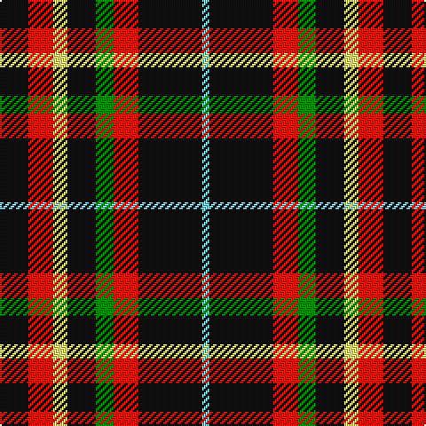

This page is one **sett** — a single exact thread-count. It belongs to the [tartan](/tartans/k8r7ly4k8g5r7k18lb2/)
(the same proportion at any scale), whose colour order is pattern [KRWKGRKW](/stripes/krwkgrkw/).

Sourced from register-of-tartans.  It is a [8 stripe tartan](/stripes/stripes8/).

Original link https://www.tartanregister.gov.uk/tartanDetails.aspx?ref=10232

## Register references

External register numbers recorded for this tartan.

- Scottish Register of Tartans: [10232](https://www.tartanregister.gov.uk/tartanDetails.aspx?ref=10232)

## Thread count
K/16 R14 LY8 K16 G10 R14 K36 LB/4

## Palette
Each colour and the base-6 reference it is a variant of.

| Colour | Shade | Base |
|---|---|---|
| G | <code style="background-color:#008B00;">#008B00</code> `oklch(55.2% 0.188 142.5)` <small>#008B00</small> | G <code style="background-color:#006100;">#006100</code> |
| K | <code style="background-color:#101010;">#101010</code> `oklch(17.3% 0.000 89.9)` <small>#101010</small> | K <code style="background-color:#000000;">#000000</code> |
| LB | <code style="background-color:#82CFFD;">#82CFFD</code> `oklch(82.2% 0.100 236.0)` <small>#82CFFD</small> | W <code style="background-color:#F7F7F7;">#F7F7F7</code> |
| LY | <code style="background-color:#FFFF7E;">#FFFF7E</code> `oklch(97.5% 0.151 108.9)` <small>#FFFF7E</small> | W <code style="background-color:#F7F7F7;">#F7F7F7</code> |
| R | <code style="background-color:#E3170D;">#E3170D</code> `oklch(58.1% 0.230 29.4)` <small>#E3170D</small> | R <code style="background-color:#CC0000;">#CC0000</code> |

# Sample pattern

## Nearest tartans

The nearest existing variants by ΔTartan distance, with this tartan at the top so the swatches line up against it.

ΔTartan

Tartan

Sett

—

<a href="/ttd/edit/#slug=k8r7w4k8g5r7k18lt2~x2">Malliou, Despina (Personal)</a> <a class="nn-out" href="/setts/s8/k8r7w4k8g5r7k18lt2~x2/" title="open its dictionary page">↗</a>

1.40

<a href="/ttd/edit/#slug=k4lo8k26o6g15o6k26w2~x2">Holestone (Corporate)</a> <a class="nn-out" href="/setts/s8/k4lo8k26o6g15o6k26w2~x2/" title="open its dictionary page">↗</a>

1.44

<a href="/ttd/edit/#slug=do4o1do5lb4k1lb1lr1~x4">Elgin</a> <a class="nn-out" href="/setts/s7/do4o1do5lb4k1lb1lr1~x4/" title="open its dictionary page">↗</a>

1.54

<a href="/ttd/edit/#slug=db1o9g5o1k5o1g5o9w1~x2">Duchess of York</a> <a class="nn-out" href="/setts/s9/db1o9g5o1k5o1g5o9w1~x2/" title="open its dictionary page">↗</a>

1.56

<a href="/ttd/edit/#slug=k40dp5k6o26lr13k9dy3~x2">de Meuron (Neuchâtel) Dress, The</a> <a class="nn-out" href="/setts/s7/k40dp5k6o26lr13k9dy3~x2/" title="open its dictionary page">↗</a>

1.59

<a href="/ttd/edit/#slug=k23r27db3r5w3k14ly6~x2">Hoffman Texas German</a> <a class="nn-out" href="/setts/s7/k23r27db3r5w3k14ly6~x2/" title="open its dictionary page">↗</a>

1.59

<a href="/ttd/edit/#slug=k3lb7lo26k26w5k26lo26lb7k3r3~x2">Cornish National</a> <a class="nn-out" href="/setts/s10/k3lb7lo26k26w5k26lo26lb7k3r3~x2/" title="open its dictionary page">↗</a>

1.61

<a href="/ttd/edit/#slug=dp2r1k4lo2k12lo8k12lo2k4lo1w2~x4">Gary (Personal)</a> <a class="nn-out" href="/setts/s11/dp2r1k4lo2k12lo8k12lo2k4lo1w2~x4/" title="open its dictionary page">↗</a>

1.61

<a href="/ttd/edit/#slug=ly3k9b1k1r6k2ly3~x4">LP Cover (Dance)</a> <a class="nn-out" href="/setts/s7/ly3k9b1k1r6k2ly3~x4/" title="open its dictionary page">↗</a>

1.62

<a href="/ttd/edit/#slug=dg6r2dg14r14db2r14w2dg14db2dg4ly3~x2">Hunter (USA)</a> <a class="nn-out" href="/setts/s11/dg6r2dg14r14db2r14w2dg14db2dg4ly3~x2/" title="open its dictionary page">↗</a>

1.65

<a href="/ttd/edit/#slug=r12db2r4db4k15g4r4g2r12~x2">Alexander</a> <a class="nn-out" href="/setts/s9/r12db2r4db4k15g4r4g2r12~x2/" title="open its dictionary page">↗</a>

## Neighbour map

Every grey dot is one of 14299 variants placed by the first two principal components of the ΔTartan feature space (44% of its variance). Red is this tartan; blue dots are its nearest — click one to open its page.

<svg viewBox="0 0 640 380" role="img" style="max-width:100%;height:auto;border:1px solid #e0e0e0;border-radius:4px;display:block" xmlns="http://www.w3.org/2000/svg"><image href="/nn/cloud.v1.png" width="640" height="380"/><a href="/setts/s8/k4lo8k26o6g15o6k26w2~x2/"><circle cx="287.6" cy="180.9" r="4" fill="#3465a4"><title>Holestone (Corporate)</title></circle></a><a href="/setts/s7/do4o1do5lb4k1lb1lr1~x4/"><circle cx="191.7" cy="201.8" r="4" fill="#3465a4"><title>Elgin</title></circle></a><a href="/setts/s9/db1o9g5o1k5o1g5o9w1~x2/"><circle cx="248.7" cy="189.1" r="4" fill="#3465a4"><title>Duchess of York</title></circle></a><a href="/setts/s7/k40dp5k6o26lr13k9dy3~x2/"><circle cx="239.5" cy="164.4" r="4" fill="#3465a4"><title>de Meuron (Neuchâtel) Dress, The</title></circle></a><a href="/setts/s7/k23r27db3r5w3k14ly6~x2/"><circle cx="207.4" cy="173.1" r="4" fill="#3465a4"><title>Hoffman Texas German</title></circle></a><a href="/setts/s10/k3lb7lo26k26w5k26lo26lb7k3r3~x2/"><circle cx="165.5" cy="160.7" r="4" fill="#3465a4"><title>Cornish National</title></circle></a><a href="/setts/s11/dp2r1k4lo2k12lo8k12lo2k4lo1w2~x4/"><circle cx="311.6" cy="151.6" r="4" fill="#3465a4"><title>Gary (Personal)</title></circle></a><a href="/setts/s7/ly3k9b1k1r6k2ly3~x4/"><circle cx="210.4" cy="198.7" r="4" fill="#3465a4"><title>LP Cover (Dance)</title></circle></a><a href="/setts/s11/dg6r2dg14r14db2r14w2dg14db2dg4ly3~x2/"><circle cx="229.2" cy="181.3" r="4" fill="#3465a4"><title>Hunter (USA)</title></circle></a><a href="/setts/s9/r12db2r4db4k15g4r4g2r12~x2/"><circle cx="243.1" cy="195.0" r="4" fill="#3465a4"><title>Alexander</title></circle></a><circle cx="227.0" cy="192.8" r="5" fill="#c00000"/></svg>

ID: /setts/s8/k8r7w4k8g5r7k18lt2~x2/
