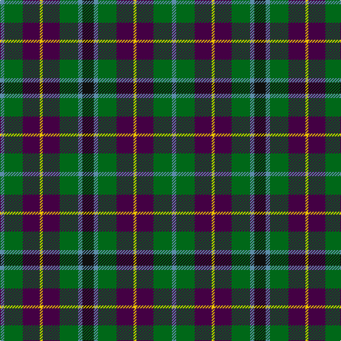

**Bands:** [BGBYBGBK](/stripes/bgbybgbk/) · **Stripes:** [T G DP LY DP G T K](/stripes/stripes8/) T G DP LY DP G T K

This was sourced from register-of-tartans.  It is a [8 band tartan](/bands/bands8/).

Original link https://www.tartanregister.gov.uk/tartanDetails.aspx?ref=4715

## Register references

External register numbers recorded for this tartan.

- Scottish Register of Tartans: [4715](https://www.tartanregister.gov.uk/tartanDetails.aspx?ref=4715)
- Scottish Tartans Authority (ITI): 1034
- Scottish Tartans World Register: 1034

## Thread count
B/6 G26 DP24 Y4 DP24 G26 B6 K/16

## Palette
Each colour and its ΔE from the base-6 reference it is a variant of.

| Colour | Shade | Base | ΔE (OKLab) |
|---|---|---|---|
| B | <code style="background-color:#5C8CA8;">#5C8CA8</code> `#5C8CA8` | B <code style="background-color:#2A418A;">#2A418A</code> | 0.23 |
| DG | <code style="background-color:#003820;">#003820</code> `#003820` | G <code style="background-color:#006100;">#006100</code> | 0.15 |
| DP | <code style="background-color:#440044;">#440044</code> `#440044` | B <code style="background-color:#2A418A;">#2A418A</code> | 0.18 |
| G | <code style="background-color:#006818;">#006818</code> `#006818` | G <code style="background-color:#006100;">#006100</code> | 0.02 |
| K | <code style="background-color:#101010;">#101010</code> `#101010` | K <code style="background-color:#000000;">#000000</code> | 0.17 |
| Y | <code style="background-color:#E8C000;">#E8C000</code> `#E8C000` | Y <code style="background-color:#F2BF00;">#F2BF00</code> | 0.02 |

# Sample pattern

## Nearest tartans

The nearest existing variants by ΔTartan distance.

1. [Selkirk (Personal) Original](/setts/s8/dp11y2k10g10lo2g10k10y2~x2/) — ΔT 0.53
1. [Wilson's No.217](/setts/s8/dp11t2k10g10ly3g10k10t2~x2/) — ΔT 0.73
1. [Scottish Parliament (unofficial)](/setts/s7/db14g18k3g18r20k14lo3~x2/) — ΔT 0.74
1. [Cunningham / Wilson's No 120](/setts/s7/k11g12w2g12k12dp12r3~x2/) — ΔT 0.75
1. [Williamson/Smart (Personal)](/setts/s8/db10o3db10r3k21g20k15r3~x2/) — ΔT 0.75
1. [Wilson's No.124](/setts/s8/g14dp11y3k5y3dp11g14ly2~x2/) — ΔT 0.79
1. [Brodie Hunting](/setts/s7/r2k8lo1k8g8t8r2~x4/) — ΔT 0.82
1. [Casely Family Tartan Tartan Number: 2146. Earliest known date: 1992 The chiefly sett of a family tartan designed by Harry Lindley for the Scottish Tartans Society, to whom Mr Gordon Casely petitioned for the design in 1990. Formal accreditation was granted in 1993. See products available Copyright © Blair Urquhart, Comrie, 2015](/setts/s10/g19r7g19k19g3db19lo5db19g3k19~x2/) — ΔT 0.85
1. [Wilson's No.229](/setts/s8/dg14dp11t3k5t3dp11dg14w2~x2/) — ΔT 0.87
1. [MacLeish](/setts/s8/k18db12k5g4r6g12k2lo4~x2/) — ΔT 0.90

## Neighbour map

Every grey dot is one of 14313 variants placed by the first two principal components of the ΔTartan feature space (44% of its variance). Red is this tartan; blue dots are its nearest — click one to open its page.

<svg viewBox="0 0 640 380" role="img" style="max-width:100%;height:auto;border:1px solid #e0e0e0;border-radius:4px;display:block" xmlns="http://www.w3.org/2000/svg"><image href="/nn/cloud.v1.png" width="640" height="380"/><a href="/setts/s8/dp11y2k10g10lo2g10k10y2~x2/"><circle cx="118.8" cy="236.2" r="4" fill="#3465a4"><title>Selkirk (Personal) Original</title></circle></a><a href="/setts/s8/dp11t2k10g10ly3g10k10t2~x2/"><circle cx="106.2" cy="240.8" r="4" fill="#3465a4"><title>Wilson's No.217</title></circle></a><a href="/setts/s7/db14g18k3g18r20k14lo3~x2/"><circle cx="143.1" cy="245.7" r="4" fill="#3465a4"><title>Scottish Parliament (unofficial)</title></circle></a><a href="/setts/s7/k11g12w2g12k12dp12r3~x2/"><circle cx="131.0" cy="254.9" r="4" fill="#3465a4"><title>Cunningham / Wilson's No 120</title></circle></a><a href="/setts/s8/db10o3db10r3k21g20k15r3~x2/"><circle cx="172.8" cy="224.1" r="4" fill="#3465a4"><title>Williamson/Smart (Personal)</title></circle></a><a href="/setts/s8/g14dp11y3k5y3dp11g14ly2~x2/"><circle cx="184.8" cy="220.6" r="4" fill="#3465a4"><title>Wilson's No.124</title></circle></a><a href="/setts/s7/r2k8lo1k8g8t8r2~x4/"><circle cx="155.5" cy="218.0" r="4" fill="#3465a4"><title>Brodie Hunting</title></circle></a><a href="/setts/s10/g19r7g19k19g3db19lo5db19g3k19~x2/"><circle cx="116.3" cy="231.1" r="4" fill="#3465a4"><title>Casely Family Tartan Tartan Number: 2146. Earliest known date: 1992 The chiefly sett of a family tartan designed by Harry Lindley for the Scottish Tartans Society, to whom Mr Gordon Casely petitioned for the design in 1990. Formal accreditation was granted in 1993. See products available Copyright © Blair Urquhart, Comrie, 2015</title></circle></a><a href="/setts/s8/dg14dp11t3k5t3dp11dg14w2~x2/"><circle cx="183.3" cy="218.6" r="4" fill="#3465a4"><title>Wilson's No.229</title></circle></a><a href="/setts/s8/k18db12k5g4r6g12k2lo4~x2/"><circle cx="156.3" cy="209.9" r="4" fill="#3465a4"><title>MacLeish</title></circle></a><circle cx="150.3" cy="233.4" r="5" fill="#c00000"/></svg>

ID: /setts/s8/k8t3g13dp12ly2dp12g13t3~x2/
