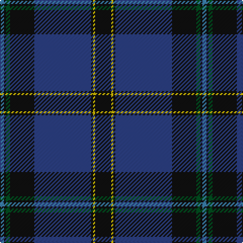

In pattern [BKGKBKYK](/patterns/bkgkbkyk/).

This was sourced from register-of-tartans.  It is a [8 stripes tartan](/stripes/stripes8/).

Original link https://www.tartanregister.gov.uk/tartanDetails.aspx?ref=1766

## Register references

External register numbers recorded for this tartan.

- Scottish Register of Tartans: [1766](https://www.tartanregister.gov.uk/tartanDetails.aspx?ref=1766)
- Scottish Tartans World Register: 327

## Thread count
B/4 K2 G4 K24 Ba56 K2 Y2 K/16

## Palette
Each colour and its ΔE from the base-6 reference it is a variant of.

| Colour | Shade | Base | ΔE (OKLab) |
|---|---|---|---|
| B | <code style="background-color:#3C82AF;">#3C82AF</code> `#3C82AF` | B <code style="background-color:#2A418A;">#2A418A</code> | 0.19 |
| Ba | <code style="background-color:#2C4084;">#2C4084</code> `#2C4084` | B <code style="background-color:#2A418A;">#2A418A</code> | 0.01 |
| G | <code style="background-color:#005020;">#005020</code> `#005020` | G <code style="background-color:#006100;">#006100</code> | 0.07 |
| K | <code style="background-color:#101010;">#101010</code> `#101010` | K <code style="background-color:#000000;">#000000</code> | 0.17 |
| Y | <code style="background-color:#E8C000;">#E8C000</code> `#E8C000` | Y <code style="background-color:#F2BF00;">#F2BF00</code> | 0.02 |

# Sample pattern

## Nearest tartans

The nearest existing variants by ΔTartan distance.

1. [Weir Clan Tartan Tartan Number: 327. Earliest known date: pre 2003 This sample comes from the MacGregor-Hastie collection which forms the basis of the cloth archive of the Scottish Tartans Society. Some of the samples, including this one, were unmarked. One can assume that the sample dates between 1930 and 1950. See products available Copyright © Blair Urquhart, Comrie, 2015](/setts/s8/k8y1k1b28k12g2k1ba2~b2c2c80-ba5c8ca8-g006818-k101010-ye8c000~x2/) — ΔT 0.31
1. [Sinclair-Brown (Personal)](/setts/s8/b64k11r2k4r2k4g32y4~b2c2c80-g006818-k101010-rc80000-ybc8c00~x2/) — ΔT 0.86
1. [MacLaurin of Brioch](/setts/s7/b36k10g3r3g6k1y2~b2c4084-g005020-k101010-rdc0000-ye8c000~x2/) — ΔT 0.98
1. [MacNeill](/setts/s9/b5r3b21k5b5k40ka2k2w1~b304080-k101010-ka000000-rc00000-we0e0e0~x2/) — ΔT 1.02
1. [MacLaurin of Brioch Clan Tartan Tartan Number: 344. Earliest known date: 1856 This sett was approved by the Chief and accepted by the A.G.M. of the Clan MacLaren Society as Dress MacLaren in 1981. The sett has been designed by changing the blue ground of the usual MacLaren sett to white and then centering a blue stripe on the white ground. This illustration is based on a kilt belonging to the designer, Mr I.G.Campbell MacLaren. See products available Copyright © Blair Urquhart, Comrie, 2015](/setts/s7/b36k10g3r3g6k1y2~b2c2c80-g006818-k101010-rc80000-ye8c000~x2/) — ΔT 1.07
1. [McClafferty](/setts/s10/r3g10k12b3k2b2k2b30r4w1~b202060-g006818-k101010-r880000-we0e0e0~x2/) — ΔT 1.09
1. [Binder Wedding (Personal)](/setts/s8/g1b1k1b30k30w2b5y1~b2c4084-g649848-k101010-wffffff-yffe600~x2/) — ΔT 1.10
1. [Al-Fadhli (Personal)](/setts/s10/b3g3b24k34w1k34b24r3b3w3~b2c4084-g003c14-k101010-rdc0000-we0e0e0~x2/) — ΔT 1.13
1. [Strachan (Name)](/setts/s9/r2k3b42k3y2k3g22k3r2~b2c2c80-g006818-k101010-rc80000-ye8c000~x2/) — ΔT 1.18
1. [Moray Council](/setts/s8/b8r2b33ba15g12y2g2r2~b1c0070-ba14283c-g006818-r880000-yd09800~x2/) — ΔT 1.18

## Neighbour map

Every grey dot is one of 15726 variants placed by the first two principal components of the ΔTartan feature space (44% of its variance). Red is this tartan; blue dots are its nearest — click one to open its page.

<svg viewBox="0 0 640 380" role="img" style="max-width:100%;height:auto;border:1px solid #e0e0e0;border-radius:4px;display:block" xmlns="http://www.w3.org/2000/svg"><image href="/nn/cloud.v1.png" width="640" height="380"/><a href="/setts/s8/k8y1k1b28k12g2k1ba2~b2c2c80-ba5c8ca8-g006818-k101010-ye8c000~x2/"><circle cx="368.8" cy="144.1" r="4" fill="#3465a4"><title>Weir Clan Tartan Tartan Number: 327. Earliest known date: pre 2003 This sample comes from the MacGregor-Hastie collection which forms the basis of the cloth archive of the Scottish Tartans Society. Some of the samples, including this one, were unmarked. One can assume that the sample dates between 1930 and 1950. See products available Copyright © Blair Urquhart, Comrie, 2015</title></circle></a><a href="/setts/s8/b64k11r2k4r2k4g32y4~b2c2c80-g006818-k101010-rc80000-ybc8c00~x2/"><circle cx="345.0" cy="127.4" r="4" fill="#3465a4"><title>Sinclair-Brown (Personal)</title></circle></a><a href="/setts/s7/b36k10g3r3g6k1y2~b2c4084-g005020-k101010-rdc0000-ye8c000~x2/"><circle cx="391.4" cy="132.1" r="4" fill="#3465a4"><title>MacLaurin of Brioch</title></circle></a><a href="/setts/s9/b5r3b21k5b5k40ka2k2w1~b304080-k101010-ka000000-rc00000-we0e0e0~x2/"><circle cx="408.8" cy="126.1" r="4" fill="#3465a4"><title>MacNeill</title></circle></a><a href="/setts/s7/b36k10g3r3g6k1y2~b2c2c80-g006818-k101010-rc80000-ye8c000~x2/"><circle cx="383.2" cy="128.5" r="4" fill="#3465a4"><title>MacLaurin of Brioch Clan Tartan Tartan Number: 344. Earliest known date: 1856 This sett was approved by the Chief and accepted by the A.G.M. of the Clan MacLaren Society as Dress MacLaren in 1981. The sett has been designed by changing the blue ground of the usual MacLaren sett to white and then centering a blue stripe on the white ground. This illustration is based on a kilt belonging to the designer, Mr I.G.Campbell MacLaren. See products available Copyright © Blair Urquhart, Comrie, 2015</title></circle></a><a href="/setts/s10/r3g10k12b3k2b2k2b30r4w1~b202060-g006818-k101010-r880000-we0e0e0~x2/"><circle cx="338.4" cy="132.9" r="4" fill="#3465a4"><title>McClafferty</title></circle></a><a href="/setts/s8/g1b1k1b30k30w2b5y1~b2c4084-g649848-k101010-wffffff-yffe600~x2/"><circle cx="355.3" cy="125.2" r="4" fill="#3465a4"><title>Binder Wedding (Personal)</title></circle></a><a href="/setts/s10/b3g3b24k34w1k34b24r3b3w3~b2c4084-g003c14-k101010-rdc0000-we0e0e0~x2/"><circle cx="346.3" cy="138.6" r="4" fill="#3465a4"><title>Al-Fadhli (Personal)</title></circle></a><a href="/setts/s9/r2k3b42k3y2k3g22k3r2~b2c2c80-g006818-k101010-rc80000-ye8c000~x2/"><circle cx="319.2" cy="128.3" r="4" fill="#3465a4"><title>Strachan (Name)</title></circle></a><a href="/setts/s8/b8r2b33ba15g12y2g2r2~b1c0070-ba14283c-g006818-r880000-yd09800~x2/"><circle cx="324.0" cy="174.3" r="4" fill="#3465a4"><title>Moray Council</title></circle></a><circle cx="367.9" cy="144.0" r="5" fill="#c00000"/></svg>

ID: /setts/s8/k8y1k1b28k12g2k1ba2~b2c4084-ba3c82af-g005020-k101010-ye8c000~x2/
