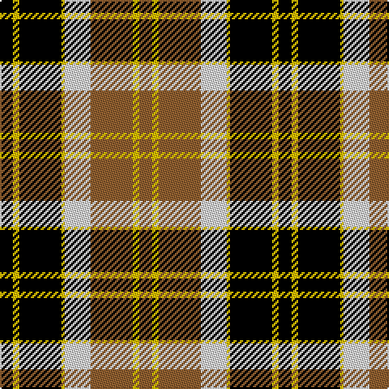

In pattern [KYKYWRYR](/patterns/kykywryr/).

This was sourced from weddslist.  It is a [8 stripes tartan](/stripes/stripes8/).

Original link http://www.weddslist.com/cgi-bin/tartans/pg.pl?source=sts

## Thread count
K/8 Y4 K26 Y2 LN16 LT26 Y4 LT/8

## Palette
Each colour and its ΔE from the base-6 reference it is a variant of.

| Colour | Shade | Base | ΔE (OKLab) |
|---|---|---|---|
| K | <code style="background-color:#000000;">#000000</code> `#000000` | K <code style="background-color:#000000;">#000000</code> | 0.00 |
| LN | <code style="background-color:#E0E0E0;">#E0E0E0</code> `#E0E0E0` | W <code style="background-color:#F4F4F0;">#F4F4F0</code> | 0.06 |
| LT | <code style="background-color:#906030;">#906030</code> `#906030` | R <code style="background-color:#C80000;">#C80000</code> | 0.15 |
| Y | <code style="background-color:#F0C000;">#F0C000</code> `#F0C000` | Y <code style="background-color:#E8C000;">#E8C000</code> | 0.01 |

# Sample pattern

## Nearest tartans

The nearest existing variants by ΔTartan distance.

1. [Prince Edward Island](/setts/s7/w4k2g32k24r24k2w4-g008000-k000000-rc00000-we0e0e0/) — ΔT 0.90
1. [Dalveen (1981)](/setts/s8/g18ga12g60ga6w66k60ga12k18-g604000-ga006818-k101010-we0e0e0/) — ΔT 0.92
1. [Bannockbane Light Tan](/setts/s8/k8y4k26y2w16ya26y4ya8-k101010-we0e0e0-ye8c000-yaa08858/) — ΔT 0.95
1. [National Trust](/setts/s8/g4b16g16r6b2w24g4b2-b401000-g004010-r906030-we0e0e0/) — ΔT 0.97
1. [Logan, Dark](/setts/s7/k18r8k2r8g30ra8k2-g008000-k000000-rd03030-rac00000/) — ΔT 1.01
1. [Dickie](/setts/s8/g16r4g24k12g6b12r48k8-b00008c-g146400-k000000-rc82800/) — ΔT 1.04
1. [Dutch](/setts/s6/w4b24y2k24y24k2-b304080-k000000-we0e0e0-yff8500/) — ΔT 1.05
1. [Black & White Golf (Corporate)](/setts/s7/y18k64g12w40y6w18k10-g006818-k101010-we8ccb8-ybc8c00/) — ΔT 1.07
1. [Prince Edward Island #2](/setts/s7/w4k2g32k24r24k2w4-g005020-k101010-rdc0000-we0e0e0/) — ΔT 1.07
1. [Longford County Crest (Fashion)](/setts/s8/k88y18k6y16y32y30y12k14-k101010-ybc8c00/) — ΔT 1.07

## Neighbour map

Every grey dot is one of 15726 variants placed by the first two principal components of the ΔTartan feature space (44% of its variance). Red is this tartan; blue dots are its nearest — click one to open its page.

<svg viewBox="0 0 640 380" role="img" style="max-width:100%;height:auto;border:1px solid #e0e0e0;border-radius:4px;display:block" xmlns="http://www.w3.org/2000/svg"><image href="/nn/cloud.v1.png" width="640" height="380"/><a href="/setts/s7/w4k2g32k24r24k2w4-g008000-k000000-rc00000-we0e0e0/"><circle cx="168.8" cy="162.8" r="4" fill="#3465a4"><title>Prince Edward Island</title></circle></a><a href="/setts/s8/g18ga12g60ga6w66k60ga12k18-g604000-ga006818-k101010-we0e0e0/"><circle cx="123.2" cy="182.4" r="4" fill="#3465a4"><title>Dalveen (1981)</title></circle></a><a href="/setts/s8/k8y4k26y2w16ya26y4ya8-k101010-we0e0e0-ye8c000-yaa08858/"><circle cx="154.9" cy="169.9" r="4" fill="#3465a4"><title>Bannockbane Light Tan</title></circle></a><a href="/setts/s8/g4b16g16r6b2w24g4b2-b401000-g004010-r906030-we0e0e0/"><circle cx="141.0" cy="170.1" r="4" fill="#3465a4"><title>National Trust</title></circle></a><a href="/setts/s7/k18r8k2r8g30ra8k2-g008000-k000000-rd03030-rac00000/"><circle cx="187.1" cy="173.4" r="4" fill="#3465a4"><title>Logan, Dark</title></circle></a><a href="/setts/s8/g16r4g24k12g6b12r48k8-b00008c-g146400-k000000-rc82800/"><circle cx="198.6" cy="180.8" r="4" fill="#3465a4"><title>Dickie</title></circle></a><a href="/setts/s6/w4b24y2k24y24k2-b304080-k000000-we0e0e0-yff8500/"><circle cx="150.2" cy="184.3" r="4" fill="#3465a4"><title>Dutch</title></circle></a><a href="/setts/s7/y18k64g12w40y6w18k10-g006818-k101010-we8ccb8-ybc8c00/"><circle cx="188.5" cy="181.9" r="4" fill="#3465a4"><title>Black &amp; White Golf (Corporate)</title></circle></a><a href="/setts/s7/w4k2g32k24r24k2w4-g005020-k101010-rdc0000-we0e0e0/"><circle cx="188.6" cy="167.5" r="4" fill="#3465a4"><title>Prince Edward Island #2</title></circle></a><a href="/setts/s8/k88y18k6y16y32y30y12k14-k101010-ybc8c00/"><circle cx="210.3" cy="166.3" r="4" fill="#3465a4"><title>Longford County Crest (Fashion)</title></circle></a><circle cx="150.8" cy="170.1" r="5" fill="#c00000"/></svg>

ID: /setts/s8/k8y4k26y2w16r26y4r8-k000000-r906030-we0e0e0-yf0c000/
