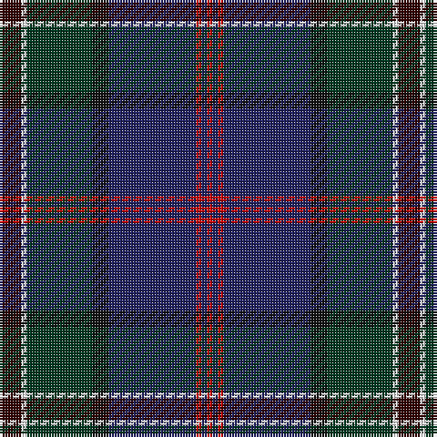

This page is one **sett** — a single exact thread-count. It belongs to the [tartan](/tartans/ki4w1dg12k3db16r1db1r1/)
(the same proportion at any scale), whose colour order is pattern [KWGKBRBR](/stripes/kwgkbrbr/).

Sourced from tartans-authority.  It is a [8 stripe tartan](/stripes/stripes8/).

Original link http://www.tartansauthority.com/tartan-ferret/display/11173/

## Register references

External register numbers recorded for this tartan.

- Scottish Register of Tartans: [11173](https://www.tartanregister.gov.uk/tartanDetails?ref=11173)
- Scottish Tartans Authority (ITI): 11173

## Thread count
DR/8 W2 DG24 K6 DB32 R2 DB2 R/2

## Palette

Palette: <strong>Tartan Register</strong> <small style="color:#888">(5 of 6 colours)</small>
<table><thead><tr><th>Colour</th><th>Threads</th><th>Shade</th><th>Base</th><th>OKLCh</th></tr></thead><tbody><tr><td>DR/</td><td style="text-align:right;font-variant-numeric:tabular-nums">8</td><td><code style="background-color:#320000;">#320000</code> <small style="color:#888">#320000</small></td><td>K <code style="background-color:#000000;">#000000</code></td><td><small style="color:#888">oklch(19.9% 0.082 29.2)</small></td></tr><tr><td>W</td><td style="text-align:right;font-variant-numeric:tabular-nums">2</td><td><code style="background-color:#FCFCFC;">#FCFCFC</code> <small style="color:#888">#FCFCFC</small></td><td>W <code style="background-color:#F7F7F7;">#F7F7F7</code></td><td><small style="color:#888">oklch(99.1% 0.000 89.9)</small></td></tr><tr><td>DG</td><td style="text-align:right;font-variant-numeric:tabular-nums">24</td><td><code style="background-color:#003820;">#003820</code> <small style="color:#888">#003820</small></td><td>G <code style="background-color:#006100;">#006100</code></td><td><small style="color:#888">oklch(30.0% 0.070 158.3)</small></td></tr><tr><td>K</td><td style="text-align:right;font-variant-numeric:tabular-nums">6</td><td><code style="background-color:#101010;">#101010</code> <small style="color:#888">#101010</small></td><td>K <code style="background-color:#000000;">#000000</code></td><td><small style="color:#888">oklch(17.3% 0.000 89.9)</small></td></tr><tr><td>DB</td><td style="text-align:right;font-variant-numeric:tabular-nums">32</td><td><code style="background-color:#202060;">#202060</code> <small style="color:#888">#202060</small></td><td>B <code style="background-color:#2A418A;">#2A418A</code></td><td><small style="color:#888">oklch(28.9% 0.111 276.9)</small></td></tr><tr><td>R</td><td style="text-align:right;font-variant-numeric:tabular-nums">2</td><td><code style="background-color:#C80000;">#C80000</code> <small style="color:#888">#C80000</small></td><td>R <code style="background-color:#CC0000;">#CC0000</code></td><td><small style="color:#888">oklch(52.3% 0.215 29.2)</small></td></tr><tr><td>DB</td><td style="text-align:right;font-variant-numeric:tabular-nums">2</td><td><code style="background-color:#202060;">#202060</code> <small style="color:#888">#202060</small></td><td>B <code style="background-color:#2A418A;">#2A418A</code></td><td><small style="color:#888">oklch(28.9% 0.111 276.9)</small></td></tr><tr><td>R/</td><td style="text-align:right;font-variant-numeric:tabular-nums">2</td><td><code style="background-color:#C80000;">#C80000</code> <small style="color:#888">#C80000</small></td><td>R <code style="background-color:#CC0000;">#CC0000</code></td><td><small style="color:#888">oklch(52.3% 0.215 29.2)</small></td></tr></tbody></table>

# Sample pattern

## Nearest tartans

The nearest existing variants by ΔTartan distance, with this tartan at the top so the swatches line up against it.

ΔTartan

Tartan

Sett

—

<a href="/ttd/edit/#slug=ki4w1dg12k3db16r1db1r1~x2">Purves (2014)</a> <a class="nn-out" href="/setts/s8/ki4w1dg12k3db16r1db1r1~x2/" title="open its dictionary page">↗</a>

0.58

<a href="/ttd/edit/#slug=do4w1dg12k3db16r1db1r1~x2">Purves (2014)</a> <a class="nn-out" href="/setts/s8/do4w1dg12k3db16r1db1r1~x2/" title="open its dictionary page">↗</a>

0.94

<a href="/setts/s10/k10n4k34db3g3db3g3db26ni2lb3~x2/">Dugan (Personal)</a>

0.97

<a href="/ttd/edit/#slug=k3r3dg4db7k3dt39db15w3~x2">American National</a> <a class="nn-out" href="/setts/s8/k3r3dg4db7k3dt39db15w3~x2/" title="open its dictionary page">↗</a>

0.99

<a href="/ttd/edit/#slug=t3k1lo2k1db10k17db2t1dy1r1~x2">Six Frigates (US)</a> <a class="nn-out" href="/setts/s10/t3k1lo2k1db10k17db2t1dy1r1~x2/" title="open its dictionary page">↗</a>

0.99

<a href="/ttd/edit/#slug=dbi4db3r2db26k3dbi3g3dbi3g17lo3~x2">Boyle (Personal)</a> <a class="nn-out" href="/setts/s10/dbi4db3r2db26k3dbi3g3dbi3g17lo3~x2/" title="open its dictionary page">↗</a>

1.06

<a href="/ttd/edit/#slug=dp4db7dp2db25k19w2dg23k2lo3~x2">Leung (Personal)</a> <a class="nn-out" href="/setts/s9/dp4db7dp2db25k19w2dg23k2lo3~x2/" title="open its dictionary page">↗</a>

1.12

<a href="/ttd/edit/#slug=db45r4k20lb3o9dr4o3dr9k11~x2">United Arrows House Check</a> <a class="nn-out" href="/setts/s9/db45r4k20lb3o9dr4o3dr9k11~x2/" title="open its dictionary page">↗</a>

1.13

<a href="/ttd/edit/#slug=k2r2k15o2k4o2n9do27w2~x2">Real Mary King's Close, The</a> <a class="nn-out" href="/setts/s9/k2r2k15o2k4o2n9do27w2~x2/" title="open its dictionary page">↗</a>

1.21

<a href="/ttd/edit/#slug=db4w1k2db25k12b1k2g16k2r1~x2">Sidey Family Tartan (Name)</a> <a class="nn-out" href="/setts/s10/db4w1k2db25k12b1k2g16k2r1~x2/" title="open its dictionary page">↗</a>

1.22

<a href="/ttd/edit/#slug=dr4dg27o2db25lo5dg3o3~x2">Kilkenny, County (District)</a> <a class="nn-out" href="/setts/s7/dr4dg27o2db25lo5dg3o3~x2/" title="open its dictionary page">↗</a>

## Neighbour map

Every grey dot is one of 14359 variants placed by the first two principal components of the ΔTartan feature space (44% of its variance). Red is this tartan; blue dots are its nearest — click one to open its page.

<svg viewBox="0 0 640 380" role="img" style="max-width:100%;height:auto;border:1px solid #e0e0e0;border-radius:4px;display:block" xmlns="http://www.w3.org/2000/svg"><image href="/nn/cloud.v1.png" width="640" height="380"/><a href="/setts/s8/do4w1dg12k3db16r1db1r1~x2/"><circle cx="256.1" cy="162.0" r="4" fill="#3465a4"><title>Purves (2014)</title></circle></a><a href="/setts/s10/k10n4k34db3g3db3g3db26ni2lb3~x2/"><circle cx="301.0" cy="151.3" r="4" fill="#3465a4"><title>Dugan (Personal)</title></circle></a><a href="/setts/s8/k3r3dg4db7k3dt39db15w3~x2/"><circle cx="292.9" cy="163.3" r="4" fill="#3465a4"><title>American National</title></circle></a><a href="/setts/s10/t3k1lo2k1db10k17db2t1dy1r1~x2/"><circle cx="297.0" cy="137.6" r="4" fill="#3465a4"><title>Six Frigates (US)</title></circle></a><a href="/setts/s10/dbi4db3r2db26k3dbi3g3dbi3g17lo3~x2/"><circle cx="243.8" cy="157.5" r="4" fill="#3465a4"><title>Boyle (Personal)</title></circle></a><a href="/setts/s9/dp4db7dp2db25k19w2dg23k2lo3~x2/"><circle cx="195.9" cy="177.3" r="4" fill="#3465a4"><title>Leung (Personal)</title></circle></a><a href="/setts/s9/db45r4k20lb3o9dr4o3dr9k11~x2/"><circle cx="224.4" cy="147.7" r="4" fill="#3465a4"><title>United Arrows House Check</title></circle></a><a href="/setts/s9/k2r2k15o2k4o2n9do27w2~x2/"><circle cx="229.3" cy="149.6" r="4" fill="#3465a4"><title>Real Mary King's Close, The</title></circle></a><a href="/setts/s10/db4w1k2db25k12b1k2g16k2r1~x2/"><circle cx="275.1" cy="130.1" r="4" fill="#3465a4"><title>Sidey Family Tartan (Name)</title></circle></a><a href="/setts/s7/dr4dg27o2db25lo5dg3o3~x2/"><circle cx="282.7" cy="195.6" r="4" fill="#3465a4"><title>Kilkenny, County (District)</title></circle></a><circle cx="263.5" cy="164.1" r="5" fill="#c00000"/></svg>

ID: /setts/s8/ki4w1dg12k3db16r1db1r1~x2/
