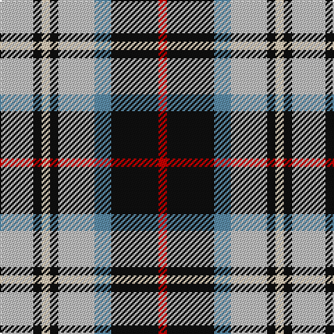

In pattern [RKBWKWKW](/stripes/rkbwkwkw/).

This was sourced from tartans-authority.  It is a [8 stripe tartan](/stripes/stripes8/).

Original link http://www.tartansauthority.com/tartan-ferret/display/2991/

## Thread count
N/24 K6 LR6 K6 N26 B12 K34 R/6

## Palette
Each colour and its ΔE from the base-6 reference it is a variant of.

| Colour | Shade | Base | ΔE (OKLab) |
|---|---|---|---|
| B | <code style="background-color:#5C8CA8;">#5C8CA8</code> `#5C8CA8` | B <code style="background-color:#2A418A;">#2A418A</code> | 0.23 |
| K | <code style="background-color:#101010;">#101010</code> `#101010` | K <code style="background-color:#000000;">#000000</code> | 0.17 |
| LR | <code style="background-color:#E8CCB8;">#E8CCB8</code> `#E8CCB8` | W <code style="background-color:#F7F7F7;">#F7F7F7</code> | 0.12 |
| N | <code style="background-color:#C0C0C0;">#C0C0C0</code> `#C0C0C0` | W <code style="background-color:#F7F7F7;">#F7F7F7</code> | 0.17 |
| R | <code style="background-color:#C80000;">#C80000</code> `#C80000` | R <code style="background-color:#CC0000;">#CC0000</code> | 0.01 |

# Sample pattern

## Nearest tartans

The nearest existing variants by ΔTartan distance.

1. [Strakan](/setts/s9/db18o5db18ly14k3w3k3ly14o3~x2/) — ΔT 0.67
1. [Ship Hector](/setts/s8/k4db9ly6db22g4w20g6w4/) — ΔT 0.89
1. [Kile (Red line) (Personal)](/setts/s8/db18w3db3w3r3w3k5ly12~x2/) — ΔT 0.98
1. [Ship Hector, The (Commemorative)](/setts/s8/k3db10ly5db16g3w16g5w3~x2/) — ΔT 1.01
1. [Thomson Dress (Grey) (Fashion)](/setts/s6/r4o25k6w12k11ly3~x2/) — ΔT 1.02
1. [Kervegant, Suzanne (Personal)](/setts/s10/g6db11lb8k4lb8r4lb8k27lb4r4~x2/) — ΔT 1.04
1. [Pengelly, The Cornish (Name)](/setts/s7/lb5k26ly4lb24dp8k3r4~x2/) — ΔT 1.06
1. [Unidentified (Winterbottom)](/setts/s6/db13w13db4ly2g8r3~x2/) — ΔT 1.08
1. [Tombow 140th Anniversary, The](/setts/s7/g4ly7o9ly9db20w2db2~x2/) — ΔT 1.12
1. [Breton District Tartan Tartan Number: 3902. Earliest known date: 2001 Commissioned by Richard Duclos of Le Coudray-Montceaux, France and produced by House of Tartan. See products available Copyright © Blair Urquhart, Comrie, 2015](/setts/s9/g6db11w8k4w8k4w8k27w4~x2/) — ΔT 1.13

## Neighbour map

Every grey dot is one of 14299 variants placed by the first two principal components of the ΔTartan feature space (44% of its variance). Red is this tartan; blue dots are its nearest — click one to open its page.

<svg viewBox="0 0 640 380" role="img" style="max-width:100%;height:auto;border:1px solid #e0e0e0;border-radius:4px;display:block" xmlns="http://www.w3.org/2000/svg"><image href="/nn/cloud.v1.png" width="640" height="380"/><a href="/setts/s9/db18o5db18ly14k3w3k3ly14o3~x2/"><circle cx="130.5" cy="182.4" r="4" fill="#3465a4"><title>Strakan</title></circle></a><a href="/setts/s8/k4db9ly6db22g4w20g6w4/"><circle cx="115.2" cy="188.2" r="4" fill="#3465a4"><title>Ship Hector</title></circle></a><a href="/setts/s8/db18w3db3w3r3w3k5ly12~x2/"><circle cx="121.5" cy="171.2" r="4" fill="#3465a4"><title>Kile (Red line) (Personal)</title></circle></a><a href="/setts/s8/k3db10ly5db16g3w16g5w3~x2/"><circle cx="109.9" cy="189.2" r="4" fill="#3465a4"><title>Ship Hector, The (Commemorative)</title></circle></a><a href="/setts/s6/r4o25k6w12k11ly3~x2/"><circle cx="141.3" cy="185.0" r="4" fill="#3465a4"><title>Thomson Dress (Grey) (Fashion)</title></circle></a><a href="/setts/s10/g6db11lb8k4lb8r4lb8k27lb4r4~x2/"><circle cx="108.2" cy="168.6" r="4" fill="#3465a4"><title>Kervegant, Suzanne (Personal)</title></circle></a><a href="/setts/s7/lb5k26ly4lb24dp8k3r4~x2/"><circle cx="152.6" cy="162.2" r="4" fill="#3465a4"><title>Pengelly, The Cornish (Name)</title></circle></a><a href="/setts/s6/db13w13db4ly2g8r3~x2/"><circle cx="113.5" cy="205.9" r="4" fill="#3465a4"><title>Unidentified (Winterbottom)</title></circle></a><a href="/setts/s7/g4ly7o9ly9db20w2db2~x2/"><circle cx="156.1" cy="170.7" r="4" fill="#3465a4"><title>Tombow 140th Anniversary, The</title></circle></a><a href="/setts/s9/g6db11w8k4w8k4w8k27w4~x2/"><circle cx="159.0" cy="191.1" r="4" fill="#3465a4"><title>Breton District Tartan Tartan Number: 3902. Earliest known date: 2001 Commissioned by Richard Duclos of Le Coudray-Montceaux, France and produced by House of Tartan. See products available Copyright © Blair Urquhart, Comrie, 2015</title></circle></a><circle cx="131.5" cy="189.9" r="5" fill="#c00000"/></svg>

ID: /setts/s8/lb12k3lb3k3lb13t6k17r3~x2/
