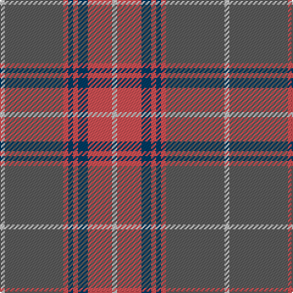

This page is one **sett** — a single exact thread-count. It belongs to the [tartan](/tartans/na1n12do1db1do1db2do5na1/)
(the same proportion at any scale), whose colour order is pattern [WBRBRBRW](/stripes/wbrbrbrw/).

Sourced from house-of-tartan.  It is a [8 stripe tartan](/stripes/stripes8/).

Original link http://www.house-of-tartan.scotland.net/house/TartanViewjs.asp?colr=Def&tnam=2346

## Thread count
Na/4 N48 DO4 DB4 DO4 DB8 DO20 Na/4

## Palette
Each colour and the base-6 reference it is a variant of.

| Colour | Shade | Base |
|---|---|---|
| DB | <code style="background-color:#003C64;">#003C64</code> `oklch(34.5% 0.089 246.0)` <small>#003C64</small> | B <code style="background-color:#2A418A;">#2A418A</code> |
| DO | <code style="background-color:#D05054;">#D05054</code> `oklch(60.2% 0.162 21.5)` <small>#D05054</small> | R <code style="background-color:#CC0000;">#CC0000</code> |
| N | <code style="background-color:#5C5C5C;">#5C5C5C</code> `oklch(47.5% 0.000 89.9)` <small>#5C5C5C</small> | B <code style="background-color:#2A418A;">#2A418A</code> |
| Na | <code style="background-color:#C0C0C0;">#C0C0C0</code> `oklch(80.8% 0.000 89.9)` <small>#C0C0C0</small> | W <code style="background-color:#F7F7F7;">#F7F7F7</code> |

# Sample pattern

## Nearest tartans

The nearest existing variants by ΔTartan distance, with this tartan at the top so the swatches line up against it.

ΔTartan

Tartan

Sett

—

<a href="/ttd/edit/#slug=lb1n12r1dt1r1dt2r5lb1~x4">Tenmaya Corporate Tartan Tartan Number: 2346. Earliest known date: 1996 May 1996 for Tenmaya Department Store Ltd in Okayama, Japan. Sample in STA Johnston Collection. Designed for British promotion October/November 1996 which demonstrated weaving and woven by Archie Snmall from Selkirk who was sent to Fukuoka to demonstrate weaving. See products available Copyright © Blair Urquhart, Comrie, 2015</a> <a class="nn-out" href="/setts/s8/lb1n12r1dt1r1dt2r5lb1~x4/" title="open its dictionary page">↗</a>

0.71

<a href="/ttd/edit/#slug=lb1o12r1dt1r1dt2r5lb1~x4">Tenmaya Check</a> <a class="nn-out" href="/setts/s8/lb1o12r1dt1r1dt2r5lb1~x4/" title="open its dictionary page">↗</a>

1.24

<a href="/ttd/edit/#slug=o3lr4o4do4o18do3n36w3~x2">Hebridean Granite Fashion Tartan Tartan Number: 6821. Earliest known date: 2005 For a new House of Edgar collection. Intended to emulate the gray morning suit perhaps. See products available Copyright © Blair Urquhart, Comrie, 2015</a> <a class="nn-out" href="/setts/s8/o3lr4o4do4o18do3n36w3~x2/" title="open its dictionary page">↗</a>

1.27

<a href="/ttd/edit/#slug=db18ly2o6ly2o19r3~x2">Balfour blue &amp; brown</a> <a class="nn-out" href="/setts/s6/db18ly2o6ly2o19r3~x2/" title="open its dictionary page">↗</a>

1.32

<a href="/ttd/edit/#slug=o3lr4o4k4o18k3n36w3~x2">Hebridean Granite (Fashion)</a> <a class="nn-out" href="/setts/s8/o3lr4o4k4o18k3n36w3~x2/" title="open its dictionary page">↗</a>

1.32

<a href="/ttd/edit/#slug=do12r1do2r1do2lb2do3o9r1o2r1o3~x4">Shieldhall (Fashion)</a> <a class="nn-out" href="/setts/s12/do12r1do2r1do2lb2do3o9r1o2r1o3~x4/" title="open its dictionary page">↗</a>

1.38

<a href="/ttd/edit/#slug=n32k3n3k3o5k8o21k4~x2">Speyside Grey (Fashion)</a> <a class="nn-out" href="/setts/s8/n32k3n3k3o5k8o21k4~x2/" title="open its dictionary page">↗</a>

1.41

<a href="/ttd/edit/#slug=t32r3t3r3t3r10g24r3~x2">Gammell (Personal)</a> <a class="nn-out" href="/setts/s8/t32r3t3r3t3r10g24r3~x2/" title="open its dictionary page">↗</a>

1.41

<a href="/ttd/edit/#slug=r2g16r1r2r12ly1t1~x2">Spragg (Name)</a> <a class="nn-out" href="/setts/s7/r2g16r1r2r12ly1t1~x2/" title="open its dictionary page">↗</a>

1.43

<a href="/ttd/edit/#slug=y30ly3y3ly3y12do30k3do5~x2">Dama Classic</a> <a class="nn-out" href="/setts/s8/y30ly3y3ly3y12do30k3do5~x2/" title="open its dictionary page">↗</a>

1.44

<a href="/ttd/edit/#slug=k5o5k5o34do33k6do5t2">Brave for Men</a> <a class="nn-out" href="/setts/s8/k5o5k5o34do33k6do5t2/" title="open its dictionary page">↗</a>

## Neighbour map

Every grey dot is one of 14299 variants placed by the first two principal components of the ΔTartan feature space (44% of its variance). Red is this tartan; blue dots are its nearest — click one to open its page.

<svg viewBox="0 0 640 380" role="img" style="max-width:100%;height:auto;border:1px solid #e0e0e0;border-radius:4px;display:block" xmlns="http://www.w3.org/2000/svg"><image href="/nn/cloud.v1.png" width="640" height="380"/><a href="/setts/s8/lb1o12r1dt1r1dt2r5lb1~x4/"><circle cx="341.6" cy="181.8" r="4" fill="#3465a4"><title>Tenmaya Check</title></circle></a><a href="/setts/s8/o3lr4o4do4o18do3n36w3~x2/"><circle cx="303.0" cy="173.3" r="4" fill="#3465a4"><title>Hebridean Granite Fashion Tartan Tartan Number: 6821. Earliest known date: 2005 For a new House of Edgar collection. Intended to emulate the gray morning suit perhaps. See products available Copyright © Blair Urquhart, Comrie, 2015</title></circle></a><a href="/setts/s6/db18ly2o6ly2o19r3~x2/"><circle cx="317.3" cy="226.5" r="4" fill="#3465a4"><title>Balfour blue &amp; brown</title></circle></a><a href="/setts/s8/o3lr4o4k4o18k3n36w3~x2/"><circle cx="291.6" cy="166.8" r="4" fill="#3465a4"><title>Hebridean Granite (Fashion)</title></circle></a><a href="/setts/s12/do12r1do2r1do2lb2do3o9r1o2r1o3~x4/"><circle cx="303.9" cy="168.6" r="4" fill="#3465a4"><title>Shieldhall (Fashion)</title></circle></a><a href="/setts/s8/n32k3n3k3o5k8o21k4~x2/"><circle cx="270.3" cy="197.1" r="4" fill="#3465a4"><title>Speyside Grey (Fashion)</title></circle></a><a href="/setts/s8/t32r3t3r3t3r10g24r3~x2/"><circle cx="303.8" cy="201.7" r="4" fill="#3465a4"><title>Gammell (Personal)</title></circle></a><a href="/setts/s7/r2g16r1r2r12ly1t1~x2/"><circle cx="299.2" cy="152.4" r="4" fill="#3465a4"><title>Spragg (Name)</title></circle></a><a href="/setts/s8/y30ly3y3ly3y12do30k3do5~x2/"><circle cx="335.9" cy="212.2" r="4" fill="#3465a4"><title>Dama Classic</title></circle></a><a href="/setts/s8/k5o5k5o34do33k6do5t2/"><circle cx="310.2" cy="188.0" r="4" fill="#3465a4"><title>Brave for Men</title></circle></a><circle cx="336.9" cy="182.1" r="5" fill="#c00000"/></svg>

ID: /setts/s8/lb1n12r1dt1r1dt2r5lb1~x4/
